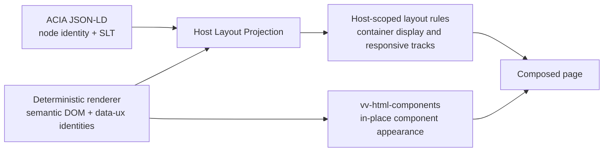

# Host-Page Layout for OSI Level 8 Profile 9 ACIA Trees

**Status:** Design recommendation  
**Scope:** Host-page layout only; no implementation is specified.  
**Authority:** This design implements the stated operator decision that layout remains a host-page responsibility. The deterministic renderer remains semantic-only, and `vv-html-components` continues to style components in place rather than acting as a layout engine.[1]

> **Decision:** The host page shall project layout intent already present in the ACIA document onto the renderer's existing semantic DOM. It shall not ask the renderer to lay out nodes, and it shall not delegate page layout to `vv-html-components`.

## 1. Executive decision

The host page should own a small, reusable **Layout Projection** capability. It reads the embedded ACIA JSON-LD, joins each ACIA node to its already-rendered element by existing identity attributes, validates that the document and DOM agree, and applies host-scoped layout rules only to validated container nodes. The projection uses direct rendered children in source order; it never reparents, wraps, reorders, or mutates the renderer's `data-ux-*` attributes.

The recommended mechanism is **host-owned, document-derived CSS rules**. In a Rails host, the view or a host helper derives the rules while composing the page. In a static host, the page ships the same local host capability and derives the rules from the embedded JSON-LD without a network request. This is not a component-library feature, an external framework, or a page-author hand-layout convention.

`layoutKind` plus `layoutArity` is necessary but **not sufficient**. The host additionally requires a trustworthy DOM-to-ACIA identity join, a defined direct-child participation rule, a versioned responsive policy selected by `responsiveSignature`, and fail-closed behavior when those facts do not validate. In particular, `layoutArity = many` does not say whether a grid should be three, five, or some other number of tracks at a given width.

| Design outcome | Required result |
|---|---|
| Renderer compatibility | Existing per-node markup remains byte-for-byte in its current contract; no renderer change is required. |
| Component-library boundary | `vv-html-components` continues to style selected components in place and does not read, apply, or infer layout. |
| Host responsibility | The host reads ACIA layout intent and determines display modes, tracks, gaps, wrapping, and responsive collapse. |
| Existing-page safety | A page without a recognized, validated Profile 9 ACIA document receives no host layout projection and stays in ordinary semantic document flow. |
| Accessibility floor | Source order, semantic tags, node nesting, and keyboard order remain the renderer's order in every mode. |

## 2. Architectural boundary and processing model

The ACIA tree is the **declaration of layout intent**. The renderer is the **semantic projection** of that tree into light DOM. The host is the **layout projection**. The component library is the **in-place visual treatment** of component elements. Those are separate projections with separate failure domains.

The host should make the layout decision at the **container node**. A container's `slt.layoutKind` applies only to its participating **direct ACIA-rendered child elements**. A nested container resolves independently inside its parent. This simple rule prevents a grid rule on an outer `PanelFrame` from accidentally selecting or laying out grandchildren, and it preserves the tree's source order.

The host applies no special rule where ordinary block flow is the selected or safe fallback. It may still apply host-owned spacing and responsive rules where the selected, validated recipe requires them; the intent is not to erase the browser's readable default, but to improve on it only when the contract is satisfied.

## 3. Normative host-page layout contract

### 3.1 Contract statement

For each candidate layout container, the host shall consume a **validated layout record** assembled from the embedded ACIA JSON-LD and the current rendered subtree. The record is usable only when every required identity and structural check succeeds. If it is not usable, the host shall emit no special layout rule for that container and ordinary document flow remains authoritative.

A layout record has four categories: an identity binding, a topology binding, the SLT declaration, and a responsive recipe selector. The current renderer already exposes the DOM side of the identity binding. The host reads the ACIA side from the JSON-LD; it does not need new renderer attributes.

| Category | Host must obtain | Source | Required rule |
|---|---|---|---|
| Document identity | The ACIA document digest represented by the rendered subtree. | JSON-LD and `data-ux-acia-digest`. | The digest in the rendered element must equal the digest of the ACIA document being projected. A mismatch disables host layout for the affected subtree. |
| Node identity | Stable node CID and node ID. | ACIA node data; `data-ux-node-cid`; `data-ux-node-id`. | The host joins a node and an element by the scoped pair **ACIA digest + node CID**, and cross-checks node ID when present. A node CID must be unique within an ACIA document. |
| Rendered role | The existing element and its semantic/component facts. | Element tag; `data-ux-component-kind`; `data-ux-content-role`; `aria-label`. | These facts constrain applicability and diagnostics; the host does not replace the tag, invent a component kind, or manufacture semantics. |
| Tree topology | Parent-child relationship and participating child sequence. | ACIA tree and DOM nesting. | The direct ACIA child sequence in JSON-LD must match the direct rendered node-element sequence by CID. Text nodes and non-ACIA helper markup are not participants. A topology mismatch disables the parent rule. |
| Layout declaration | `slt.layoutKind` and `slt.layoutArity`. | ACIA JSON-LD only, under the node's SLT. | Values must be from the fixed Profile 9 enumerations. Unknown or absent values fall back to `stack` behavior. |
| Responsive selector | `responsiveSignature`. | ACIA JSON-LD only. | It must name a known, versioned host recipe that is permitted for the stated layout kind and arity. Unknown or absent signatures select the safe generic recipe, never an unsafe desktop-only arrangement. |

The contract requires that the JSON-LD serialize the stable node identity that the renderer used to emit `data-ux-node-cid` and `data-ux-node-id`. If the embedded document does not expose either a usable CID or a stable equivalent that can be matched without guesswork, the host has no safe join and must not project layout. Parsing labels, text, component kinds, tree position, or CSS selector order as a substitute identity is expressly prohibited.

### 3.2 Direct-child and arity semantics

`layoutArity` is a **cardinality assertion and recipe selector**, not a CSS column count. Profile 9 should define its meaning precisely as follows: `one` means exactly one participating direct child, `two` exactly two, `three` exactly three, and `many` four or more. The actual direct-child count remains available to the host and is essential for a multi-panel grid.

For the StewardshipTranslation Board, the grid container has five participating direct `PanelFrame` children. The valid declaration is therefore `layoutKind = grid` and `layoutArity = many`; the host learns that the board has five panels from the validated direct-child sequence. It must not infer five columns merely because an element happens to be a panel, nor because five panel-looking descendants happen to be visible.

| `layoutKind` | Host applies the declaration to | Minimum recipe information needed beyond kind/arity | Safe behavior when the recipe is unavailable |
|---|---|---|---|
| `stack` | Direct children in source order. | Spacing policy only, if any. | Ordinary one-column flow. |
| `inline` | Direct children as an inline row group. | Wrapping and alignment policy. | Ordinary source-order flow. |
| `grid` | Direct children as grid items. | Maximum or target tracks by width band, minimum usable item width, gap, and collapse rule. | Ordinary one-column flow. |
| `split` | Two direct children, unless an explicitly defined one-/three-pane recipe exists. | Pane ratio, priority, and narrow-width collapse rule. | Ordinary one-column flow. |
| `overlay` | Direct children only under a named overlay recipe. | Layering, anchor, reserved-space, focus, and narrow-width fallback policy. | Ordinary one-column flow; no overlap is inferred. |
| `timeline` | Direct children while retaining the renderer's ordered semantic structure. | Marker/rail placement and compact-width policy. | Ordinary ordered flow. |
| `table` | Only a renderer-produced, semantically valid table-shaped subtree. | Column/overflow policy and a compact-width representation. | Ordinary source-order flow; the host does not synthesize table semantics. |

This table is deliberately conservative. `overlay` and `table` carry risks that cannot be derived from a bare layout kind. The host must apply those modes only through an explicit, accessible registered recipe. It must never create overlap or fake a table from arbitrary nested panels.

### 3.3 Validation and fault containment

The host validates a container independently. A malformed, stale, unknown, or mismatched container is a local layout miss, not a page failure. The host may record diagnostics for development, but production rendering remains readable and continues to evaluate valid nested containers where their own identity and topology checks succeed.

| Validation outcome | Host action | User-visible outcome |
|---|---|---|
| ACIA digest, CID, node ID, topology, kind, arity, and recipe are valid. | Apply the registered host layout recipe. | Intended responsive layout. |
| Document or node identity is mismatched. | Apply no rule to that container or mismatched subtree. | Semantic browser flow. |
| Direct-child count violates `layoutArity`. | Apply no non-stack layout to that container; preserve the DOM. | Semantic browser flow. |
| Signature is absent, `default`, or unknown. | Use only the registered safe generic policy; if none is defined, use flow. | Responsive flow or a conservative host layout. |
| A recipe would require unsupported semantics, such as an unspecified overlay anchor. | Reject that recipe for the container. | Semantic browser flow. |

## 4. Recommended mechanism and author cost

### 4.1 Recommendation: host-owned layout projection

The recommended delivery mechanism is a **shared host layout policy plus a document-derived rule projection**. The policy is owned by the host platform—Rails view shell, static host shell, or CPCP FRONT pod—not by the component library and not by each page author. It is responsible for interpreting the Profile 9 recipe registry and producing rules that are scoped to the exact existing `data-ux-acia-digest` and `data-ux-node-cid` values of the validated rendered elements.

The generated rule set is private to the rendered ACIA document. It targets only the validated container and its direct participating children. It must not use broad selectors such as every `PanelFrame`, every `main`, or every element with a component kind. It must not add layout classes as a second identity scheme, and it must not alter `data-ux-*` attributes.

The delivery form may differ by host without changing the contract. Rails can derive the scoped rules during page composition. A static host can carry the same small local host capability with its page and derive rules from the already embedded JSON-LD. Neither form needs a third-party CSS framework, remote asset, runtime network request, or an external build pipeline. For static delivery where first-paint stability is a concern, the page should ship the already-derived host-scoped rules as part of the page artifact; that is a delivery optimization, not a change to the contract.

| Option | Viability now | Recommendation | Page-author cost | Why |
|---|---|---|---|---|
| A static stylesheet keyed only to current emitted `data-ux-*` attributes. | Insufficient. `layoutKind`, arity, and signature are not emitted. | Do not use as the primary mechanism. | Seemingly low, but forces fragile conventions or cannot express the tree's intent. | CSS cannot select a value that does not exist in the DOM. |
| Host reads JSON-LD and creates scoped rules for the existing DOM. | Fully viable without renderer change. | **Adopt.** | Author chooses Profile 9 SLT and an approved responsive signature; no hand-authored layout CSS. | Uses the authoritative tree, maintains the boundary, and works with existing markup. |
| Page author writes layout CSS or follows hand conventions. | Technically possible, operationally weak. | Do not standardize. | High and recurring; author must duplicate tree knowledge and revise CSS whenever structure changes. | Loses determinism and makes the ACIA layout declaration non-authoritative. |
| Change the component library to consume SLT. | Prohibited by the operator decision. | Do not build. | Hidden coupling and cross-page regression cost. | Makes a component styler into a layout engine. |

### 4.2 Cost to page authors and host integrators

The **page author** has a narrow declarative responsibility: author the correct existing Profile 9 layout kind and arity on each layout container, choose a registered responsive signature when `default` is insufficient, and preserve the intended direct-child tree. The author does not choose CSS grid syntax, breakpoint pixels, utility classes, widths, wrappers, or library-specific layout props.

The **host integrator** pays a one-time cost to adopt the shared Layout Projection capability in the host shell and maintain its finite recipe registry. A Rails view may invoke its host layout facility for an ACIA document; a static page includes the local host facility. Individual pages should not implement their own resolver. This centralization is the price of keeping layout at the host layer while retaining one deterministic interpretation across hosts.

## 5. How the host obtains `layoutKind` now, and a future Profile 9 proposal

### 5.1 Current, recommended path: read embedded JSON-LD

The renderer currently does not emit `slt.layoutKind`, `slt.layoutArity`, or `responsiveSignature` as HTML attributes. The host therefore obtains all three from the embedded ACIA JSON-LD and joins them to the rendered elements using the existing digest and node identity attributes. This is the recommended and immediately available design. It respects the conformance-pinned markup contract because it requires no renderer output change.

The JSON-LD remains the sole authoritative declaration. Host-derived CSS is a projection of it, not a second editable layout schema. If the DOM and JSON-LD disagree, the host must prefer safety over visual intent and leave the affected region in readable flow.

### 5.2 Optional future change — not part of this recommendation

If an operator later approves a Profile 9 evolution, it may be useful to define the following numbered change:

> **P9-LAYOUT-ATTR-01 — Optional rendered layout hints.** For each rendered ACIA node, emit three additional attributes: `data-ux-layout-kind`, `data-ux-layout-arity`, and `data-ux-responsive-signature`. Their values are a normalized, verbatim projection of the node's SLT fields.

This proposal is **not assumed approved**, and this design does not depend on it. If approved, it would permit a more conventional static host stylesheet to select recognized layout hints directly. It would not transfer layout ownership to `vv-html-components`; the host would still own the stylesheet and responsive recipe registry.

| Blast-radius area | Consequence of P9-LAYOUT-ATTR-01 |
|---|---|
| Renderer contract | Every affected node's rendered markup changes. The existing no-change renderer constraint is therefore violated until a new profile/version explicitly permits it. |
| Digest and conformance | Golden renderings, digest-covered output expectations, fixtures, and conformance tests must be revised and versioned. |
| Existing consumers | Consumers that correctly ignore unknown `data-*` attributes should continue to function, but every digest-sensitive or exact-markup consumer must be audited. |
| Host migration | Hosts must accept both the current JSON-LD-derived path and the new hint path during a compatibility window. JSON-LD remains authoritative if values disagree. |
| Component library | No required change. It must continue not to read or act on these attributes. |
| Authoring | No new author action if attributes are purely renderer projections; authors still author SLT in the tree. |

Even under this proposal, the attributes alone do not eliminate the need for a responsive recipe registry. A `grid` plus `many` value is still not a complete five-column-and-collapse policy.

## 6. Responsive contract and narrow-viewport behavior

### 6.1 What `responsiveSignature` must mean

`responsiveSignature` must become a **controlled, versioned reference to a host layout recipe**, rather than a permanently undifferentiated string. It should not contain raw CSS, ad hoc breakpoint values, or page-specific imperative instructions. The host owns the finite registry; the ACIA tree names the intended recipe.

A signature should encode, by stable policy name and version, at least: the layout family it applies to; the maximum/target tracks or pane arrangement at each host-defined width band; a minimum usable inline size for each child or an equivalent host token; gaps/alignment; and the compact-width disposition—wrap, reflow, stack, scroll, or another explicitly supported accessible behavior. A recipe for overlap must additionally encode safe anchor, layering, and focus rules.

A suitable naming form is `p9.r1.<layout-family>.<recipe>`. The names below illustrate the required semantics; their exact strings may be governed by the Profile 9 registry.

| Example signature | Wide behavior | Intermediate behavior | Compact / phone behavior |
|---|---|---|---|
| `p9.r1.grid.board-5` | Up to five equal panel tracks, in direct-child source order. | Reduce to the recipe's defined three- or two-track arrangements before items become too narrow. | One full-width track; all five panels stack in source order. |
| `p9.r1.grid.generic` | A safe number of equal tracks bounded by usable child width. | Reduce track count as the container narrows. | One full-width track. |
| `p9.r1.split.equal` | Two balanced panes. | Preserve two panes only while each remains usable. | One column, first pane then second. |
| `p9.r1.inline.wrap` | Inline group. | Wrap naturally under the recipe's alignment rules. | Wrapped or stacked source order; never clipped. |
| `p9.r1.default` | The safe generic policy registered for the node's kind and arity. | Reflow conservatively. | One-column source-order flow whenever fitting would compromise usable width. |

The host may define the concrete width thresholds through its design tokens, but the recipe must be evaluated against **available container width**, not merely a device name. The critical invariant is behavioral: no recipe may retain multiple narrow columns after its minimum usable item width is violated.

### 6.2 StewardshipTranslation Board behavior

The Board should be authored with a specific board recipe, such as `p9.r1.grid.board-5`, rather than relying on an ambiguous `default`. At generous available width, its five direct `PanelFrame` children are five equal grid columns. At intermediate widths, the host reduces columns according to the registered recipe. At phone width—or earlier if the board is placed in a narrow side region—the Board becomes one vertical sequence of five full-width panels in existing source order.

This is the correct degradation. A five-column squeeze harms scanability, produces unreadable panel content, and risks overflow or clipped interactions. A horizontal-scroll board should not be the default because it hides panels from the primary reading flow and creates an avoidable two-axis interaction burden. A single-column sequence preserves every panel, its accessible order, and its internal component styling while making the information readable.

## 7. Degradation floor: the Board in three operating states

The Board must be readable even when every enhancement is absent. The source DOM is the baseline, not an error case.

| Operating state | Board appearance | Required guarantee |
|---|---|---|
| **1. Semantic DOM only:** no host layout rules and no component library. | Five semantic `PanelFrame` regions appear as five vertically ordered blocks in browser flow. | All five panels are visible, readable, focusable according to their semantic controls, and ordered exactly as authored. Nothing throws. |
| **2. Component styling only:** `vv-html-components` is present but host layout is absent or has rejected the container. | The same five vertically ordered panels receive their in-place visual component treatment, but remain a long one-column scroll. | Styling does not reparent nodes, alter `data-ux-*`, assume a grid, or throw. The Board is still readable but not board-shaped. |
| **3. Full composition:** validated host layout projection plus, optionally, component styling. | At wide available width, the five panels form the Board's defined multi-column grid. At smaller widths, they step down through the registered recipe and become one column on phone width. | Layout changes visual arrangement only. The semantic tree, DOM order, and component-library independence remain intact. |

Host layout must also remain meaningful if the component library is unavailable: it can arrange the bare semantic panels as a grid at wide widths and as a stack when narrow. The library is a visual enhancement, not a prerequisite for either the host's layout correctness or the page's readability.

## 8. Ownership paragraph for implementation teams

**The renderer owns the deterministic semantic DOM projection:** semantic tags, tree-preserving nesting, node identity attributes, ACIA/token digests, content-role metadata, and accessible labels; it does not create grids, widths, columns, wrappers, or layout attributes under the current profile. **`vv-html-components` owns in-place component appearance:** it selects existing component nodes, applies component-local visual styles, preserves the rendered DOM and `data-ux-*` values, and does not consume SLT or make page-layout decisions. **The host page owns layout projection:** it reads the authoritative embedded ACIA JSON-LD, validates it against the existing rendered DOM, resolves Profile 9 layout and responsive recipes, applies scoped layout rules to direct children, and fails safely to semantic document flow. Layout intent is authored in the ACIA tree and becomes visible only when the host consumes it.

## 9. Explicit non-goals and prohibited designs

The following should **not** be built because each violates the boundary, weakens determinism, or reduces the readable failure floor.

| Do not build | Why it is rejected |
|---|---|
| A layout engine inside `vv-html-components`. | It directly contradicts the operator decision and couples page composition to a component styler. |
| A renderer change as a prerequisite for the first host solution. | Current markup is digest-covered and conformance-pinned; JSON-LD supplies the missing layout signal without that blast radius. |
| A host that infers layout from semantic tags, component kinds, text, or descendant count. | Those are not authoritative layout declarations and will mislay out structurally similar content. |
| Per-page hand-authored grid classes, widths, or breakpoint CSS. | It duplicates the ACIA tree's intent, creates drift, and makes maintenance a manual synchronization problem. |
| Any reparenting, wrapper insertion around semantic nodes, visual reordering, or mutation of `data-ux-*`. | It damages the renderer's deterministic/tree-preserving contract and can separate visual and accessible order. |
| A generic implementation of `overlay` or `table` from only `layoutKind` and arity. | Those modes require additional, explicit accessible recipe semantics; otherwise the safe fallback is ordinary flow. |
| Mandatory horizontal scrolling for the Board at phone width. | It conceals content and preserves an unusable desktop geometry instead of preserving readable source order. |
| A remote CSS framework, runtime network fetch, or separate build-pipeline dependency. | The host needs a local, dependency-free, deployable capability that works under the stated operating constraints. |

## 10. Adoption sequence and acceptance criteria

Adoption should proceed in small, reversible blocks. First, the host establishes the identity/topology validator and safe no-op fallback. Next, it registers the safe generic `stack`, `inline`, and `grid` recipes. Then it adds the Board's explicit five-column responsive recipe. Higher-risk modes such as `overlay` and non-native `table` presentation remain disabled until their explicit recipe contracts are defined and tested.

| Acceptance criterion | Observable result |
|---|---|
| Existing renderer output is used unchanged. | The host consumes the embedded JSON-LD and existing `data-ux-*` attributes; no renderer release is needed. |
| Stale or invalid JSON-LD cannot mislay out content. | Any failed digest, identity, topology, enum, or recipe validation leaves the affected container in normal flow. |
| The Board is a board on wide space. | A valid five-child grid with `p9.r1.grid.board-5` displays its five direct panels in five intended tracks where the recipe permits. |
| The Board is readable on phone width. | The same panels appear as one full-width source-ordered stack, with no squeeze, clipping, or mandatory horizontal board scroll. |
| The component library remains independent. | Removing it changes local component appearance only; it neither breaks host layout nor causes an exception. |
| No host layout is a valid state. | Removing host rules returns the Board to ordinary readable semantic flow. |
| Existing non-ACIA or unrecognized pages remain safe. | The host applies no broad global layout selector and makes no assumption based on component kind alone. |

## 11. Final recommendation

Adopt **JSON-LD-driven, host-scoped Layout Projection** now. Make `responsiveSignature` a versioned reference into a host-owned Profile 9 recipe registry, and give the StewardshipTranslation Board an explicit five-column grid recipe that collapses to one source-ordered column at phone width. Treat the current renderer output and component-library boundary as fixed. Consider P9-LAYOUT-ATTR-01 only as a separately approved future compatibility evolution, not as a prerequisite or an assumed change.

## References

[1]: pasted_content_SOIcAA5Kbw79QRIEDnx1Ib.txt "Supplied operator decision, architecture facts, constraints, and deliverables"

*Prepared by Manus AI.*
