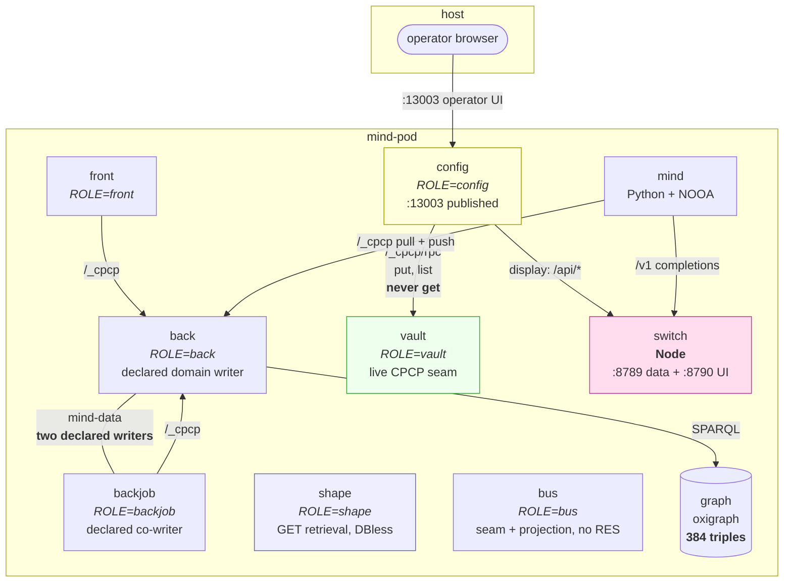
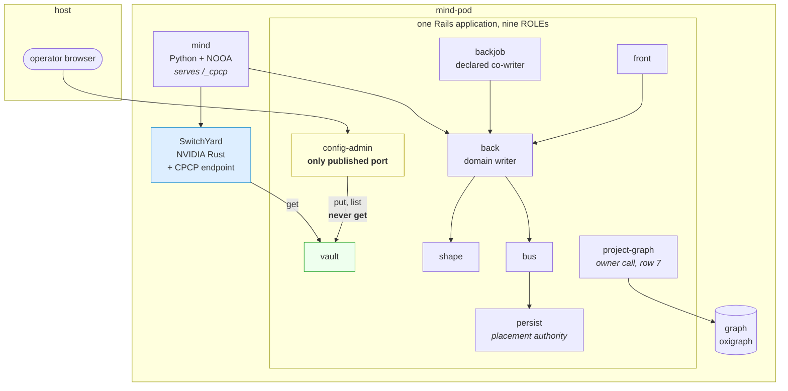
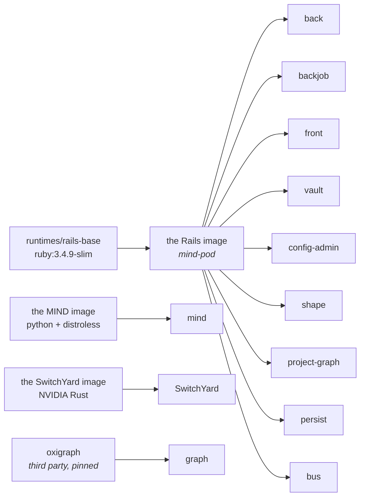
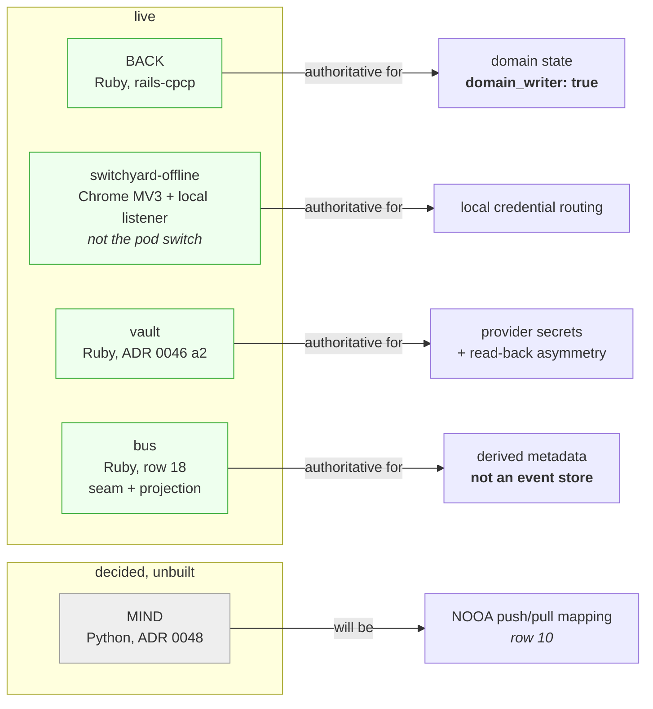
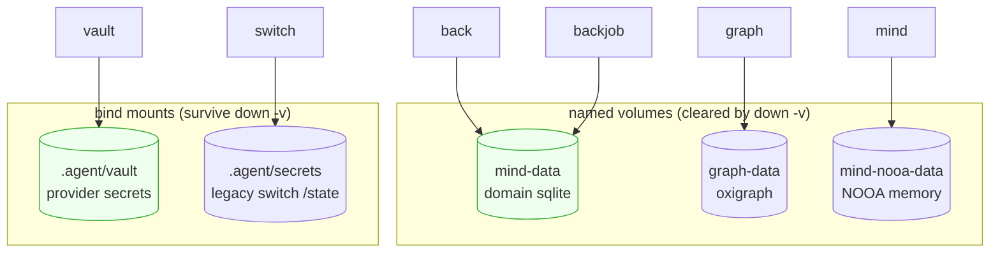
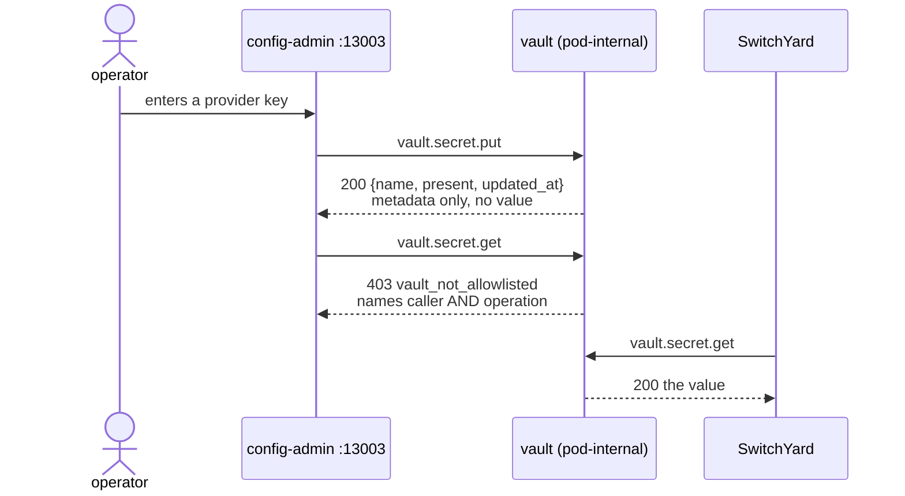

# Container topology

Measured 2026-09-03 at `0ed7db3`. Companion to
[`COVERAGE_GAPS.md`](COVERAGE_GAPS.md), which tracks the distance between the
two diagrams below. Row numbers cited here are that file's.

Governed by ADR [0046](../adr/0046-vault-is-not-the-config-ui.md),
[0047](../adr/0047-three-languages-container-boundaries-own-images.md),
[0048](../adr/0048-mind-serves-a-cpcp-seam.md),
[0049](../adr/0049-role-shape-serves-from-mounted-gems.md),
[0050](../adr/0050-switchyard-is-the-upstream-plus-bus-and-persist-roles.md),
[0051](../adr/0051-db-path-is-a-cpcp-effect.md),
[0056](../adr/0056-back-and-backjob-are-the-writers.md).

**Read this first:** ten containers exist today; twelve are the target. Every
diagram is labelled which. Nothing here describes something that runs unless it
says so.

**What changed since the 2026-08-31 revision of this page.** Four claims it made
are no longer true, and each was load-bearing:

| It said | Now |
|---|---|
| seven containers | **ten** — `config` (row 5), `shape` (row 6), `bus` (row 18) |
| `vault` has no inbound edge, built and idle | **live CPCP seam**, and `config-admin` is calling it (rows 50, 4) |
| `graph` is empty, 0 triples | **384 named-graph triples, 96 of 96 notes applied** (row 7 after gap 94) |
| only one of five seams has stated authority | **all five state it**; `seam_authority.json` is the register (row 20) |

---

## 1. What runs today (10 containers)

**What the diagram shows that the table cannot.** `vault` finally has an inbound
edge, and it is a CPCP one: rows 50 then 4 defined the contract before the caller
existed, so `config-admin` was written once, against methods, not against a REST
stand-in that later moved.

The `back`/`backjob` volume edge is **no longer red**. It was closed by
declaration, not by construction (ADR 0056): both are declared domain writers.
The physical arrangement did not change; the doctrine did.

**One port is published, not two.** `config` on `:13003` is the operator
surface; `switch :13001` retired with row 11 slice C (display moved to
config-admin, keys to vault). The container holding provider keys is no
longer host-reachable — which is the whole reason `vault` exists.

---

## 2. The target (12 containers)

**Nine of those exist.** Three are new: `project-graph`, `persist`, `bus`. `switch` becomes `SwitchYard` and changes
language (row 11, the last item in *next*).

The target's single published port is true since row 11 slice C retired
`switch :13001`.

---

## 3. Image lineage: 12 containers, 4 images

One image per **language lineage**, not per container (ADR 0047 amendment 1).
The cost is recorded and accepted: **hot-patch granularity is four units, not
twelve** — a `vault` fix rebuilds the image eight other containers run.

That cost is now paid in practice, not in theory: `config` and `vault` run the
same `mind-pod:latest` and differ only by `ROLE`. Row 4 shipped a vault-only
controller and rebuilt the image every Rails role runs.

---

## 4. The five CPCP seams — four live, one decided

CPCP began as one seam. It is becoming the universal interface, and that changes
what the old sentence meant.

**Gap 20 is closed.** `tooling/cpcp/seam_authority.json` is the register, and it
keeps LIVE and DECIDED-UNBUILT as separate lists so an unbuilt seam cannot be
read as a running one. A `kind=server` file in `cpcp_callers.json` must belong to
a live seam.

**Exactly one seam is a domain writer.** Every comment in the tree saying "the
`/_cpcp` seam is the ONLY write path" was written when there was one seam. That
sentence is false wherever it still appears; what it *means* is **BACK is the
only writer of domain state** — and that is now a machine-readable field
(`domain_writer`), not a sentence in a doc.

`front` and `runtimes/switch` are listed explicitly as **not a seam**. Naming the
non-seams is what stops the register from passing by omission.

All of them validate against a **language-neutral data contract**: the SHACL
shapes are the specification, and `grounding.rb:123` says so — the Ruby is a
deliberate hand-written reproduction because `mm-shacl-reader` is not wired
in-process, kept honest by `gate-shacl-conformance` running `pyshacl` plus a
drift checker.

So a second implementation does not need a spec written for it; it needs **the
TTL at runtime**, which is what `ROLE=shape` serves. That puts §7's `shape`
container on the critical path rather than beside it — it is row 6, in flight.

What the shapes do *not* define is **behaviour** — the never-raise envelope,
`operationId` and replay semantics, receipt and outcome cids, the method registry,
error taxonomy. That half is still Ruby-only, which is why `grammar/osi-level-8`
is frozen normative prose rather than deleted.

### HTTP status is a separate contract from the envelope

Row 49 ruled that a refusal carries **both** a non-200 status and a conforming
envelope — neither substitutes for the other. Row 109 froze that contract at
`tooling/cpcp/cpcp_http_status.json` with `implemented: false` and
`default_profile: legacy-all-200`.

Vault is the one seam already speaking it: `Vault::Api` maps refusals to 401 /
403 / 404 while returning `{ok:false, reason:, because:}`. That is why row 4
built `VaultCpcpController` instead of mounting the stock engine —
`RailsCpcp::RpcController` renders HTTP 200 at four sites, which would have
flattened every vault refusal into a success status.

---

## 5. Storage ownership

**Two writers on `mind-data` is no longer the red edge.** Gaps 1 and 2 closed as
a **declaration**, not a fix (ADR 0056): `back` and `backjob` are both declared
domain writers. `bin/backjob:37` still calls `Reconciliation.create!` directly;
what changed is that this is now the stated arrangement rather than a violation
of one. New work moved to rows 76-79.

The two mount kinds are a deliberate distinction:

| Kind | Survives `down -v` | Why |
|---|---|---|
| bind mount | yes | credentials are placed by a human and must not be destroyed by a teardown command (ADR 0046) |
| named volume | no | agent memory and projections are derived; `down -v` is *meant* to clear them |

`mind-nooa-data` is deliberately a **named** volume even though it is durable
state: NOOA ships `_is_virtiofs` detection because SQLite misbehaves on Docker
Desktop file sharing, and a named volume sidesteps the hazard a bind mount walks
into.

**Row 46 closed as amended: convert neither.** The proposal was to make the two
credential bind mounts named volumes for consistency. Measurement killed it —
`_is_virtiofs` is a SQLite lock/WAL detector, and neither credential store is
SQLite (`.agent/vault` is one encrypted JSON file written tmp+rename;
`.agent/secrets` is `sources.json`). Converting them would spend the one property
ADR 0046 paid for — surviving `down -v` — and buy nothing the detector cares
about. **Credential bind mounts are the stated exception**, and a gate holds
ADR 0046:85 to that.

### The refusal log is a new kind of thing on this diagram

`RefusalLog` (ADR 0054) writes an append-only JSONL of refusals plus a
**heartbeat that proves the observer ran** — paths from `CPCP_REFUSAL_LOG` and
`CPCP_REFUSAL_HEARTBEAT`. It is not domain state, not a projection, and not a
credential. It exists so that a boundary saying "no" is heard by something.

The heartbeat is the load-bearing half: **a missing heartbeat is not zero
refusals.** Verified — heartbeat absent exits 1, heartbeat present with an empty
log exits 0.

**Still nothing on this page WATCHES it.** There is no refusal-log workflow in
`.github/workflows`; the only things reading `CPCP_REFUSAL_HEARTBEAT` are four
plants. ADR 0054's final observation point has to sit outside the pod, and a CI
gate remains the only candidate we actually have. Nothing in §1 observes
anything.

When `DB_PATH` becomes a CPCP effect (ADR 0051), this diagram stops being a
deploy-time fact and becomes a **runtime, admitted** one — which is why the path
parameter must be a closed set (row 39) and must encode single-writer (row 43).
Both are prerequisites owned by `persist`, and both are still open.

---

## 6. Credential flow, and the asymmetry that makes it worth the container

As of row 4 this is a CPCP exchange, not REST. The methods did not change when
the transport did — rows 50 and 5 named them first.

**`config-admin` may write a secret and may never read one back.** That is the
property that earns `vault` its own container: compromising the only intended
host-published surface buys the ability to *replace* a credential, not to
*exfiltrate* one.

The refusal is **ahead of the store, not a filter on the response**. In
`Vault::Api#get` the allowlist authenticates on the line before the store is
read, so a refused caller's secret is never in memory. Row 4 preserved this by
leaving `Vault::Api` byte-identical and putting only transport in the new
controller.

It is refused twice, independently: `ConfigAdmin::VaultClient` has no `get` in
its `ALLOWED` map and returns `vault_not_allowlisted` without a network call, and
vault refuses again on arrival. Neither one is trusted to be the only check.

A container without its caller token, master key, store path, or with the pod
default `SECRET_KEY_BASE`, **refuses to boot**. `VAULT_CALLERS` and
`CONFIG_VAULT_TOKEN` both default to empty in compose, so the failure is
fail-closed by construction.

---

## 7. The containers, one at a time

Legend: **RUNS** = in `docker-compose.yml` today. **TARGET** = decided, not built.

### back — RUNS

`ROLE=back`. The Rails application serving `/_cpcp/rpc`, the write seam.
Mounts `mind-data`, holds the domain SQLite at `/data/mind_pod.sqlite3`, and
reaches `graph` over `MM_OXIGRAPH_URL`. Shape **enforcement** runs here,
in-process: `CpcpAdapter.wrap` calls `Grounding.closed_shape_violations` at
admission. That is why `ROLE=shape` is additive and cannot take shapes away from
BACK (ADR 0049) — moving enforcement out would put a network hop between a
request and the decision to admit it.

Authoritative for domain state, and the only seam with `domain_writer: true`.

### backjob — RUNS

`ROLE=backjob`. Reconciles note counts and completes L8 executions through
BACK's seam. Its completion path was dead until `5f5adb2` — `BACK_URL` was unset,
so it posted to loopback inside its own container and the failure was swallowed
by a rescued never-raise envelope that only printed.

**A declared co-writer, not a defect** (ADR 0056, rows 1 and 2 closed). It mounts
`mind-data` and writes `Reconciliation` rows directly, and that is the stated
arrangement. It does **not** mount `/_cpcp`.

### front — RUNS

`ROLE=front`. DB-less browser page; reads and acts through BACK over CPCP.
Listed in `seam_authority.json` under **not_a_seam**.

Until `0a7d67f` it drew the **entire** route table, including `mount
RailsCpcp::Engine`, and `extract/compose.yml` publishes it on host `13000`. The
write seam was reachable on the browser-facing container. "BACK is the sole
writer" was a convention about which URL clients were handed. Now `routes.rb`
gates by ROLE.

**Row 24 is closed and the answer was no.** Nothing was admitted through FRONT:
the FRONT overlay `/rails/db/mind_pod.sqlite3` is gone with the containers, the
image sqlite is the Aug 19 host snapshot rather than a FRONT overlay, and volume
`mind-pod-demo_mind-data` is BACK's. See [`GAP24_FRONT_CPCP.md`](GAP24_FRONT_CPCP.md).

### vault — RUNS, live, and called

`ROLE=vault`. Pod-internal, `expose: 3000`, **no published port**. Bind-mounts
`.agent/vault`; secrets encrypted with `MessageEncryptor` over a SHA-256-derived
key, written tmp+rename at `0600`, listed as metadata only.

**No longer idle.** Row 50 defined the CPCP contract, row 5 built the caller
against it, row 4 swapped the transport. `ROLE=vault` now draws exactly one
route — `POST /_cpcp/rpc` on `VaultCpcpController` — and the bespoke REST
surface that landed at `968d3cd` is retired. Three methods: `vault.secret.put`,
`vault.secret.list`, `vault.secret.get`.

It does **not** mount `RailsCpcp::Engine`. Stock `RpcController` renders HTTP 200
unconditionally, which would erase the non-200 half of row 49's ruling.

### config — RUNS

`ROLE=config`. The operator UI, published on `:13003`. Built as Rails, not split
out of Node (ADR 0047 amendment to 0046). Vault's first and only caller:
`put` and `list`, never `get`.

Also holds the **catalogue table** (row 15) at `config/llm_catalog.json`, served
display-only at `GET /catalog`. Prices are indicative. `tools: false` on
`qwen2.5:3b` and `llama3.2:1b` is observed failure, not vendor documentation.

What did **not** move here: `discovery` and `verify` stay on switch/router,
because they need `state.keys` and one of them bills. A catalogue is a table; the
other two are actions against providers.

### mind — RUNS

Python. Hosts NOOA as-published from the pinned vendored tree. Holds **no
provider credential and names no model** — cognition goes to SWITCH.

As of `030af95` its NOOA SQLite is bound through `DB_PATH` to the named volume
`mind-nooa-data`; unset, it keeps NOOA's `:memory:` default. The agent's system
prompt was rewritten in the same commit, because binding a store while telling
the model "you never persist anything" is an inconsistency in the cognition
layer, not in the docs. That prompt is now **pinned by digest** (row 99) so the
false claims gap 62 removed cannot silently return.

Still a CPCP **client only** — no `EXPOSE`, no inbound surface. Its seam is
decided and unbuilt (row 10).

### switch — RUNS → becomes SwitchYard (TARGET, row 11)

Today: Node, 17 `.mjs`, one process serving `:8789` (pod-internal data plane) and
`:8790` (pod-internal UI plane for config-admin's display, unpublished since
row 11 slice C). Keys live in vault (`switchyard.<vendor>`); `.agent/secrets`
keeps non-key routing state. Listed under **not_a_seam** — and it has no live seam entry of its own.
`switchyard-offline` is a **different component**: `gems/switchyard-offline/`,
a Chrome MV3 service worker plus a local listener, authoritative for local
credential routing. It is not this container, and not ADR 0050 SwitchYard.
Conflating the two is easy and wrong.

**Row 11 is unblocked** — rows 15, 18 and 19 were all decided 2026-09-02. It is
the last item in *next*. It is also the only named violation of the
three-language rule (row 12's gate lists it as a violation, not an exemption).

Target: ONLY NVIDIA Switchyard plus a `/_cpcp/rpc` endpoint. The upstream covers
routing, protocol translation and the data plane; keys move to `vault`, the UI to
`config-admin`. It inherits the row-83 obligation to refuse cache reuse it cannot
attest.

### graph — RUNS, and no longer empty

Oxigraph, digest-pinned, third-party. An RDF **projection**, never the authority.

**Measured after gap 94: 96 notes, 96 applied `vv_graph_projection_jobs`, 384
named-graph triples, 0 applied-without-graph.** The previous revision of this
page recorded 0 triples; that is the single most out-of-date fact it carried.

A default-graph `COUNT` still returns 0, which is correct rather than alarming —
the triples live in named graphs. A checker that counts the default graph will
report an empty store forever.

The two failure modes that hid this are both closed: `ensure_schema!` no longer
returns `false` for both "outbox not installed" and "schema check failed"
(row 69 split them, row 112 pinned the plant), and a SPARQL `{ok:false}` on emit
is now `RefusalLog graph_unreachable` **with restoration**, not `:applied`
(row 94).

---

### shape — RUNS

`ROLE=shape`. Pod-internal, `expose: 3000`, **not host-published**, no domain DB.
v1 landed at `d74a7d3` (row 6) against the design in
[`ROLE_SHAPE.md`](ROLE_SHAPE.md).

**v1 is retrieval, and only retrieval.** Three GET routes — `/_cpcp/up`,
`/_cpcp/shapes.json`, `/_cpcp/shapes/sha256:<digest>`. It does **not** mount
`RailsCpcp::Engine`, because the engine draws `POST rpc` and BACK's
`note.create` catalog; `POST rpc` is not in v1. This was the first shape HTTP
surface in the stack — `rails-osi-level-8` is an engine with no controllers and
no routes, and `rails-cpcp` draws only `rpc`, `cid.json`, `up`.

Retrieval is **content-addressed and verified**: the catalog groups
`ProfileCatalog.default` by file digest, and `turtle` re-hashes the file on disk
and refuses unless it matches the digest asked for. An unknown or mismatched
digest is a 404, never a different graph.

The named failure mode is closed by construction: **an empty catalog answers
`ok:false`** (`shape_catalog_empty`), not `ok:true` with an empty list.

`incomplete: true` is permanent for now and its reason is measured rather than
asserted — P2–P8/P10 absent from the pin; `Shapes::Level8.catalog` still an empty
stub; `contextframe.shacl.ttl` and `profile-9-ghis.ttl` on disk but absent from
`ProfileCatalog`; 52 TTL still in `osi-level-8-profiles` (gap 23); and ADR 0045's
publication, trust, compilation and compatibility services unbuilt. So the
container name still promises more than the container does, and says so in every
response.

ADR 0049 now names `check_role_shape.py` and `shape_spec.rb` in `enforced_by`
while staying `unenforced: true` — an explicit **partial**, which is the shape row
96 requires: a doc may be a `stand_in` but never satisfies `enforced_by`.

Enforcement did not move. `Grounding` and `CpcpAdapter` stay `ROLE=back`, and the
gate plants a violation to prove it — along with `engine-mount-fails`,
`empty-ok-true-fails`, `host-publish-fails`, and `false-reason-fails`, which
fails the build if the incompleteness reason is reverted to the wrong one the gap
row originally carried.

Serving shapes also makes `osi.example` externally visible — publishing a defect
rather than merely storing it. Row 22 built the mitigation ahead of the exposure:
`l8.context.list` resolves a historical `shape_id` to its successor on read,
reporting `historical | current | unresolved`, without rewriting stored rows. The
rename itself is still an unscheduled compatibility event (ADR 0060).

### project-graph — TARGET, and now an owner call rather than a build

The RDF projection worker. Reads authoritative state, writes derived RDF, and is
authoritative for nothing — which is exactly why it may write to `graph` directly
while `backjob` writing domain rows needed a declaration. Same *kind* of thing as
`backjob`; they differ in **write authority**, not in packaging.

**The projection is already wired and working inside BACK.** `project_on_save!`
is on `note.rb:20` and `reconciliation.rb:11` since `3cbd5bf`. Canonical
`MM_OXIGRAPH_URL` is **two** env settings (back, backjob); the third grep hit was
a comment. Extract sets the same two plus `VV_GRAPH_TRIPLE_GATE=strict`.

So row 7 is no longer "why is the graph empty" — it is populated. What remains is
an owner repartition: **whether projection stays in BACK or becomes its own
ROLE.** See [`GAP7_ENV.md`](GAP7_ENV.md).

### persist — TARGET, scoped

**Owns the write LOCATION, not the data** (ADR 0050 amendment). It never holds an
event. It is the authority over *where a store writes* — held in one place,
changed only by an admitted operation.

That is what let it survive row 44. "Persist owns physical storage" foundered on
**SQLite having no server**; placement authority is a job it can actually do. It
also unifies with ADR 0051: `persist` holds the closed path set (row 39) and
enforces the single-writer invariant (row 43).

Those two rows are the **only prerequisites left on the board**, and both are
blocked on a container that does not exist — which is the honest reason they have
not moved.

Open (row 48): the decision names the Event Store, while ADR 0051 makes `DB_PATH`
an effect for every Rails container and MIND. Whether `persist` is the placement
authority for *all* stores is the obvious reading but was not what was said.

### bus — RUNS

`ROLE=bus`. Pod-internal, unpublished, own `BusCpcpController` serving
`POST /_cpcp/rpc`. Landed `0ed7db3` (row 18). It does **not** mount
`RailsCpcp::Engine`: the engine draws `note.create`, which is BACK's, and stock
`RpcController` is all-200.

**It is not an event store.** `rails_event_store` was evaluated and **declined**
by the owner (row 17). The decisive argument was that RES would be a *second
event log*: ADR 0052 makes BACK's operation journal the only admission truth,
while RES doctrine makes its store the source of truth. Calling one of them
"metadata" would not have stopped it being a log.

So bus is a seam plus a **projection**: one method, `bus.projection.latest`,
retaining counts derived from BACK's journal into `bus_projections` (an additive
table — `create_table` plus an index, nothing altered).

Rows 72 and 73 are enforced rather than asserted. 73: nothing moves — the
`OperationRequest` row and its journal stay in BACK. 72: bus is async and a call
must complete with bus **down**, which the gate proves by planting a violation —
`back-dials-bus-fails` checks that `back_cpcp_client.rb`, `bin/backjob`,
`home_controller.rb` and the `rails_cpcp` initializer never dial it.

It introduces a **third kind of writer**. `domain_writers.json` previously had
`all_domain` (back) and `[]` (front, vault, config, shape); bus writes
`BusProjection` into `bus_projections` and nothing else — its own derived table,
not domain state and not the journal. Where that table lives is still persist's
call (row 16); the shared `DB_PATH` is a stand-in.

What is still open (row 9, narrowed): whether anything should CALL
`bus.projection.latest` on a schedule. Today nothing does, and that is recorded
rather than papered over with an invented caller.

**ADR 0050 still says BUS implements RES.** That sentence is now false and the
amendment is owed — the decision moved before the ADR text did.

## 8. What would change these diagrams

| If you decide | Diagram that changes |
|---|---|
| ~~bus owns the event repository (row 16)~~ | **decided.** §7: bus owns the log, `persist` owns placement |
| ~~vault's CPCP contract (row 50)~~ | **built.** §1 has the edge, §4 has the seam, §6 is CPCP not REST |
| ~~seam authority (row 20)~~ | **registered.** §4 is now three live and two decided, from `seam_authority.json` |
| ~~the backjob writer boundary (row 2)~~ | **declared.** §5's red edge is the correct arrangement (ADR 0056) |
| ~~credential mounts become named volumes (row 46)~~ | **refused.** §5 keeps both bind mounts; the exception is stated |
| ~~`ROLE=shape` v1 lands (row 6)~~ | **built.** §1 has nine containers; §4's "TTL at runtime" is served, retrieval only |
| the upstream replaces switch (row 11) | §1 drops to one published port; §2 and §3 lose the Node service |
| projection becomes its own ROLE (row 7) | §7 `project-graph` becomes RUNS; §1 gains a container |
| `persist` is the placement authority for EVERY store (row 48) | §5 and §7 `persist` widen; rows 39 and 43 unblock |
| MIND's seam is built (row 10) | §4 moves `MIND` from decided to live |
| where the final observation point lives (ADR 0054) | a diagram that does not exist yet — nothing in §1 watches |
