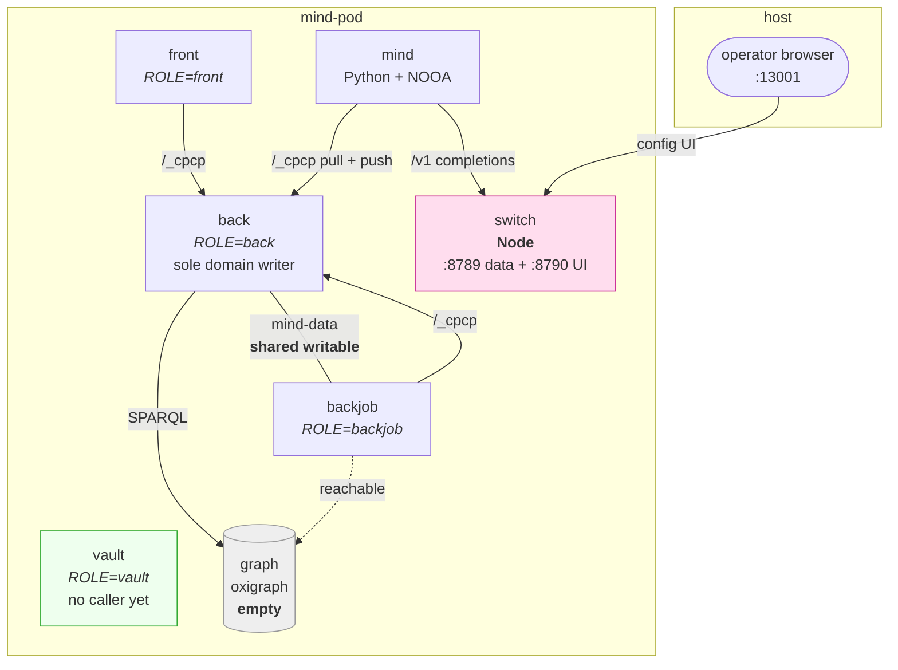
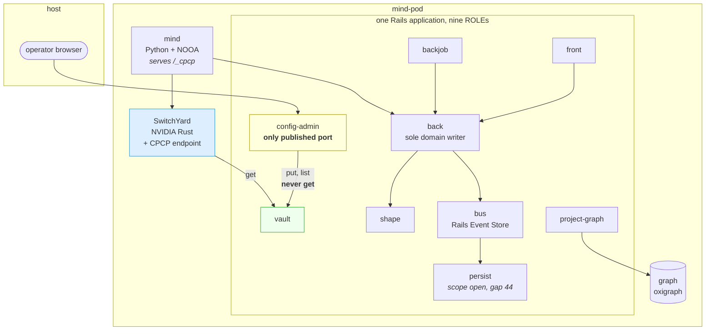
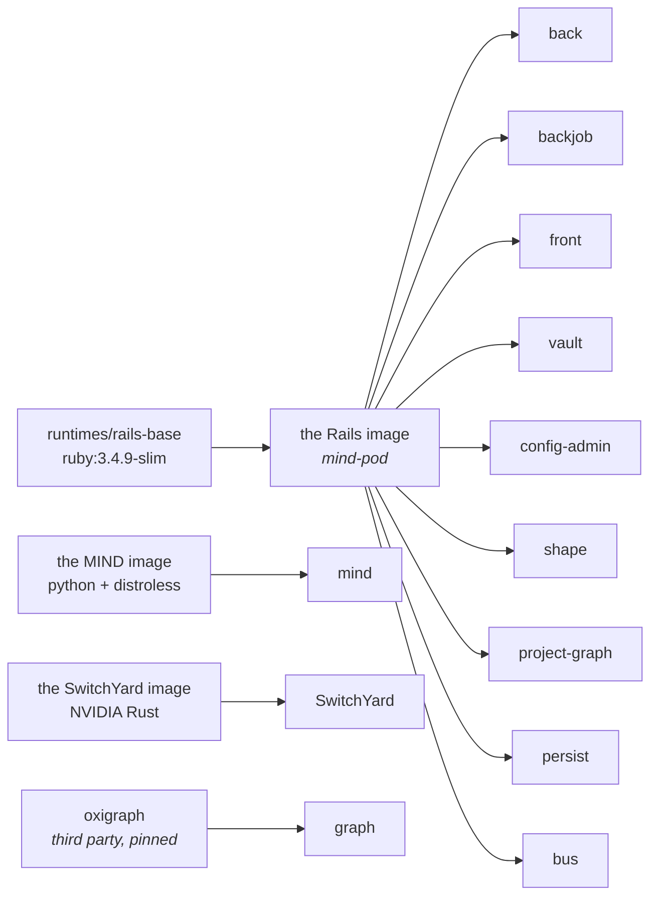
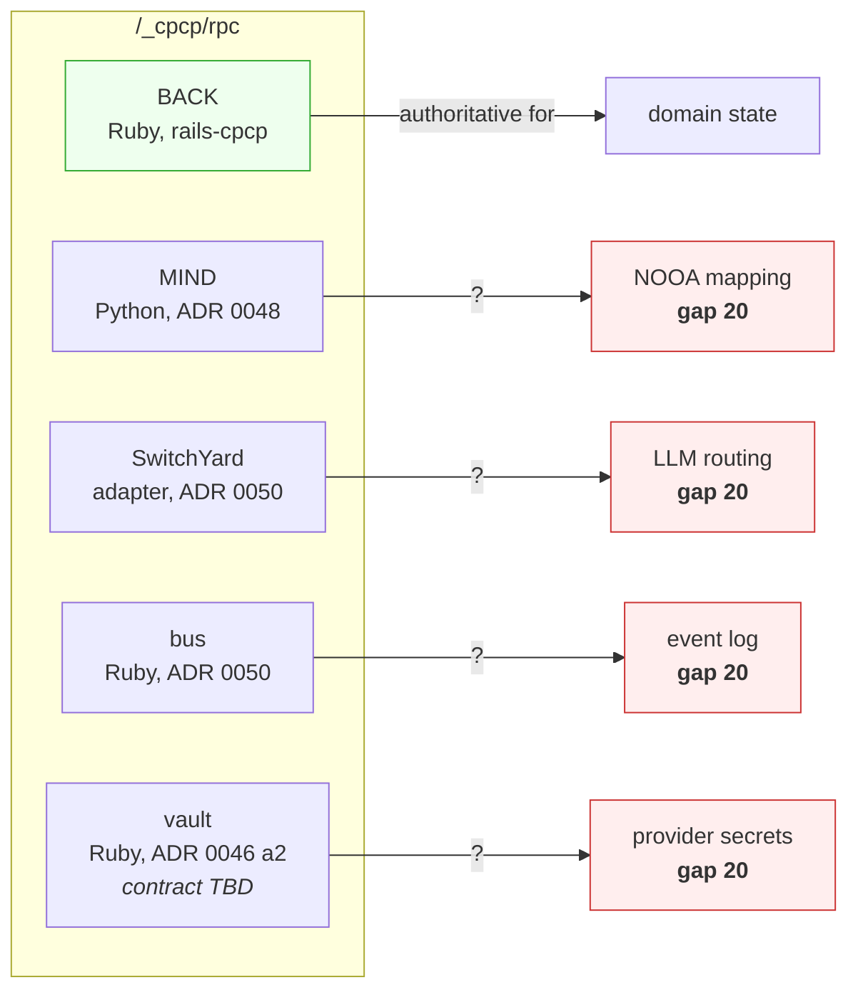
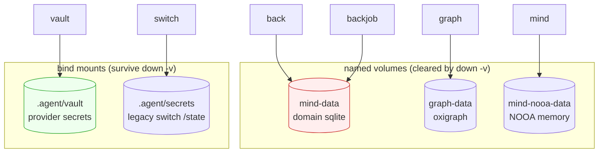
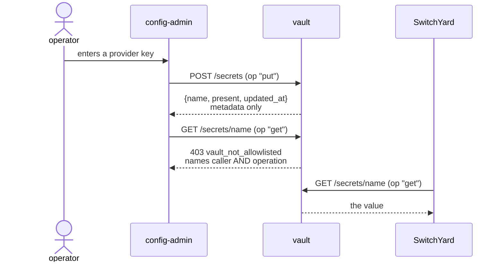

# Container topology

Measured 2026-08-31 at `fb41771`. Companion to
[`COVERAGE_GAPS.md`](COVERAGE_GAPS.md), which tracks the distance between the
two diagrams below. Row numbers cited here are that file's.

Governed by ADR [0046](../adr/0046-vault-is-not-the-config-ui.md),
[0047](../adr/0047-three-languages-container-boundaries-own-images.md),
[0048](../adr/0048-mind-serves-a-cpcp-seam.md),
[0049](../adr/0049-role-shape-serves-from-mounted-gems.md),
[0050](../adr/0050-switchyard-is-the-upstream-plus-bus-and-persist-roles.md),
[0051](../adr/0051-db-path-is-a-cpcp-effect.md).

**Read this first:** seven containers exist today; twelve are the target. Every
diagram is labelled which. Nothing here describes something that runs unless it
says so.

---

## 1. What runs today (7 containers)

**What the diagram shows that the table cannot.** `back` and `backjob` are joined
by a shared writable volume, not by a protocol — that edge is gap 1. `vault` has
no inbound edge at all: it is built and idle (gap 4). `switch` is the only
container the host can reach, and it is also the one holding every provider key.

---

## 2. The target (12 containers)

Seven of those exist. Five are new: `config-admin`, `shape`, `project-graph`,
`persist`, `bus`. `switch` becomes `SwitchYard` and changes language.

---

## 3. Image lineage: 12 containers, 4 images

One image per **language lineage**, not per container (ADR 0047 amendment 1).
The cost is recorded and accepted: **hot-patch granularity is four units, not
twelve** — a `vault` fix rebuilds the image eight other containers run.

---

## 4. The five CPCP seams

CPCP began as one seam. It is becoming the universal interface, and that changes
what the old sentence meant. `vault` joined the list when ADR 0046 amendment 2
made its inbound edge a CPCP contract.

**Only one of the five has stated authority.** Every comment in the tree saying
"the `/_cpcp` seam is the ONLY write path" was written when there was one seam.
That sentence is now false wherever it appears; what it *means* is **BACK is the
only writer of domain state**. The other three must each say what they are
authoritative for, or "sole writer" degrades into folklore (gap 20).

All four validate against a **language-neutral data contract**: the SHACL shapes
are the specification, and `grounding.rb:123` says so — the Ruby is a deliberate
hand-written reproduction because `mm-shacl-reader` is not wired in-process, kept
honest by `gate-shacl-conformance` running `pyshacl` plus a drift checker.

So a second implementation does not need a spec written for it; it needs **the
TTL at runtime**, which is what `ROLE=shape` serves. That puts §7's `shape`
container on the critical path rather than beside it.

What the shapes do *not* define is **behaviour** — the never-raise envelope,
`operationId` and replay semantics, receipt and outcome cids, the method registry,
error taxonomy. That half is still Ruby-only (gap 14), which is why
`grammar/osi-level-8` is frozen normative prose rather than deleted.

---

## 5. Storage ownership

**Two writers on `mind-data` is the red edge** (gaps 1 and 2). "BACK is the sole
writer" is doctrine, not construction: `backjob` mounts the same file and
`bin/backjob:37` writes `Reconciliation` rows straight to it.

The two mount kinds are a deliberate distinction:

| Kind | Survives `down -v` | Why |
|---|---|---|
| bind mount | yes | credentials are placed by a human and must not be destroyed by a teardown command (ADR 0046) |
| named volume | no | agent memory and projections are derived; `down -v` is *meant* to clear them |

`mind-nooa-data` is deliberately a **named** volume even though it is durable
state: NOOA ships `_is_virtiofs` detection because SQLite misbehaves on Docker
Desktop file sharing, and a named volume sidesteps the hazard a bind mount walks
into (gap 46).

### The refusal log is a new kind of thing on this diagram

`RefusalLog` (ADR 0054, landed `fb41771`) writes an append-only JSONL of refusals
plus a **heartbeat that proves the observer ran** — paths from `CPCP_REFUSAL_LOG`
and `CPCP_REFUSAL_HEARTBEAT`. It is not domain state, not a projection, and not a
credential. It exists so that a boundary saying "no" is heard by something.

The heartbeat is the load-bearing half: **a missing heartbeat is not zero
refusals.** Verified — heartbeat absent exits 1, heartbeat present with an empty
log exits 0.

But nothing on this page WATCHES it. ADR 0054's final observation point has to
sit outside the pod, and the honest reading is that a CI gate is the only
candidate we actually have. Nothing in §1 observes anything.

When `DB_PATH` becomes a CPCP effect (ADR 0051), this diagram stops being a
deploy-time fact and becomes a **runtime, admitted** one — which is why the path
parameter must be a closed set (gap 39) and must encode single-writer (gap 43).

---

## 6. Credential flow, and the asymmetry that makes it worth the container

**`config-admin` may write a secret and may never read one back.** That is the
property that earns `vault` its own container: compromising the only
host-published surface buys the ability to *replace* a credential, not to
*exfiltrate* one. Enforced by construction in `Vault::Api`, not by a controller
check — the allowlist is `(token -> identity -> operation)`, and a caller
presenting a valid token for an operation it does not hold is refused.

A container without its caller token, master key, store path, or with the pod
default `SECRET_KEY_BASE`, **refuses to boot**.

---

## 7. The containers, one at a time

Legend: **RUNS** = in `docker-compose.yml` today. **TARGET** = decided, not built.

### back — RUNS

`ROLE=back`. The Rails application serving `/_cpcp/rpc`, the write seam.
Mounts `mind-data`, holds the domain SQLite at `/data/mind_pod.sqlite3`, and
reaches `graph` over `MM_OXIGRAPH_URL`. Shape **enforcement** runs here,
in-process: `CpcpAdapter.wrap` calls `Grounding.closed_shape_violations` at
admission. That is why `ROLE=shape` is additive and cannot take shapes away from
BACK (ADR 0049) — moving enforcement out would put a network hop between a
request and the decision to admit it.

Authoritative for domain state. The only container that is.

### backjob — RUNS

`ROLE=backjob`. Reconciles note counts and completes L8 executions through
BACK's seam. Its completion path was dead until `5f5adb2` — `BACK_URL` was unset,
so it posted to loopback inside its own container and the failure was swallowed
by a rescued never-raise envelope that only printed.

**Still a second physical writer** (gaps 1, 2): mounts `mind-data`, and
`bin/backjob:37` calls `Reconciliation.create!` directly. Owner decision — remove
the write, or declare a co-writer with an explicit multi-writer protocol.

### front — RUNS

`ROLE=front`. DB-less browser page; reads and acts through BACK over CPCP.

Until `0a7d67f` it drew the **entire** route table, including `mount
RailsCpcp::Engine`, and `extract/compose.yml` publishes it on host `13000`. The
write seam was reachable on the browser-facing container. "BACK is the sole
writer" was a convention about which URL clients were handed. Now `routes.rb`
gates by ROLE. Whether anything was ever admitted through FRONT is gap 24 — a
question about durable state, still unanswered.

### vault — RUNS (idle)

`ROLE=vault`. Landed `968d3cd`. Pod-internal, no published port. Bind-mounts
`.agent/vault`; secrets encrypted with `MessageEncryptor` over a SHA-256-derived
key, written tmp+rename at `0600`, listed as metadata only.

Nothing calls it yet (gap 4). Its first caller is `config-admin` — and ADR 0046
amendment 2 made vault's inbound edge a **CPCP contract (TBD)**, which must be
defined BEFORE `config-admin` exists or the caller gets written twice (gap 50).
The bespoke REST surface landed at `968d3cd` is what changes.

### mind — RUNS

Python. Hosts NOOA as-published from the pinned vendored tree. Holds **no
provider credential and names no model** — cognition goes to SWITCH.

As of `030af95` its NOOA SQLite is bound through `DB_PATH` to the named volume
`mind-nooa-data`; unset, it keeps NOOA's `:memory:` default. The agent's system
prompt was rewritten in the same commit, because binding a store while telling
the model "you never persist anything" is an inconsistency in the cognition
layer, not in the docs.

Still a CPCP **client only** — no `EXPOSE`, no inbound surface. ADR 0048 makes it
serve a seam; what it needs is the TTL at runtime, which is `ROLE=shape`'s job
(gap 13 reframed — the shapes ARE the language-neutral spec).

### switch — RUNS → becomes SwitchYard (TARGET)

Today: Node, 17 `.mjs`, one process serving `:8789` (pod-internal data plane) and
`:8790` (config UI, published as `13001`). Holds every provider key in
`.agent/secrets`. **The only host-reachable container.**

Target: ONLY NVIDIA Switchyard plus a `/_cpcp/rpc` endpoint. The upstream covers
routing, protocol translation and the data plane; keys move to `vault`, the UI to
`config-admin`. Three things unsettled: `catalog`/`discovery`/`verify` have no
described upstream equivalent (gap 15); the endpoint's language versus
do-not-fork (gap 18); and the upstream calls itself pre-alpha and not for
production while we would put the whole LLM plane on it (gap 19).

### graph — RUNS (empty)

Oxigraph, digest-pinned, third-party. An RDF **projection**, never the authority.

**Measured, not inferred (gap 7): 0 triples, no named graphs.** A second
candidate reason sits alongside the missing env var — `ensure_schema!` returns
`false` for both "outbox not installed" and "schema check failed", and projection
proceeds without durability either way (U6, flagged highest urgency in
`docs/reviews/2026-08-31a`).

### config-admin — TARGET, next

`ROLE=config`. The operator UI, the admin API, the credential-entry workflow, and
**the only published port in the pod**. Built as Rails, not split out of Node
(ADR 0047 amendment to 0046). Writes to `vault` and can never read back.

### shape — TARGET

`ROLE=shape`. Serves shape **services** — publication, retrieval, trust metadata,
compilation, compatibility evidence — from gems already in the image, in the
period before `app-shacl-store` is assembled (ADR 0049).

There is **no shape HTTP surface anywhere in the stack today**:
`rails-osi-level-8` is an engine with no controllers and no routes, and
`rails-cpcp` draws only `rpc`, `cid.json`, `up`. This is the first. Serving
shapes also makes `osi.example` externally visible (gap 22) — publishing a
defect rather than merely storing it.

### project-graph — TARGET

The RDF projection worker. Reads authoritative state, writes derived RDF, and is
authoritative for nothing — which is exactly why it may write to `graph` directly
while `backjob` writing domain rows is a defect. Same *kind* of thing as
`backjob`; they differ in **write authority**, not in packaging.

**Correction (gap 7): the projection is already WIRED.** `project_on_save!` is on
`note.rb:20` and `reconciliation.rb:11` since `3cbd5bf`. The compose header
saying "not wired yet" is stale. Canonical `MM_OXIGRAPH_URL` is **two** env
settings (back, backjob); the third grep hit was the comment. Extract now
sets the same two. This container is still not what stands between us and a
populated graph — `ROLE=project-graph` is an owner repartition, not the empty
store. See [`GAP7_ENV.md`](GAP7_ENV.md).

### persist — TARGET, scoped

**Owns the write LOCATION, not the data** (ADR 0050 amendment). It never holds an
event. It is the authority over *where a store writes* — held in one place,
changed only by an admitted operation.

That is what let it survive gap 44. "Persist owns physical storage" foundered on
**SQLite having no server**; placement authority is a job it can actually do. It
also unifies with ADR 0051: `persist` holds the closed path set (gap 39) and
enforces the single-writer invariant (gap 43), instead of those being scattered
across callers.

Open (gap 48): the decision names the Event Store, while ADR 0051 makes `DB_PATH`
an effect for every Rails container and MIND. Whether `persist` is the placement
authority for *all* stores is the obvious reading but was not what was said.

### bus — TARGET

`ROLE=bus`. Rails Event Store with a CPCP interface. `rails_event_store` has
**zero hits** in this repository — this is adoption of new infrastructure, not
relocation of something we run (gap 17).

RES **is** a repository, not a transport: it appends to a durable log and layers
pub/sub on top. **Gap 16 is closed — the bus owns the event log's content;
`persist` decides where it is written.** Memo `2026-08-30d` said the bus must not
own the durable repository; that judgement was reasoning about a Rust router that
*also* held every provider credential, and the premise moved when the bus moved
into Rails.

**"The SWITCH ecosystem" means the `SwitchYard` container together with
`ROLE=bus`** — not RES inside SwitchYard, which would put Ruby in the Rust
container.

And it is **not** the observer ADR 0054 needs. A durable store retains; it does
not watch. Under ADR 0047 amendment 1 the bus shares one Rails image with eight
other roles, so a bad Rails deploy takes out the refuser and the recorder
together — and a refusal *about the bus* has nowhere to go. See ADR 0054.

---

## 8. What would change these diagrams

| If you decide | Diagram that changes |
|---|---|
| ~~bus owns the event repository (gap 16)~~ | **decided.** §7: bus owns the log, `persist` owns placement |
| the 8 UNCLEAR contract changes (gap 68) | §7 `graph` — U6 may be why it is empty |
| `persist` is the placement authority for EVERY store (gap 48) | §5 and §7 `persist` widen |
| vault's CPCP contract (gap 50) | §4 gets its second answered arrow; §6 changes shape |
| MIND's seam authority (gap 20) | §4 |
| the backjob writer boundary (gap 2) | §5's red edge disappears |
| the upstream's pre-alpha risk is refused (gap 19) | §2 keeps a Node service; §3 keeps a fourth language |
| where the final observation point lives (ADR 0054) | a diagram that does not exist yet — nothing in §1 watches |
