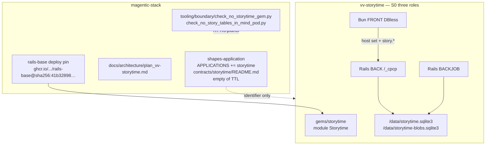
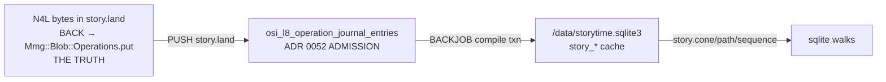

# vv-storytime — a private StoryTime overlay on magentic-stack

This file is the contract an implementation has to keep, and the list
of things it must refuse to build. Same job as
[`plan_vv-perch.md`](plan_vv-perch.md) (R1–R4, gates that plant
failures) and [`plan_sharedai_canvas.md`](plan_sharedai_canvas.md)
(C1–C7, overlay `ruby bin/check-overlay.rb`). CANONICAL wins for
application shape; this file wins for N4L / SST semantics on this
overlay.

It is **not** a gem in magentic-stack. It is **not** medallion. It is
**not** a Go sidecar. It is **not** MCP-SST.

Source research (one URL, by design):
`magentic-market-ai/docs/research/Storytime.md` →
[markburgess/SSTorytime](https://github.com/markburgess/SSTorytime).
Upstream LICENSE is **Apache-2.0**. Treat as FOLLOW THEM *research*.
R9 (do not fork into this overlay or into `upstreams/`) is a
**product policy of this plan**, not an ADR 0038/0062 charter
entailment: 0038 closes *this* repo's gems; 0062 FOLLOW THEM applies
to `upstreams/` in magentic-stack. An overlay may cite Apache-2.0
fixtures with NOTICE; it may not vendor a patched Go tree.

There is **no** existing storytime / N4L / SST code in magentic-stack
(measured 2026-09-16: zero matches under `gems/`, `runtimes/`,
`tooling/`, `docs/`). Greenfield overlay.

Prior art in this repo that sets the shape:

- [`CANONICAL.md`](CANONICAL.md) — Bun FRONT (DBless) + Rails BACK +
  Rails BACKJOB; FRONT talks to BACK only over CPCP; one image per
  container; artifact named by digest.
- [ADR 0063](../adr/0063-application-overlays-consume-the-substrate.md)
  — an application is a separate repo; it does not live in `gems/`;
  contracts live with the application; persistence is per-application;
  no shared multi-app database.
- [ADR 0038](../adr/0038-magentic-stack-is-closed.md) — a gem here has
  no other home. `vv-storytime` is therefore **not**
  `gems/vv-storytime`, even though the name starts with `vv-`.
- [ADR 0004](../adr/0004-osi-level-8-the-cyborg-layer.md) — Context =
  PULL, Effect = PUSH, closed SHACL, `/_cpcp` is the only public RPC
  seam. SSTorytime's "cyborg enhancement" maps here, not to MCP.
- [ADR 0069](../adr/0069-linkml-is-the-shape-source-artifacts-are-reified.md)
  — a shape is authored once in LinkML; SHACL is a reified artifact;
  Ruby `Grounding.closed_shape_violations` is the live refusal path.
- [ADR 0047](../adr/0047-three-languages-container-boundaries-own-images.md)
  + [ADR 0072](../adr/0072-front-is-bun.md) — Python=MIND, Rust=SWITCH
  (target; Node today is a named violation), Ruby/Rails=BACK/BACKJOB,
  Bun=FRONT. A Go SSTorytime container would be a **fourth language**.
- [ADR 0052](../adr/0052-the-journal-is-the-only-admission-truth.md) /
  [0064](../adr/0064-a-request-turned-away-is-not-an-admission.md) —
  N4L upload is an admitted Effect, or a refused request. Never a
  silent DB write.
- [ADR 0056](../adr/0056-back-and-backjob-are-the-writers.md) /
  [0057](../adr/0057-three-kinds-of-state.md) — BACK admits; BACKJOB
  compiles the cache.
- [ADR 0032](../adr/0032-mmg-graph-grounding-is-enforced.md) /
  [0034](../adr/0034-native-oxigraph-backs-sparql.md) — oxigraph is a
  grounded projection of Rails rows. ADR 0011 is **superseded** by
  0032 (`enforced_by: []` on 0011); cite 0032 for the live refusal
  `ungrounded_graph`.
- [ADR 0070](../adr/0070-never-persist-datasets-and-the-inverted-observer-seam.md)
  — if FRONT ever shows a shared story view, it carries bindings, not
  values. Blocked on a proven actor (ADR
  [0040](../adr/0040-the-session-is-one-entity.md)).
- [`plan_vv_medallion_memory.md`](plan_vv_medallion_memory.md) +
  [`MemoryGaps.md`](MemoryGaps.md) — the memory product is **not**
  StoryTime. `EngineBinding.bind!` currently refuses
  `engine_not_landed`. Do not wait on M1–M10.

Overlay-gate ancestor (copy FROM-digest / no-`:latest` posture from
a **public** FLOOR consumer; do not cite private
`shared-ai-space-app/bin/check-overlay.rb` as a file this review can
verify):
`https://github.com/laquereric/hello-magentic` `bin/check-template.rb`
(`runtimes/rails-base/FLOOR.json` `consumers.known`). StoryTime's
R-plants are new code in `vv-storytime/bin/check-overlay.rb`.

---

## Overview

Mark Burgess's SSTorytime is a Semantic Spacetime story graph: N4L
notes compile into a four-STType graph (Near / LeadsTo / Contains /
Property), stored in SQL as a **rebuildable cache** of the N4L
source. It is explicitly not RDF and not Topic Maps. It is a "cyborg
enhancement" — the human remains in control of rummaging; an LLM
take-it-or-leave-it summary is the thing it exists to refuse.

**`vv-storytime` is a private GitHub overlay application** (owner
assumed `laquereric`; visibility private) that consumes magentic-stack
and reimplements those SST semantics in Rails on the overlay's own
sqlite. It does not enter magentic-stack `gems/`. It does not run
Burgess's Go+Postgres as a pod container. CPCP is the cyborg seam,
not MCP-SST. N4L source is the truth (content-addressed blob, written
**inside** `story.land`); the application sqlite is a working graph;
the journal is admission.

The product is rummaging, not summarising. Tidying is a learning
strategy. Stories that do not form an obvious story are incomplete.

**Fidelity cut (FRONT).** An SST orbit is a neighbour list, not a
2-D graph. A `GraphOrbit` ghis kind is refused. The named artifact
is the N4L blob.

---

## Background & Motivation

### What SSTorytime actually is

Upstream ([SSTorytime README](https://github.com/markburgess/SSTorytime),
`docs/N4L.md`, `docs/API.md`, `docs/Storytelling.md`,
`docs/http_server.md`, `docs/pathsolve.md`):

- **N4L** — Notes For Learning / Narrative for Loading / Network for
  Logical inference. Small Unicode note language. Implicit typing from
  relation names, not OWL classes.
- **Four STTypes** for every arrow, signed for orientation:
  `0` Near/similarity, `1` LeadsTo, `2` Contains, `3` Property/express.
  Similarity is directionless (`0 = -0`).
- **SQL is a cache.** N4L source is the truth; rebuild anytime.
  Upstream tables: `node`, `arrowdirectory`, `arrowinverses`,
  `nodearrownode`, `pagemap`, `contextdirectory` (plus `lastseen`).
  Node rows also carry adjacency arrays `im3..ie3` — a Postgres trick
  this overlay will **not** copy (R11).
- **Go API** — `Vertex` / `Edge`, `GetFwdPathsAsLinks`,
  `GetFwdConeAsNodes`, `SolveNodePtrs`, `HubJoin`, pathsolve with loop
  corrections, eigenvector centrality.
  `GetDBNodePtrMatchingNCCS` is Name / Chapter / Context / Sequence
  (+ arrows). That is what `nccs` means in this plan.
- **Tools** — N4L compiler, `searchN4L`, `text2N4L`, `removeN4L`,
  `notes`, `pathsolve`, `graph_report`, `http_server` (four views:
  ad-hoc orbit, page notes, story/sequence, path solutions).
- **Context sets** — CFEngine-descended but "backwards": contexts are
  sensory tags on notes, not selection criteria.
- **Sequence mode** — `_sequence_` context → reserved `then` arrows.
- **Arrow vocab** in `SSTconfig/`.
- **MCP-SST** — a Claude proxy. Prior art. **Not** the Magentic seam.

Burgess claims this plan takes seriously:

1. Knowledge is process/story, not an ontology of things.
2. Implicit typing from relation names, not OWL classes.
3. The SQL store is a cache; N4L source is the truth; rebuild anytime.
4. LLM summarization on ingest destroys the thing you wanted to remember.
5. Stories that do not form an obvious story are incomplete.
6. "Tidying is a learning strategy."

### Why this is an overlay, not a gem

ADR 0063: this repo is the substrate; an application is a separate
repo. `shapes-application` currently names four family members:

```ruby
# gems/shapes-application/lib/shapes-application.rb
APPLICATIONS = %w[mind-pod folkcoder-pod translation-board-pod sharedai-space].freeze
```

`gems/shapes-application/README.md` family layout is already stale
(omits `translation-board-pod`, prints an old APPLICATIONS array).
MS-1's README edit is load-bearing, not cosmetic.

A fifth application costs a slot: identifier `storytime` and an empty
`contracts/storytime/README.md`. Application shapes stay in the
**overlay** repo (ADR 0063 amendment 2026-09-04). Persistence is
per-application (amendment 2026-09-04b). mind-pod's schema currently
lists **65** `create_table` calls
(`runtimes/mind-pod/app/db/schema.rb`); ADR 0063 named 64. That count
is the substrate app's, not a schema an overlay inherits.

The overlay's own schema is **exactly ten** `create_table :story_*`
plus one FTS5 virtual table that does **not** count toward that
integer (see §Schema). osi-l8 journal tables and blob tables also
live in the overlay process; the count gate is prefix-scoped
`story_%`.

ADR 0038: magentic-stack is closed. `vv-perch`, `vv-canvas`, `vv-blob`
are substrate gems. `vv-storytime` is a **product**. The repo keeps
the owner's name `vv-storytime`. The slot is `storytime` so
`APPLICATIONS` does not grow a `vv-` gem-shaped identifier. MS-1
plants `gems/vv-storytime/` as a substrate failure (R7) because the
repo name is the affordance for `mkdir gems/vv-storytime`.

Existing overlay repos referenced in-tree (they do not live here):
`shared-ai-space-app`, `app-oriented-translation`,
`magentic-market-ai-site`, `hello-magentic`
(`runtimes/rails-base/FLOOR.json` `consumers.known`).

### Why Rails+sqlite, not Go+Postgres

1. **ADR 0047 forbids a fourth language without a carve-out.**
   `tooling/compose/language_rule.json` exemptions are third-party
   datastores we ship no source into. SST is the product. Overlay Go
   is gated in `vv-storytime/bin/check-overlay.rb`, **not** in
   substrate `check_language_rule.py` (that checker only reads
   `runtimes/mind-pod/docker-compose.yml`,
   `runtimes/mind-pod/app/extract/compose.yml`, and `SOURCE_TREES`
   under `runtimes/`; `LANG_EXT` has no `.go`).
2. **SST already treats SQL as a cache rebuilt from N4L.** Maps onto
   blob + sqlite + journal without remainder.
3. **ADR 0063: the application owns its schema.** Ten `story_*`
   tables in the overlay BACK, not mind-pod's 65, not a tenant column.

---

## Goals & Non-Goals

### Goals

- A private overlay that lets a single steward land N4L, rummage
  neighbour-lists / notes / sequences / paths, and rebuild the graph
  from source at any time.
- Closed CPCP wire: ten `story.*` **product** methods plus a named
  **host** set the front-base skeleton already calls. FRONT never
  calls `blob.*` / `board.*`.
- Overlay-local LinkML → committed SHACL for every `story.*` request
  (and responses). `Grounding.register_twin` for overlay-required keys.
- Path and cone walks take `depth` and `node_budget`. Always.
- FRONT is Bun, DBless, catalog-hosted. Orbit = neighbour list.
- Overlay gate `ruby bin/check-overlay.rb` that plants R1–R12.

### Non-goals

- Becoming the substrate's Rails app, or mounting into mind-pod.
- A `gems/vv-storytime` component in magentic-stack.
- Running Burgess's Go binary, his Postgres schema, or MCP-SST.
- Pretending oxigraph *is* the story graph. S0–S6 compose no GRAPH.
- LLM summarization, silent `text2N4L` overwrite, Platinum fold.
- Waiting on medallion M1–M10, `memory.*`, or botdataengine.
- Multi-steward identity. No `NOT NULL actor_id` on `story_*`.
- Public multi-tenant StoryTime. S0–S7 bind the compose network.
- Forking SSTorytime into `upstreams/` or a patched Go tree.
- Inventing ghis kinds (`GraphOrbit` refused).
- DuckDB as a second cache (`IntegrateDuckDb_3_paths.md`).
- A schema-only substrate gem plus overlay UI (perch split).

---

## Load-bearing refusals

A refusal that lives only in this file is a memo. Each R names:
**assertion**, **file read**, **plant**.

### R1 · No Go runtime in the pod

**Assertion.** Overlay compose services, Dockerfiles, and image
build context contain no Go toolchain and no `.go` sources.

**File.** `vv-storytime/bin/check-overlay.rb` reads overlay
`compose.yml` / `docker-compose.yml`, `Dockerfile.thin`,
`Dockerfile.front`, and the build context excluding
`fixtures/` comments. It does **not** call
`tooling/compose/check_language_rule.py` (population is substrate
`runtimes/` only; `LANG_EXT` has no `.go`; it never inspects
`FROM golang`).

**Plant.** `bin/plant-overlay.rb r1` writes `go.mod` and a
`FROM golang:` line; `check-overlay.rb` must fail with
`fourth_language_refused`. Cleanup restores.

Reason on the wire if a Go sidecar is ever proposed as a CPCP
method: `fourth_language_refused`.

### R2 · No Postgres

**Assertion.** Overlay `Gemfile.lock` has no `pg`;
`config/database.yml` adapter is `sqlite3`; compose has no
`postgres` service.

**File.** `bin/check-overlay.rb`.

**Plant.** `r2` inserts `gem "pg"` and `adapter: postgresql`;
check fails `postgres_refused`.

### R3 · SST graph is not oxigraph / RDF

**Assertion.** Walk implementation files
(`gems/storytime/lib/storytime/cone.rb`, `path.rb`) do not
`require "mmg/graph"` / `Mmg::Graph::Execute` / call SPARQL.
S0–S6 compose has no `graph` service and `MM_OXIGRAPH_URL` is unset.

**File.** Overlay allowlist: those two files may `require` only
`storytime/node`, `storytime/link`, ActiveRecord. AST/const scan,
not a `SPARQL` string grep.

**Plant.** `r3` inserts `Mmg::Graph::Execute.query(...)` into
`cone.rb`; check fails `sst_is_not_rdf`.

S7 may publish via `entry:` (ADR 0032). Walks still do not read it.

### R4 · No MCP-SST as the agent path

**Assertion.** Overlay tree has no `mcp`, `mcp2sst`, `N4Lquery`
binary, and compose has no MCP service.

**File.** `bin/check-overlay.rb` scans overlay (not fixtures
PROVENANCE URLs).

**Plant.** `r4` adds `bin/mcp2sst`; check fails `mcp_sst_refused`.

### R5 · No LLM summarization on ingest

**Assertion.** `story.land` handler and N4L compiler do not
`require` SWITCH / LLM clients (`openai`, `anthropic`,
`switchyard`, `Net::HTTP` to SWITCH). Allowlist: compiler is
pure Ruby + ActiveRecord + `Mmg::Blob::Operations`.

**File.** `gems/storytime/lib/storytime/land.rb`, `compiler.rb`.

**Plant.** `r5` inserts a SWITCH HTTP call in `land.rb`; check
fails `ingest_summary_refused`.

### R6 · N4L compiler is not an LLM job

**Assertion.** Same allowlist as R5 on `compiler.rb` specifically.

**Plant.** `r6` inserts an LLM round-trip in `compiler.rb`; check
fails `n4l_compiler_is_not_an_llm`.

### R7 · Not a magentic-stack `gems/` component

**Assertion (substrate).** `gems/vv-storytime/` does not exist.
`check_closed.py` is **insufficient**: a gemspec whose
`homepage` is magentic-stack **passes**. MS-1 adds
`tooling/boundary/check_no_storytime_gem.py`: fail if
`gems/vv-storytime/` exists or any gemspec `name` is
`vv-storytime` / `storytime`.

**Plant (substrate).** `plant_no_storytime_gem.py` mkdir
`gems/vv-storytime/` + a gemspec pointing at magentic-stack;
check must fail. (A homepage-clean gemspec is the real footgun.)

**Assertion (overlay).** Overlay does not contain a nested
`gems/vv-storytime` that claims to be a substrate gem. Engine
path is `gems/storytime` (no `vv-` prefix on the engine).

**Plant (overlay).** `r7` mkdir `gems/vv-storytime`; overlay check
fails `storytime_is_not_a_substrate_gem`.

### R8 · No shared mind-pod schema / no multi-app tenant DB

**Assertion (substrate).** `runtimes/mind-pod/app/db/schema.rb`
and mind-pod migrations contain no `create_table "story_`.
MS-1 adds `tooling/boundary/check_no_story_tables_in_mind_pod.py`.

**Plant (substrate).** Insert `create_table "story_nodes"` into a
copy of schema.rb; check fails `shared_schema_refused`.

**Assertion (overlay).** Domain path is `/data/storytime.sqlite3`,
not `/data/mind_pod.sqlite3`. `store_bindings.json` closed set.

**Plant (overlay).** `r8` sets `DB_PATH=/data/mind_pod.sqlite3`;
check fails `shared_schema_refused`.

### R9 · Do not fork SSTorytime (product policy)

**Assertion (overlay).** No `vendor/SSTorytime`, no
`upstreams/sstorytime`, no `.gitmodules` URL containing
`markburgess/SSTorytime`. Fixtures may copy `Mary.in` / arrow
names with NOTICE (Apache-2.0 §4).

**Plant (overlay).** `r9` git-submodule the Go repo; check fails
`sst_fork_refused`.

**Assertion (substrate).** `check_closed.py`
`ALLOWED_SUBMODULE_URLS` does not include SSTorytime. Adding it
is a separate ADR, not a silent pin.

**Plant (substrate).** Optional: plant that URL into
`ALLOWED_SUBMODULE_URLS` in a copy; a dedicated check is *not*
required in MS-1 if overlay R9 exists. MS-1 documents the
allowlist must not grow this URL without an ADR.

### R10 · Do not wait on medallion M1–M10

**Assertion.** Overlay `Gemfile` / `Gemfile.lock` do not depend on
`mmg-medallion` or `vv-medallion_memory`. `story.land` does not
call `EngineBinding.bind!`.

**File.** `bin/check-overlay.rb` Gemfile + land.rb const scan.

**Plant.** `r10` adds `EngineBinding.bind!` to land.rb; check
fails `storytime_blocked_on_medallion`.

### R11 · No array-on-row adjacency

**Assertion.** Overlay migrations have no columns `im3`, `im2`,
`im1`, `in0`, `il1`, `ic2`, `ie3`. `story_page_maps` has no
unconstrained `layout_json`.

**Plant.** `r11` adds `t.json :im3`; check fails
`array_on_row_refused`.

### R12 · `text2N4L` is a draft, never a silent overwrite

**Assertion.** No code path updates `story_n4l_sources.bytes` /
blob bytes for an existing digest. Digests are content-addressed
(ADR 0012): different bytes → different digest. A `text2N4L`
helper, if added later, may `blob.put` a **new** draft and return
it; it may not call `story.land` without a steward PUSH.

**File.** `compiler.rb`, `land.rb`. No `UPDATE vv_blobs`.

**Plant.** `r12` updates blob bytes in place; check fails
`n4l_source_overwritten`.

---

## Key Decisions

| # | Decision | Rationale |
|---|---|---|
| **D1** | Private overlay repo `vv-storytime`, not a magentic-stack gem. | ADR 0038 + 0063. Owner named the repo; keep it. |
| **D2** | Slot identifier **`storytime`**. Engine gem **`Storytime`** at overlay path `gems/storytime`. | `APPLICATIONS` never carries `vv-`. MS-1 plants `gems/vv-storytime/` in the substrate. |
| **D3** | Reimplement SST in Rails on overlay sqlite. No Go, no Postgres. | R1, R2, cache doctrine. |
| **D4** | N4L source is the truth (blob). sqlite is a rebuildable cache. Journal is admission. | Burgess + ADR 0012 + 0052 + 0057. |
| **D5** | BACK admits `story.land` / `story.remove`. BACKJOB compiles. | ADR 0056 named split. |
| **D6** | Path/cone/sequence/report run against `story_*`. S0–S6: no oxigraph. S7: overlay-owned graph or skip. | R3, ADR 0032/0034, ADR 0063 per-app persistence. |
| **D7** | Wire is two closed sets: (1) ten `story.*` product methods; (2) **host** methods the front-base skeleton already calls (`front.bind`, `front.path.act`, `ui.surface.put`, `ui.surface.get`, `ui.action`, `ui.catalog.get`). Do **not** register `blob.*` or `board.*`. FRONT persist is `scheduleSave` in `stage-storytime.js` → overlay FRONT proxy → `story.land`. BACK still `Mmg::Blob::Operations.put/get` internally. | `runtimes/front-base/src/skeleton.js` is closed (CANONICAL §4.3.1). It always POSTs `/canvas/front/bind`, `/canvas/ui/surface`, `/canvas/ui/action`, `/canvas/front/path`. `scheduleSave` is **not** a skeleton export (`FrontSkeleton` has no such key; vv-canvas implements it in `editor.js` and POSTs `blob.put` — we must not copy that). |
| **D8** | S1 arrow seed is the closed table in §Arrow seed (includes `written by`, `then`, `note`, `example of`). Adding an arrow is a migration. | Compiles Mary.in. Chinese fixtures are **not** S2. OQ5 is closed. |
| **D9** | `story_links` is a real table. No `im3..ie3`. | R11. |
| **D10** | FRONT is Bun. Orbit = neighbour list. Named artifact = N4L blob. `GraphOrbit` refused. Stage editor is a **native textarea** in `stage-storytime.js`, not ghis-21 `Input` (`Input` only in `#taskSlot` `task.form`). | CANONICAL §8: do not compile Plane A into ghis-19. |
| **D11** | Single-steward. Seed one `Vv::Base::Actor` (`role_key=steward`). `front.bind` still runs, returns `actor_proven: false`. No `NOT NULL actor_id` on `story_*`. | ADR 0040; skeleton `bindIfNeeded` is closed (CANONICAL §4.3.1). |
| **D12** | Do not wait on medallion. S8 optional and later. | R10. |
| **D13** | Creating the private GitHub repo is an operator step: `gh repo create laquereric/vv-storytime --private --yes`. | Not a substrate commit. `--yes` is current `gh` CLI (`--confirm` is stale). |
| **D14** | Overlay `database.yml` copies mind-pod: `pragmas: { journal_mode: wal }`, `timeout: 5000`. | ADR 0056; mind-pod already declares this (`runtimes/mind-pod/app/config/database.yml`). Do not invent `busy_timeout` as a separate PRAGMA name. |
| **D15** | Shapes are overlay-local LinkML + committed SHACL. `CpcpAdapter.wrap` on every PUSH. `Grounding.register_twin` for required keys. **Not** added to substrate `boundary_manifest.json` / `seam_authority.json` / `cpcp_callers.json` / `tooling/linkml/sources.json` / `shapes-application` TTL. | ADR 0069 + 0063 amendment + FLOOR `p11_enforced`. |
| **D16** | Domain sqlite `/data/storytime.sqlite3`. Blob sqlite `/data/storytime-blobs.sqlite3` (`MMG_BLOB_PATH`). Overlay `store_bindings.json` is the closed set. osi-l8 + vv-blob/mmg-blob migrations run on the overlay host (`db:prepare` at boot). | ADR 0063 co-tenancy; do not bind `mind_pod.sqlite3`. |
| **D17** | `nptr` is occurrence identity: `n:` + hex(sha256(chapter \|\| 0x00 \|\| occurrence_index \|\| 0x00 \|\| s)). Same string twice → two nodes. | Upstream `NodePtr` is `(chan,l)`, not string equality. |
| **D18** | S0 compose is **three overlay roles only** (FRONT, BACK, BACKJOB). No MIND, SWITCH, GRAPH, VAULT, NATS. | S0 receiver is a steward at the host. MIND PULL is a later OV. |
| **D19** | S0–S7 bind compose-internal / `127.0.0.1`. No published BACK port on a multi-app VPS. The box is **not** a security boundary. | ADR 0063 co-tenancy (`31.97.8.47` already hosts two apps). |
| **D20** | Overlay LICENSE is owner-chosen. `fixtures/` that copy upstream Source are Apache-2.0-notice-bearing from S1. Do not copy Go sources. "SSTorytime"/"N4L" are attribution, not an implication Burgess ships this overlay (Apache §6). | Issue 20. |
| **D21** | Rebuild wipe+insert is one SQLite transaction, serialised per chapter. BACKJOB sets `current_source_id` in **that same txn** (on BACKJOB allowlist). Compile failure rolls back; previous cache **and** previous pointer remain; journal `failed` not `completed`. Replay of same `operationId` with different body → `operation_id_replay_mismatch`. | One writer, one commit. No compile-ack seam across processes. |
| **D22** | FTS5 tokenizer `unicode61`. No unaccent extension. OV-2 preflight `PRAGMA compile_options` must list `ENABLE_FTS5`. FTS5 virtual table does **not** count toward the ten `create_table`. | No unaccent in this tree; rails-base does not install ICU. |
| **D23** | Agent (`session.actor_kind=agent`) `story.land` / `story.remove` refused `agent_land_requires_review` until a HumanReview FlowStep exists. Steward FRONT land is the human. | CANONICAL freeze: HumanReview cannot be skipped. S0 does not compose MIND; the refusal is named so composing MIND later cannot silently enable Effect. |
| **D24** | Plane B uses rails-osi-level-8 `ui.*` catalog (`task.form` / `task.confirm` / `task.empty` / `task.error`). No mmg-acia pin. No ACIA documents authored in this overlay until a later OV that also moves FLOOR. Seed Mission / Vision / Journey as `vv-base` rows in OV-1. | rails-base GEM_HOME already has rails-osi-level-8 and vv-base; mmg-acia is **not** in `runtimes/rails-base/Dockerfile`. |
| **D25** | `/` replaces Core homepage (rummage host) but **keeps** Core chrome: brand, digest line, `#taskSlot`, `front.bind`. OQ7 closed as this default. | Product overlay, same move as Shared AI Space. |

---

## Proposed Design

### Overlay vs substrate (S0 topology)



S0 does **not** compose MIND, SWITCH, GRAPH, VAULT, or NATS.
Those planes are a later OV when a MIND PULL is a journey. Do not
compose MIND without VAULT (ADR 0046).

### Closed env (S0)

| Name | Value | Notes |
|---|---|---|
| `DB_PATH` | `/data/storytime.sqlite3` | domain + osi-l8 journal |
| `MMG_BLOB_PATH` | `/data/storytime-blobs.sqlite3` | `Mmg::Blob::Operations.path` |
| `BASE_IRI` | `https://storytime.local` | rails-cpcp |
| `FRONT_BIND_TOKEN` | steward token | skeleton `data-front-token` |
| `BACK_CPCP_ORIGIN` | compose BACK origin, no trailing slash | `runtimes/front-base/src/server.js` `backOrigin()`; unset → `back_origin_missing` |
| `ROLE` | `back` \| `backjob` | BACKJOB has no ingress |
| `MM_OXIGRAPH_URL` | **unset** | S0–S6 |

### Mission / vision / journeys

**Mission (one sentence, also a `vv-base` Mission row in OV-1).**
A person remains in control of rummaging their own notes as stories;
the machine rebuilds a searchable graph from N4L and never summarises
it away.

**Vision.** A change arrives as a chapter the steward landed, a view
the host already knows how to draw, and a journal row that says who
landed it.

**Journeys** (seeded `vv-base` Journey rows; do not replace Review):

| Journey | Over time |
|---|---|
| **Enter** | pair, `front.bind`, land on the rummage host |
| **Land** | author N4L, shape-gate, admit, rebuild chapter |
| **Rummage** | neighbour-list / notes / sequence / path, budgeted |
| **Tidy** | edit N4L, re-land; cache wiped+rebuilt in one transaction |
| **Review** | inspect a digest / path receipt / refusal |

**User-flows** (`inspect · collect · decide · confirm`):

| Flow | Steps | Task kinds |
|---|---|---|
| Land a chapter | collect → confirm | `task.form` (chapter, n4l) → `task.confirm` |
| Remove a chapter | confirm | `task.confirm` |
| Solve a path | collect → inspect | `task.form` (from, to, depth, node_budget) → `task.preview` |
| Empty / error | — | `task.empty` / `task.error` |

Agent-authored N4L is **not** a flow in S0–S7 (`agent_land_requires_review`).

### Three stores, three jobs



A graph full of rows whose chapter has no `story_n4l_sources` row is
`cache_without_source` (required population: zero).

---

## Schema (exactly ten `create_table :story_*`)

**Count gate.** `bin/check-overlay.rb` counts
`create_table :story_` / `create_table "story_` in overlay
migrations. **Must equal 10.** It also requires exactly one
`create_virtual_table :story_nodes_fts`. FTS5 does **not** count
toward 10. The matcher is prefix `story_`, so `osi_l8_*` and
`vv_blobs` do not trip it.

Register the count in the **same commit as the migration** (OV-2).
A counter that finds zero is an error; do not register in S0.

Integer PKs everywhere. `nptr` is a unique text column, not the PK
(rebuilds re-use nptr strings; rowids churn).

```ruby
# gems/storytime/db/migrate/20260916000001_create_story_tables.rb
class CreateStoryTables < ActiveRecord::Migration[8.0]
  def change
    create_table :story_chapters do |t|
      t.string  :name, null: false
      t.integer :current_source_id  # FK added after story_n4l_sources
      t.integer :compiler_generation, null: false, default: 0
      t.datetime :rebuilt_at
      t.text    :evc_json           # cached report; null until S5
      t.datetime :evc_at
      t.timestamps
    end
    add_index :story_chapters, :name, unique: true

    create_table :story_n4l_sources do |t|
      t.string  :digest, null: false          # "sha256:" + hex; uniqueness is per chapter (a filing)
      t.references :chapter, null: false,
                   foreign_key: { to_table: :story_chapters, on_delete: :cascade }
      t.string  :journal_ref, null: false     # OperationRequest cid
      t.datetime :uploaded_at, null: false
      t.timestamps
    end
    add_index :story_n4l_sources, [:chapter_id, :digest], unique: true
    add_index :story_n4l_sources, :journal_ref, unique: true
    # Bytes are unique in vv_blobs. A source row is a filing (this chapter
    # cites this digest). Global unique(digest) would forbid landing Mary.in
    # under two chapter names.

    add_foreign_key :story_chapters, :story_n4l_sources,
                    column: :current_source_id, on_delete: :nullify

    create_table :story_arrows do |t|
      t.integer :sttype, null: false          # 0..3
      t.integer :sign,   null: false          # -1 or +1; STType 0 uses +1 only
      t.string  :long_name, null: false
      t.string  :short_alias, null: false
      t.timestamps
    end
    add_index :story_arrows, :short_alias, unique: true
    add_index :story_arrows, :long_name, unique: true
    add_check_constraint :story_arrows, "sttype BETWEEN 0 AND 3", name: "story_arrows_sttype"
    add_check_constraint :story_arrows, "sign IN (-1, 1)", name: "story_arrows_sign"

    create_table :story_arrow_inverses do |t|
      t.references :fwd_arrow, null: false, foreign_key: { to_table: :story_arrows }
      t.references :bwd_arrow, null: false, foreign_key: { to_table: :story_arrows }
      t.timestamps
    end
    add_index :story_arrow_inverses, :fwd_arrow_id, unique: true
    add_index :story_arrow_inverses, :bwd_arrow_id, unique: true

    create_table :story_contexts do |t|
      t.string :name, null: false
      t.timestamps
    end
    add_index :story_contexts, :name, unique: true

    create_table :story_nodes do |t|
      t.string  :nptr, null: false
      t.text    :s,    null: false
      t.references :chapter, null: false, foreign_key: { to_table: :story_chapters, on_delete: :cascade }
      t.integer :occurrence_index, null: false
      t.boolean :seq, null: false, default: false
      t.timestamps
    end
    add_index :story_nodes, :nptr, unique: true
    add_index :story_nodes, [:chapter_id, :occurrence_index], unique: true

    create_table :story_links do |t|
      t.references :from_node, null: false, foreign_key: { to_table: :story_nodes, on_delete: :cascade }
      t.references :arrow,     null: false, foreign_key: { to_table: :story_arrows }
      t.references :to_node,   null: false, foreign_key: { to_table: :story_nodes, on_delete: :cascade }
      t.integer :sttype, null: false          # denorm of arrows.sttype; CHECK 0..3
      t.float   :weight, null: false, default: 1.0
      t.timestamps
    end
    add_index :story_links, [:from_node_id, :sttype]
    add_index :story_links, [:to_node_id, :sttype]
    add_index :story_links, :arrow_id
    add_check_constraint :story_links, "sttype BETWEEN 0 AND 3", name: "story_links_sttype"
    add_check_constraint :story_links, "weight >= 0", name: "story_links_weight"

    create_table :story_link_contexts do |t|
      t.references :link,    null: false, foreign_key: { to_table: :story_links, on_delete: :cascade }
      t.references :context, null: false, foreign_key: { to_table: :story_contexts }
      t.timestamps
    end
    add_index :story_link_contexts, [:link_id, :context_id], unique: true

    create_table :story_page_maps do |t|
      t.references :chapter, null: false, foreign_key: { to_table: :story_chapters, on_delete: :cascade }
      t.integer :page,    null: false, default: 1
      t.integer :line_no, null: false
      t.references :node, foreign_key: { to_table: :story_nodes, on_delete: :nullify }
      t.string  :kind, null: false            # item | note | blank
      t.timestamps
    end
    add_index :story_page_maps, [:chapter_id, :page, :line_no], unique: true
    add_check_constraint :story_page_maps, "kind IN ('item','note','blank')", name: "story_page_maps_kind"
    # NO layout_json. R11: unconstrained JSON is the array-on-row affordance.

    create_table :story_aliases do |t|
      t.string :name, null: false
      t.references :chapter, null: false, foreign_key: { to_table: :story_chapters, on_delete: :cascade }
      t.references :node, null: false, foreign_key: { to_table: :story_nodes, on_delete: :cascade }
      t.integer :ordinal, null: false, default: 1   # $alias.1
      t.timestamps
    end
    add_index :story_aliases, [:chapter_id, :name, :ordinal], unique: true
    # @title is per-chapter. Global unique(name, ordinal) would fail a second
    # chapter that also uses @title (Mary.in). nptr stays globally unique
    # (hash already includes chapter).
  end
end
```

FTS5 (does not count toward 10):

```ruby
# 20260916000002_create_story_nodes_fts.rb
class CreateStoryNodesFts < ActiveRecord::Migration[8.0]
  def up
    execute <<~SQL
      CREATE VIRTUAL TABLE story_nodes_fts USING fts5(
        s,
        content='story_nodes',
        content_rowid='id',
        tokenize='unicode61'
      );
    SQL
    # Keep FTS in sync. content= external-content requires triggers.
    execute <<~SQL
      CREATE TRIGGER story_nodes_fts_ai AFTER INSERT ON story_nodes BEGIN
        INSERT INTO story_nodes_fts(rowid, s) VALUES (new.id, new.s);
      END;
      CREATE TRIGGER story_nodes_fts_ad AFTER DELETE ON story_nodes BEGIN
        INSERT INTO story_nodes_fts(story_nodes_fts, rowid, s)
          VALUES('delete', old.id, old.s);
      END;
      CREATE TRIGGER story_nodes_fts_au AFTER UPDATE ON story_nodes BEGIN
        INSERT INTO story_nodes_fts(story_nodes_fts, rowid, s)
          VALUES('delete', old.id, old.s);
        INSERT INTO story_nodes_fts(rowid, s) VALUES (new.id, new.s);
      END;
    SQL
  end
  def down
    execute "DROP TABLE IF EXISTS story_nodes_fts"
  end
end
```

**`story_links.sttype` denorm.** AR `before_validation` copies
`arrow.sttype`. If the copied value ≠ `arrow.sttype` at insert,
refuse `arrow_sttype_mismatch`. No UPDATE of `sttype` without
changing `arrow_id`.

**`story.remove` cascade.** Nullify `current_source_id` first
(circular FK to sources), then destroy the chapter. `ON DELETE
CASCADE` from chapter → nodes, page_maps, sources, aliases;
nodes → links. Application-local only (R8). BACK admits the
remove; BACKJOB performs the destroy in one txn (same writer as
compile — do not CASCADE-delete cache rows from a BACK request
thread).

**WAL / timeout** (copy mind-pod, do not pioneer):

```yaml
# overlay config/database.yml
default: &default
  adapter: sqlite3
  pool: 5
  timeout: 5000
  pragmas:
    journal_mode: wal
production:
  primary:
    <<: *default
    database: <%= ENV.fetch("DB_PATH", "db/storytime.sqlite3") %>
```

**Writer split** (`config/domain_writers.json` in the overlay;
overlay `bin/check-overlay.rb` compares BACKJOB Ruby writes to this
file — substrate `check_two_writers.py` is hardcoded to
`runtimes/mind-pod/app` and will not see the overlay):

| Role | Writes |
|---|---|
| BACK | `story_n4l_sources` (insert filing), `story_chapters` (**name only** on first land), osi-l8 journal, blobs via `Mmg::Blob::Operations` |
| BACKJOB | compiled cache (`story_nodes`, `story_links`, `story_link_contexts`, `story_page_maps`, `story_aliases`, `story_contexts`); `story_chapters.current_source_id` / `rebuilt_at` / `compiler_generation` / `evc_*`; chapter destroy on `story.remove` |
| FRONT | nothing |

`current_source_id` is set **in the same BACKJOB SQLite
transaction** as the cache insert (one writer, one commit,
pointer and rows agree). There is no compile-ack RPC and no
mind-pod `l8.execution.complete` analogue. A PULL of
`story.source` while `current_source_id` is null returns
`cache_not_ready` (compile pending) — it does not empty the
editor.

`story_arrows` / `story_arrow_inverses` are seed/migration only.

**store_bindings.json** (overlay closed set):

```json
{
  "adr": "0051 analog — overlay",
  "stores": [
    {
      "id": "domain",
      "path": "/data/storytime.sqlite3",
      "volume": "storytime-data",
      "env": "DB_PATH",
      "rw": ["back", "backjob"],
      "ro": []
    },
    {
      "id": "blob",
      "path": "/data/storytime-blobs.sqlite3",
      "volume": "storytime-data",
      "env": "MMG_BLOB_PATH",
      "rw": ["back", "backjob"],
      "ro": []
    }
  ]
}
```

BACKJOB reads blobs to compile; BACK writes them. osi-l8 migrations
from `gems/rails-osi-level-8/db/migrate/` run on the domain file
because the overlay host enables the engine migration path
(`db:prepare` at boot — ADR 0063 translation-board lesson).

---

## nptr (occurrence identity)

Upstream `NodePtr` is composite `(chan, l)` — **occurrence**, not
string identity. This overlay does not use `(chan, l)`. Divergence,
documented:

```
nptr = "n:" + hex(SHA256( chapter_utf8 + 0x00 + ascii(occurrence_index) + 0x00 + s_utf8 ))
```

`occurrence_index` is the 0-based order of item emissions in the
N4L file (each item on a statement, including chain members, is an
emission). Two lines `please` in one chapter → two nodes, two
nptrs. Aliases point at nptr, not at `s`.

**Fixture (OV-3 parser, OV-4 land):**

```
-dup
please (note) first
please (note) second
```

Expect `COUNT(*) = 2` where `s = 'please'`. A collapse to one row
fails `nptr_is_occurrence`. Rebuild of the same file yields the
same two nptrs (deterministic).

---

## N4L S2 grammar (frozen)

S2-accepted. Anything else is `n4l_construct_deferred` (parse
succeeds as a skip with a warning list) or `n4l_parse_failed`
(hard fail). Compiler is pure:
`(text, arrow_directory) → {nodes, links, page_map, aliases, deferred[]}`
or a refusal. No I/O.

```
file       := { line NL }
line       := comment | chapter | context | extend | prune | stmt | blank
comment    := ('#' | '//') REST
chapter    := '-' NAME                 # rest of line is chapter name
context    := ':'+ csv ':'+            # csv is comma-separated; '|' FORBIDDEN in S2
extend     := '+' '::' csv '::'
prune      := '-' '::' csv '::'
stmt       := [alias] item { rel item } [inline_note]
alias      := '@' IDENT                # may share the line with item (Mary.in @title)
item       := BARE | DQ | SQ | continuation | ref
continuation := '"'                    # previous first item of last stmt
ref        := '$' IDENT '.' INT        # $title.1
            | '$' INT                  # $1 $2 previous items
rel        := '(' RELNAME ')'          # RELNAME matched to long_name OR short_alias
inline_note := rel item                # ordinary chain; (note) is just STType 3
blank      := SP*
csv        := NAME { ',' NAME }
```

**Sequence.** While context set contains `_sequence_`, after each
stmt whose first item is a **new emission** (not continuation, not
`$ref`), emit a `then` link from the previous sequence head to this
first item. `" ` continuation does not start a sequence step
(upstream: only new items).

**S2 deferred (named, not silent drop):**

| Construct | Reason |
|---|---|
| `\|` inside `:: … ::` | `n4l_construct_deferred` (OR-bar contexts) |
| annotation markers `% = * >` inside a paragraph | `n4l_construct_deferred` |
| reserved `has url` / `has image` | `n4l_construct_deferred` |
| HubJoin / hyperlink many-to-one | `hub_join_deferred` (S5) |
| `NOTE TO SELF ALLCAPS` as a to-do node | `n4l_construct_deferred` |
| weight syntax on a link | none in S2; `weight` always `1.0` |

Unknown `(rel)` → `arrow_not_in_directory` (hard fail). Unbalanced
quotes → `n4l_parse_failed`. `|` is deferred, not a hard fail, so a
file that is otherwise Mary.in-shaped still lands; the OR-bar line
is skipped and listed in `deferred[]`.

**S2 fixture: Mary.in** (verbatim subset of upstream N4L.md;
Apache-2.0 NOTICE in `fixtures/PROVENANCE`):

```
-poetry

 :: cutting edge, high brow ::

 +:: _sequence_ , poem ::

@title Mary had a little lamb  (note) Had means possessed not gave birth to
              "                (written by) Mary's mum

       Whose fleece was white as snow
       And everywhere that Mary went

       The lamb was sure to go        (note) SatNav invented later

 -:: _sequence_ ::

 $title.1 (example of) Nursery rhyme
```

S2 acceptance: this file compiles; search `q=lamb` hits; four
`then` links along the verse; `(written by)` and `(example of)`
resolve. **Chinese fragments are not S2 fixtures** (they need
`eh`/`hp`/`pe`/`ph`/`he`, which are not in the S1 seed; adding
them is a later migration + fixture, not a silent directory
growth).

---

## Arrow seed (S1, closed, D8)

Compiler matches `RELNAME` against `long_name` **or** `short_alias`
(trim, case-sensitive as written).

| sttype | sign | long_name | short_alias |
|---|---|---|---|
| 1 | +1 | then the next is | then |
| 1 | -1 | previous | prior |
| 1 | +1 | written by | written |
| 1 | -1 | wrote | wrote |
| 1 | +1 | leads to | lt |
| 1 | -1 | arriving from | af |
| 1 | +1 | causes | cf |
| 1 | -1 | is caused by | cb |
| 2 | +1 | contains | c |
| 2 | -1 | is within | in |
| 2 | +1 | example of | ex |
| 2 | -1 | has example | hasex |
| 3 | +1 | note/remark | note |
| 3 | -1 | is a note or remark about | isnotefor |
| 0 | +1 | near | nr |
| 0 | +1 | similar to | sim |

Inverses: `(then, prior)`, `(written, wrote)`, `(lt, af)`,
`(cf, cb)`, `(c, in)`, `(ex, hasex)`, `(note, isnotefor)`.
STType 0 rows are their own inverses.

`then` / `prior` are reserved for sequence mode. A user writing
`(then)` is the same arrow.

Adding a row is a **migration + fixture + CID bump**, never a
request-path insert. Unknown rel → `arrow_not_in_directory`.

---

## Blob seam (D7) and land pipeline

**FRONT never calls `blob.*` or `board.*`.** Product persist is
`story.land`. An overlay that registers `Mmg::Blob::Cpcp.register!`
or `board.*` fails the closed-set gate. Do not register them.

The wire is **two** closed sets, not "ten names only":

| Set | Methods | Who calls |
|---|---|---|
| **Product** | ten `story.*` (table below) | Stage (`scheduleSave` → `story.land`) and rummage PULLs |
| **Host** | `front.bind`, `front.path.act`, `ui.surface.put`, `ui.surface.get`, `ui.action`, `ui.catalog.get` | front-base `skeleton.js` (closed). Measured 2026-09-16: `bindIfNeeded` POSTs `/canvas/front/bind`; `putError`/`putEmpty` POST `/canvas/ui/surface`; `showSurface` GET `/canvas/ui/surface`; `bindCatalogActions` POST `/canvas/ui/action`; `journalPath` POST `/canvas/front/path`. `ui.catalog.get` is on the front-base PULL table (`GET /canvas/ui/catalog`) and is kept so `#taskSlot` can list kinds. |

`runtimes/front-base/src/server.js` also proxies `blob.*`,
`board.*`, `front.script.*`. Overlay FRONT **does not**. Overlay
`src/server.js` is a copy of that file with blob/board/script
routes **removed** and `story.*` routes **added**. A mistaken
`POST /canvas/blob` is HTTP 404 from FRONT, not a CPCP
`unknown_operation` that looks like a land refusal.

`scheduleSave` is **not** on `FrontSkeleton` (verified:
`skeleton.js` exports `envelope`, `bindIfNeeded`, `showSurface`,
`rpc`, `journalPath`, `putError`, `putEmpty`, `showReason`,
`taskSlotEl`, `opId`, `DEBOUNCE_MS`, `lastDigest` — no
`scheduleSave`). vv-canvas implements it in
`gems/vv-canvas/public/editor.js` and POSTs `/canvas/blob`.
StoryTime implements `scheduleSave` in `stage-storytime.js` and
POSTs `/canvas/story/land`. Overlay hook checker fails a Stage
that POSTs `/canvas/blob` or that mutates the editor without
calling `scheduleSave`.

BACK, inside `story.land` after shape + admission:

```ruby
Mmg::Blob::Operations.put(
  "bytes" => Base64.strict_encode64(n4l_utf8),
  "date" => Date.today.iso8601,
  "name" => "n4l:#{chapter}",
  "description" => "story.land #{operationId}",
  "content_type" => "text/plain; charset=utf-8"
)
# digest is the name (ADR 0012). Same bytes → stored: false.
```

Reload of the editor is `story.source` PULL (BACK
`Operations.get`, returns UTF-8 text, not a FRONT `blob.get`).

```mermaid
sequenceDiagram
  actor Person
  participant FRONT as Bun FRONT
  participant BACK as Rails BACK
  participant Shape as overlay SHACL + twin
  participant Journal as osi_l8 journal
  participant Blob as Mmg::Blob::Operations
  participant JOB as BACKJOB
  participant SQLite as story_* txn

  Person->>FRONT: edit N4L (scheduleSave)
  FRONT->>BACK: PUSH story.land {operationId, chapter, n4l}
  BACK->>Shape: LandEffectShape + register_twin
  alt shape fails
    Shape-->>FRONT: AdmissionAttempt private_local
  else actor_kind=agent
    BACK-->>FRONT: agent_land_requires_review
  else ok
    BACK->>Journal: received → grounded → authorized
    BACK->>Blob: put(bytes)
    BACK-->>FRONT: {digest, chapter, journal_ref}
    JOB->>JOB: lock chapter
    JOB->>Blob: get(digest)
    JOB->>JOB: compile
    alt compile fails
      JOB->>SQLite: ROLLBACK
      JOB->>Journal: failed
      Note over SQLite: previous cache intact
    else compile ok
      JOB->>SQLite: BEGIN; DELETE chapter cache; INSERT; set current_source_id; COMMIT
      JOB->>Journal: completed
    end
  end
```

**Invariants.**

1. FRONT never mounts `/_cpcp`, never holds a database, never
   calls `blob.*` / `board.*`. Persist of the editor is
   `scheduleSave` in `stage-storytime.js` → FRONT proxy
   `POST /canvas/story/land` → `story.land`. Overlay hook checker
   fails a Stage mutation that does not call `scheduleSave`, and
   fails a Stage that POSTs `/canvas/blob`.
2. PUSH without `operationId` → `operation_id_required`.
3. Same `operationId` + **same** n4l bytes → return existing
   digest, do not compile twice.
4. Same `operationId` + **different** bytes →
   `operation_id_replay_mismatch` (do not silently keep the old
   corpus).
5. Compile is wipe+insert of **one chapter** in **one SQLite
   transaction**. Serialise with a named lock:
   `Storytime::ChapterLock.with(chapter_id)` (SQLite
   `BEGIN IMMEDIATE` on the domain connection is sufficient under
   one BACKJOB worker; if BACKJOB is scaled, a `story_chapters`
   row lock `SELECT … FOR UPDATE` on that chapter). A PULL during
   rebuild waits on the lock or sees the previous committed cache
   — never a half-wiped chapter.
6. Compile failure: ROLLBACK (cache **and** `current_source_id`
   unchanged); journal kind `failed` (not `completed`); BACKJOB
   must not swallow `SQLITE_BUSY` in a generic `rescue
   StandardError` (copy mind-pod `SqliteBusy` posture). Success
   sets `current_source_id` in the same COMMIT as the new rows.
7. Compiler does not call SWITCH (R5/R6).
8. `text2N4L` if added: new blob + return draft digest; never
   `story.land` from that helper (R12).

---

## CPCP methods

Two closed sets on overlay BACK. `RailsCpcp.project(model: "Story")`
for product. Host methods: `ui.*` from rails-osi-level-8 (same
registration as `runtimes/mind-pod/app/config/initializers/rails_cpcp.rb`
lines 186–200) plus overlay `front.bind` / `front.path.act`
(`front.bind` is **not** in a substrate gem — grep of `gems/**/*.rb`
is empty; overlay implements it).

Every **PUSH** uses `RailsOsiLevel8::CpcpAdapter.wrap` with
`request_shape` / `response_shape`. PULLs that require keys
(`source`, `notes`, `cone`, `path`) also wrap. Bare `via:` is
forbidden on PUSH.

**Negative constraint (MS-1 plant):** substrate files
`tooling/cpcp/boundary_manifest.json`,
`tooling/cpcp/seam_authority.json`,
`tooling/cpcp/cpcp_callers.json`,
`tooling/linkml/sources.json` do **not** gain `story.*`.
`check_no_story_in_substrate_cpcp.py` greps those four files.

**Three-way close (overlay):** host CID (`.cpcp/cid/host.json`) ∪
`.cpcp/cid/story.json` ∪ initializer(s)
(`rails_cpcp_host.rb` + `rails_cpcp_story.rb`) ∪ overlay
`.cpcp/package.json` index. Check both directions. The close is
**not** "ten `story.*` names only." Deploy pins live in
`.cpcp/deploy.json`, **not** in `.cpcp/package.json` (CANONICAL
freeze).

Host CID lists exactly: `front.bind`, `front.path.act`,
`ui.surface.put`, `ui.surface.get`, `ui.action`, `ui.catalog.get`.
A live host method missing from the fragment is an undeclared
wire surface. `blob.*` / `board.*` / `front.script.*` in the
initializer fail the plant `host_set_includes_blob`.

Repo format citation:
`upstreams/coordination-protocol-contract-package/src/spec/repo-format.md`
(ADR 0063's `spec/repo-format.md` is that file; it is not at
repo root).

| Method | Dir | Params | Shape pair | Twin required keys |
|---|---|---|---|---|
| `story.land` | PUSH | `operationId, chapter, n4l` | `Storytime::LandEffectShape` / `LandContextShape` | `chapter`, `n4l`, `operationId` |
| `story.remove` | PUSH | `operationId, chapter` | `RemoveEffectShape` / `RemoveContextShape` | `chapter`, `operationId` |
| `story.source` | PULL | `chapter` | `SourcePullShape` / `SourceContextShape` | `chapter` |
| `story.search` | PULL | `q?, chapter?, context?, arrow?, seq?, limit?` | `SearchPullShape` / `SearchContextShape` | — ; `limit` default 50 max 200 |
| `story.notes` | PULL | `chapter, page?` | `NotesPullShape` / `NotesContextShape` | `chapter` |
| `story.cone` | PULL | `nptr, sttype, depth, node_budget` | `ConePullShape` / `ConeContextShape` | `nptr`, `sttype`, `depth`, `node_budget` |
| `story.path` | PULL | `from[], to[], depth, node_budget, min_length?` | `PathPullShape` / `PathContextShape` | `from`, `to`, `depth`, `node_budget` |
| `story.sequence` | PULL | `chapter?` | `SequencePullShape` / `SequenceContextShape` | — |
| `story.report` | PULL | `chapter?` | `ReportPullShape` / `ReportContextShape` | — |
| `story.stat` | PULL | — | `StatPullShape` / `StatContextShape` | — |

`nccs` as a single param is **removed**. Search is Name (`q`) +
Chapter + Context + Sequence (`seq` boolean) + Arrow — the NCCS
axes, named separately so a caller does not invent a struct.

Unknown method → rails-cpcp `:unknown_operation`. Body with `html`
→ `html_forbidden`; `graph_iri` → `graph_iri_refused`; credential
fields → `credential_on_wire`. Missing cone/path budget →
`budget_required` (twin + wrap; fail closed, no default depth).

Envelope (wire JSON; Ruby hashes below are the same keys):

```json
{
  "jsonrpc": "2.0",
  "@context": {"@vocab": "https://w3id.org/cpcp/ns#", "id": "@id", "type": "@type",
               "operationId": "https://w3id.org/json-rpc-ld/ns#operationId"},
  "id": "req-9",
  "ok": false,
  "error": {
    "reason": "budget_required",
    "because": "story.cone requires depth and node_budget; open walks are refused"
  }
}
```

### Overlay LinkML (lives in the overlay repo)

Path convention (ADR 0069, **overlay-local**
`tooling/linkml/sources.json`; substrate `sources.json` must not
list these):

```
contracts/storytime/linkml/story-land.yaml
contracts/storytime/linkml/story-remove.yaml
contracts/storytime/linkml/story-source.yaml
contracts/storytime/linkml/story-search.yaml
contracts/storytime/linkml/story-notes.yaml
contracts/storytime/linkml/story-cone.yaml
contracts/storytime/linkml/story-path.yaml
contracts/storytime/linkml/story-sequence.yaml
contracts/storytime/linkml/story-report.yaml
contracts/storytime/linkml/story-stat.yaml
contracts/storytime/*-generated.shacl.ttl
```

Each YAML: closed class (`sh:closed true` via gen-shacl, same
mechanism as `gems/shapes-application/contracts/mind-pod/linkml/pod-note.yaml`).
Do **not** declare `ledgerPlacement` / `cid` / `digest` as caller
fields — BACK stamps them (FLOOR `p11_enforced`). Omission is the
forbid; do not use `maximum_cardinality: 0`.

Ruby constants in `gems/storytime/lib/storytime/shapes.rb` match
the table. Overlay initializer:

```ruby
RailsOsiLevel8::Grounding.register_twin("Storytime::LandEffectShape") do |g|
  v = []
  v << { path: "chapter", message: "story.land names a chapter" } if g["chapter"].to_s.empty?
  v << { path: "n4l", message: "story.land carries n4l bytes" } if g["n4l"].to_s.empty?
  v << { path: "operationId", message: "a PUSH names its intent" } if g["operationId"].to_s.empty?
  v
end
RailsOsiLevel8::Grounding.register_twin("Storytime::ConePullShape") do |g|
  v = []
  %w[nptr sttype depth node_budget].each do |k|
    v << { path: k, message: "story.cone requires #{k}" } if g[k].nil? || g[k].to_s.empty?
  end
  v
end
# likewise Remove (chapter, operationId), Path (from, to, depth, node_budget),
# Notes (chapter), Source (chapter).
```

Twins append to substrate protocol twins; they must not register
`P1::` names (`Grounding.register_twin` raises on
`PROTOCOL_SHAPES`).

---

## Cone / path / report (implementable)

`story_links.sttype` is `0..3`. Query `sttype` is signed `-3..3`.

```
neighbours(node, signed_sttype):
  k = abs(signed_sttype)
  if k == 0:
    # symmetric: both orientations of sttype=0
    return links where (from=node OR to=node) AND sttype=0
          .map { other end }
  if signed_sttype > 0:
    return links where from=node AND sttype=k  → to
  if signed_sttype < 0:
    return links where to=node AND sttype=k    → from
          # walking backward along forward arrows
          # inverse-arrow rows are NOT required for this walk
```

```
cone(start_nptr, signed_sttype, depth, node_budget):
  refuse unless depth and node_budget present and Integers ≥ 0
  refuse unless signed_sttype in -3..3          → sttype_unknown
  visited = {start}; q = [(start, 0)]; out = []
  truncated = false
  while q not empty:
    if out.size >= node_budget: truncated = true; break
    n, d = q.shift
    out << n
    next if d == depth
    for m in neighbours(n, signed_sttype):
      if m not in visited:
        visited.add(m); q.push (m, d+1)
  return {nodes: out, truncated}
```

**Path (S4 simple fwd).** BFS from `from[]` toward `to[]` along
`signed_sttype` default `+1` (LeadsTo), depth cap, node_budget on
**nodes expanded**. `min_length` default 2 (skip the single-node
trivial path, matching upstream pathsolve.md). Loop corrections
and betweenness omitted in S4 (`loop_corrections_deferred` in the
result payload as empty arrays, not fake scores).

**S5 EVC.** Cached on `story_chapters.evc_json`. Matrix: symmetrized
weighted adjacency of the chapter's `story_links` (undirected:
`A[i,j] += weight`, `A[j,i] += weight`). Power iteration, 50
max steps, L2-normalise, start ones-vector. Live `story.report`
returns the cache; if `evc_at` is null, BACKJOB computes and
stores, PULL waits or returns `report_pending` (not a guessed
vector). Sources = in-degree 0 for the requested STType;
sinks = out-degree 0; loops = cycles found by DFS on that
orientation, listed as nptr rings, budgeted.

**HubJoin.** S2 that would need a minted hub →
`hub_join_deferred` in `deferred[]`. S5 may mint
`hub_<short_alias>_<nptr-list>` as a compile artefact.

**weight.** S2 always `1.0`. No producer elsewhere.

---

## FRONT

**Fidelity cut:** orbit is a neighbour list, not a 2-D graph; a
`GraphOrbit` kind is refused.

**Named artifact:** the N4L blob (`sha256:` of source bytes).
Rummage views are chrome over the cache derived from that digest.
Digest status line cites the source digest, not a graph IRI.

**Stage vs rail (mermaid matches this table):**

| Region | Holds |
|---|---|
| **Rail** | mode: `editor \| orbit \| notes \| sequence \| path`; chapter picker; land/remove actions |
| **Stage** | the selected mode's view (editor textarea **or** one rummage view) |
| **`#taskSlot`** | Plane B: land confirm, remove confirm, path-budget form, empty, error |

Chrome literals (checker-held, closed):

```
front.story.editor
front.story.orbit
front.story.notes
front.story.sequence
front.story.path
front.story.chapters
```

Unknown path → `path_not_in_tree`. Overlay hook checker fails if
Stage reimplements `envelope` / `bindIfNeeded` / `showSurface`, or
if an editor mutation does not call `scheduleSave` (defined in
`stage-storytime.js`, not skeleton).

**`overlay.html`** is required for D25 (`/` replace). front-base
`server.js` serves `ROOT + "/overlay.html"` when present
(`OVERLAY = import.meta.dir + "/overlay.html"`). Dockerfile.front
must COPY it next to `server.js`. It loads `skeleton.js` +
`stage-storytime.js`, sets `data-front-token="{{FRONT_BIND_TOKEN}}"`,
and contains `#taskSlot` plus a native Stage `<textarea id="n4l">`.
Do not compile Plane A into a ghis kind (CANONICAL §8).

**Overlay `src/server.js`** copies `runtimes/front-base/src/server.js`
and edits the route table:

```javascript
const PUSH = {
  "POST /canvas/ui/surface": { rpc: "ui.surface.put", push: true },
  "POST /canvas/ui/action": { rpc: "ui.action", push: true },
  "POST /canvas/front/path": { rpc: "front.path.act", push: true },
  "POST /canvas/front/bind": { rpc: "front.bind", push: true },
  "POST /canvas/story/land": { rpc: "story.land", push: true },
  "POST /canvas/story/remove": { rpc: "story.remove", push: true }
};
const PULL = {
  "GET /canvas/ui/catalog": { rpc: "ui.catalog.get", keys: [] },
  "GET /canvas/ui/surface": { rpc: "ui.surface.get", keys: ["aciaCid", "digest", "as"] },
  "GET /canvas/story/source": { rpc: "story.source", keys: ["chapter"] },
  "GET /canvas/story/search": { rpc: "story.search", keys: ["q", "chapter", "context", "arrow", "seq", "limit"] },
  "GET /canvas/story/notes": { rpc: "story.notes", keys: ["chapter", "page"] },
  "GET /canvas/story/cone": { rpc: "story.cone", keys: ["nptr", "sttype", "depth", "node_budget"] },
  "GET /canvas/story/path": { rpc: "story.path", keys: ["from", "to", "depth", "node_budget", "min_length"] },
  "GET /canvas/story/sequence": { rpc: "story.sequence", keys: ["chapter"] },
  "GET /canvas/story/report": { rpc: "story.report", keys: ["chapter"] },
  "GET /canvas/story/stat": { rpc: "story.stat", keys: [] }
};
```

No `blob.*`, `board.*`, `front.script.*`. `BACK_CPCP_ORIGIN` must
be set (closed env). CMD stays `bun run src/server.js`.

**`scheduleSave` in `stage-storytime.js`** (not skeleton):

```javascript
function scheduleSave() {
  clearTimeout(saveTimer);
  saveTimer = setTimeout(function () {
    var ta = document.getElementById("n4l");
    FrontSkeleton.rpc("POST", "/canvas/story/land", {
      operationId: FrontSkeleton.opId("land"),
      chapter: currentChapter,
      n4l: ta ? ta.value : ""
    }).then(function (env) {
      if (env && env.ok === false) return FrontSkeleton.putError(env.reason);
      if (env && env.digest) FrontSkeleton.lastDigest = env.digest;
    });
  }, FrontSkeleton.DEBOUNCE_MS);
}
document.getElementById("n4l").addEventListener("input", scheduleSave);
```

Uses skeleton `rpc` / `opId` / `putError` / `DEBOUNCE_MS`. Does
not reimplement `envelope`.

### Worked walks

**W-editor (Plane A).** Steward types N4L in a **native
`<textarea id="n4l">`** owned by `stage-storytime.js` (Stage
override — "where the artifact is"). Not ghis-21 `Input`. `Input`
is a DecisionForm field and lives only inside `#taskSlot`
`task.form` (chapter name on land-confirm, path from/to/budget).
Each debounced change → `scheduleSave` (above) → FRONT proxy →
`story.land`. Digest line updates from `env.digest`. No ACIA. No
`blob.put`. CANONICAL freeze: do not compile Plane A into ghis-19.

**W-orbit.** Rail mode `orbit`. PULL `story.cone` `{nptr, sttype:0,
depth:2, node_budget:50}`. Stage: `DrillDownCard` for the centre
(title = `s`, id = `nptr`) + `DataList` of neighbours (columns:
`s`, `sttype`, `arrow`). `ReferentBridge` on a row sets the
centre to that `nptr` and re-PULLs. `truncated: true` →
`ContextBanner` "truncated". This is a list, not a canvas.

**W-notes.** PULL `story.notes` `{chapter, page:1}`. Stage:
`DataList` of `line_no` + `s`. Empty chapter → `#taskSlot`
`task.empty` (CANONICAL W1). No fake `undefined` row.

**W-sequence.** PULL `story.sequence` `{chapter}`. Stage:
`Timeline` of `then` chain (`s` as events). Requires OV-6.

**W-path.** `#taskSlot` `task.form` (fields: from, to, depth,
node_budget — F2 information model seeded in OV-1). Submit →
PULL `story.path`. Stage: `Timeline` of each path; `EvidencePanel`
for `truncated`. Missing budget never leaves the form (twin
refuses).

**W-BACK-down.** `task.error` → `PageShell` + `RefusalNotice`
(CANONICAL W4). Clearing `#taskSlot` without the reason fails the
blank-panel plant.

Plane B does **not** compile an ACIA tree in this overlay. FRONT
maps catalog kinds itself from PULL results (host already holds
the 19 + DateInput + Input in
`runtimes/front-base/src/widgets/registry.js`). `ui.surface.put`
is available from rails-osi-level-8 on BACK if a FlowStep needs
it; StoryTime S6 does not require mmg-acia.

---

## Identity (S0 procedure)

1. Overlay seed: **one** `Vv::Base::Actor` row,
   `role_key="steward"`. This is not a proven principal.
2. FRONT sets `data-front-token` from `FRONT_BIND_TOKEN`.
   Skeleton `bindIfNeeded` POSTs `front.bind` `{operationId, token}`
   (`runtimes/front-base/src/skeleton.js`). Overlay BACK implements
   `front.bind`: token must match env; returns
   `{actorCid: steward.cid, actor_proven: false}`. Wrong token →
   `front_bind_refused`. Empty token → skeleton already errors
   `front_bind_refused`.
3. `session.open` may run as a **scope** (ADR 0040). It is not
   authorization. `actor_proven` stays false.
4. **No** `actor_id` column on any `story_*` table. **No**
   `NOT NULL` steward FK. Notes are per-application.
5. If `session.actor_kind == "agent"`: PUSH `story.land` /
   `story.remove` → `agent_land_requires_review`. S0 does not
   compose MIND; keep the refusal so a later compose cannot
   skip HumanReview.
6. ADR 0070 shared views: not in S0–S7. If added later: bindings
   not values, and `actor_unproven` rather than one shared
   credential.

---

## API / Interface Changes

### Substrate (tiny)

- `APPLICATIONS` += `storytime`
- `contracts/storytime/README.md` empty of TTL
- `plan_vv-storytime.md` (this file)
- CANONICAL.md §9 table row
- `shapes-application/README.md` family layout (currently stale)
- `tooling/boundary/check_no_storytime_gem.py` + plant (R7)
- `tooling/boundary/check_no_story_tables_in_mind_pod.py` + plant (R8)
- `tooling/boundary/check_no_story_in_substrate_cpcp.py` + plant (D15)
- FLOOR `consumers.known` documents the private URL (MS-2,
  documentation not enforcement)

No new substrate CPCP method, ROLE, image, or language.

### Overlay Gemfile

Do **not** pin `mmg-acia`. It is not in rails-base GEM_HOME
(`runtimes/rails-base/Dockerfile` COPY list). This overlay does
not compile ACIA documents (D24). A later Plane-B ACIA OV is a
FLOOR move.

```ruby
source "https://rubygems.org"
gem "json", "< 3"   # FLOOR.json json_pin: Rails 8.1.3.1 cannot call json 3.0.0
# rails-cpcp, rails-osi-level-8, vv-blob, mmg-blob, vv-base, vv-html-components
# are in GEM_HOME of rails-base. Declare them without git:
gem "rails-cpcp"
gem "rails-osi-level-8"
gem "vv-blob"
gem "mmg-blob"
gem "vv-base"
```

Do **not** declare `json-rpc-ld`. `runtimes/rails-base/Dockerfile`
does not install it; `rails-cpcp.gemspec` does not depend on it;
the IRI is a string in `RailsCpcp.standard_iri`. Envelope
`@context` comes from `RailsCpcp::Envelope.context`. Bundler would
resolve the gem from rubygems.org (or fail) — a red OV-1 build.

No `glob:` git pin unless the overlay is **ahead** of FLOOR and
documents the SHA in `.cpcp/deploy.json`.

### Dockerfile.thin (BACK/BACKJOB)

```dockerfile
# Deploy pin = last public GHCR amd64 index (FLOOR.json).
# Do not auto-bump. Do not use :latest.
FROM ghcr.io/laquereric/magentic-stack/rails-base@sha256:41b32898b307945fc1ae50f2402688a54a0abc051d4d13abc74dfe5bce1121ba
COPY gems/storytime /opt/magentic/src/storytime
COPY app /app
WORKDIR /app
```

Local arm64 working floor (`sha256:0ea294d5…`) is recorded in
`.cpcp/deploy.json` as `rails_base.working` and is **not** the
FROM an amd64 deploy copies.

### Dockerfile.front

Do **not** copy-paste `FROM front-base@sha256:6691de3d…` as if it
were a registry digest. `FLOOR-FRONT.json` is local arm64,
`index_digest: false`, "Last public GHCR index does not exist."

```dockerfile
# Digest injected from .cpcp/deploy.json.
# front_base.deploy is null until publish-images ships front-base.
# Local arm64 may pass --build-arg FRONT_BASE=front-base@sha256:6691de3d…
# Amd64 CI must not build FRONT for deploy while deploy is null
# (check-overlay.rb: front_deploy_blocked).
ARG FRONT_BASE
FROM ${FRONT_BASE}
# Overlay FRONT replaces the closed route table (add story.*, drop blob/board)
# and supplies overlay.html so / is the rummage host (server.js OVERLAY).
COPY src/server.js /opt/magentic/front/src/server.js
COPY src/overlay.html /opt/magentic/front/src/overlay.html
COPY src/stage-storytime.js /opt/magentic/front/src/stage-storytime.js
```

`.cpcp/deploy.json`:

```json
{
  "rails_base": {
    "deploy": "ghcr.io/laquereric/magentic-stack/rails-base@sha256:41b32898b307945fc1ae50f2402688a54a0abc051d4d13abc74dfe5bce1121ba",
    "working": "mind-pod-rails-base@sha256:0ea294d507a82ffe5a363ec43ddbce0e442ed7a4d6ce43eb712d51ac99791008",
    "working_platforms": ["linux/arm64"]
  },
  "front_base": {
    "deploy": null,
    "deploy_blocked_because": "runtimes/front-base/FLOOR-FRONT.json has no public GHCR index (2026-09-16)",
    "working": "front-base@sha256:6691de3dd3b9dfabf3d916f7636a5fc0ca3dfba90b1d55811e13c4c1ea540a04",
    "working_platforms": ["linux/arm64"]
  }
}
```

`ROLE=front` on a Rails image is a proxy-only stopgap (ADR 0072).
This overlay does not add ERB product chrome on Rails FRONT.

### Compose publish (D19)

BACK `/_cpcp` is compose-internal only. FRONT may publish
`127.0.0.1:13000:3000` for local. Gate: a `ports:` of `3000:3000`
or `0.0.0.0:…` on BACK fails `cpcp_published`. S0–S7 do not
publish BACK on the VPS.

---

## Data Model Changes

All `story_*` schema lives in the overlay. Substrate schema is
untouched (R8 plant). osi-l8 + blob tables are engine migrations
on the overlay host, not copied into this plan's ten-count.

**Rebuild is the cache migration.** Compiler behaviour change
bumps `compiler_generation`; BACKJOB rebuilds every chapter from
`story_n4l_sources` (blob get by digest); source bytes do not
change.

**No import from mind-pod `notes`.** Silent import is a summary
(R5).

---

## Alternatives Considered

### A1. Run Burgess's Go+Postgres as a pod container

Reject. Fourth language (R1) without an exemption that fits
(`we ship no source into it` is false — SST is the product).
Postgres (R2). MCP as agent path (R4). Revisit only if ADR 0047
is amended to add Go **and** a separate ADR names SST as a
third-party datastore — which it is not. **Never**, unless those
ADRs exist.

### A2. Vendor the Go binary as a BACKJOB sidecar

Reject. Still Go in the pod. Still a second RPC next to `/_cpcp`
(ADR 0004). "Internal" seams that are reachable become the protocol.

### A3. Put StoryTime in magentic-stack `gems/vv-storytime`

Reject. StoryTime is a product with UI and its own persistence.
ADR 0063. The `vv-` repo name is the owner's; MS-1 plants the
directory so the next agent cannot treat the name as a gem slot.

### A4. Use oxigraph as the story graph

Reject. SST is not RDF. Pathsolve geometry is not SPARQL. S0–S6
compose no GRAPH. S7 is overlay-owned or skipped — never write
private N4L into another application's oxigraph (ADR 0063).

### A5. Wait for medallion, land N4L as Bronze

Reject. `bind!` refuses `engine_not_landed`. S8 may point later.
It does not start there.

### A6. Schema-only `gems/vv-storytime` plus overlay UI (perch split)

Reject. Perch is schema-only **substrate capability** with the
CPCP seam on mind-pod BACK (`perch_seam.rb`). StoryTime's
compiler, `story.*` seam, sqlite files, and FRONT **are** the
product. A schema gem in magentic-stack would put `story_*` next
to mind-pod's 65 tables (R8) and make the substrate name a
consumer. The perch analogy is correct about "schema-only gems
exist"; it is the wrong home for this schema.

### A7. DuckDB for budgeted walks

Reject. [`IntegrateDuckDb_3_paths.md`](IntegrateDuckDb_3_paths.md)
is design-only and is a lakehouse/Iceberg conversation, not a
story-graph engine. DuckDB would be a **second cache** beside
`story_links`. Walks run on sqlite + STType indexes. If walks
are too slow under budget, lower `node_budget`; do not add a
store.

---

## Security & Privacy

S0–S7 threat model is single-steward, **compose-internal**. The
VPS box is not the boundary (ADR 0063 co-tenancy).

| Threat | Severity | Mitigation |
|---|---|---|
| LLM ingest rewrite | High | R5/R6/R12 allowlist plants |
| Unvalidated N4L journals | High | SHACL + twin before OperationRequest (ADR 0064) |
| Invented arrow / predicate | High | Closed directory + closed CPCP |
| FRONT eval / HTML-in-prop | High | `html_forbidden`; hook checker |
| Credentials in columns | High | perch-R3 column names planted |
| Another overlay on the same VPS hits `/_cpcp` | High | D19: BACK not published; `cpcp_published` plant. Not "the box." |
| Agent `story.land` without Review | High | `agent_land_requires_review` |
| Unbounded walk | Medium | `budget_required` twin |
| Path/cone as DoS | Medium | node_budget + chapter lock |
| Multi-app sqlite collision | Medium | `/data/storytime.sqlite3`; R8 plant |
| Forked Go tree | Medium | R9 plant |
| Private N4L via public FRONT | High | no public DNS in S0–S7; OQ1 default holds |
| Fixtures shipped without NOTICE | Medium | D20; S1 PROVENANCE |

`because` never carries the N4L body. Blobs are not logged.

Auth: `FRONT_BIND_TOKEN` → `front.bind` as specified in
§Identity. That is a shared-secret allowlist, not a proven
actor. Do not pretend a Session is authorization (ADR 0040).

---

## Observability

Log operation name, cid, digest, chapter, duration — not N4L
text. BACKJOB logs compiler_generation, node/link counts,
truncated, duration.

Metrics: land admitted / P6-refused / shape-turned-away (three
ADR 0064 registers); compile duration; `truncated` rate;
`SQLITE_BUSY` count; `cache_without_source` (must be 0);
`agent_land_requires_review` count.

Alarms: journal `indeterminate` population 0; `cache_without_source`
> 0; compile `failed` after `authorized`.

---

## Product stages

Each stage is a whole for a receiver that predates it.

| Stage | Receiver | Terminates at | Contains |
|---|---|---|---|
| **S0** | whoever can create a private repo and a substrate slot | three roles boot on pinned bases; S0 plants green | scaffold; slot; this plan; `check-overlay.rb` S0 plants only; compose FRONT+BACK+BACKJOB; `story.*` names registered returning `not_implemented` |
| **S1** | whoever has an arrow vocabulary | closed directory loaded; unknown arrow refuses | ten tables + FTS5; WAL; writer split; store_bindings; seed arrows that compile Mary.in |
| **S2a** | whoever parses N4L | Mary.in fixture → frozen graph digest in memory | Ruby parser + fixtures; **no I/O** |
| **S2b** | whoever lands a chapter | N4L in → digest + rebuilt rows in one txn | land/remove/source/stat; blob internal; BACKJOB; replay mismatch; agent refuse |
| **S3** | whoever rummages by name | search and notes page return rows | FTS5 unicode61; notes page map |
| **S4** | whoever asks what follows | cone and path return under a budget | walk pseudocode; `budget_required` planted |
| **S5** | whoever wants a story, not a bag | sequence + report | then-chains; EVC cache; HubJoin optional |
| **S6** | a person at the host | four views + editor | Stage/rail as table; scheduleSave; four walks |
| **S7** | optional SPARQL preview | overlay-owned graph or skip | Entry-required publish; walks still sqlite |
| **S8** | later memory product | N4L land *may* cite Bronze | no `bind!` |

S0 plants (empty schema): R1 go.mod/FROM golang; R2 pg; R4 MCP;
R7 overlay `gems/vv-storytime`; credential column names in any
migration file that exists (none yet → pass); FROM digest pin;
`cpcp_published`; `front_deploy_blocked` if amd64 and
`front_base.deploy` null; no `story.*` in a substrate checkout
submodule. Count gate waits for OV-2.

S2b acceptance: Mary.in lands; `story.search q=lamb` hits;
`story.remove` empties; same operationId+bytes idempotent;
different bytes → `operation_id_replay_mismatch`; two `please`
→ two nodes; agent session → `agent_land_requires_review`.

S4: missing budget refuses; budget 1 on a deeper graph returns
`truncated: true`.

Do not skip to S6. S6 depends on S5 (four views include
sequence). S7/S8 skippable.

---

## Overlay gate (`ruby bin/check-overlay.rb`)

Ancestor: hello-magentic `bin/check-template.rb` (public FLOOR
consumer) for FROM-digest / no-`:latest`. R-plants are native.

| Rule | When | Reproduces |
|---|---|---|
| no `pg` / postgres service | S0 | R2 |
| no `go.mod` / `FROM golang` / `.go` in context | S0 | R1 |
| no MCP binaries | S0 | R4 |
| no `gems/vv-storytime` | S0 | R7 overlay half |
| FROM digest-pinned; `.cpcp/deploy.json` not package.json | S0 | ADR 0063/0072 |
| `front_base.deploy` null ⇒ amd64 deploy FRONT blocked | S0 | Issue 10 |
| BACK `ports` not public | S0 | D19 |
| no `jws`/`signature`/`token`/`secret`/`credential` columns | S1 | perch R3 |
| no `im3`…`ie3`; no `layout_json` | S1 | R11 |
| ten `create_table :story_` + one `story_nodes_fts` | S1 | count |
| `pragmas.journal_mode: wal` + `timeout: 5000` | S1 | D14 |
| `DB_PATH` is `/data/storytime.sqlite3` | S1 | R8 overlay |
| `ENABLE_FTS5` in compile_options (OV-2 preflight) | S1 | D22 |
| writer-split matches `domain_writers.json` | S2b | D5 |
| land/compiler allowlist (no SWITCH, no `EngineBinding`) | S2b | R5 R6 R10 |
| no in-place blob UPDATE | S2b | R12 |
| cone/path allowlist (no `Mmg::Graph::Execute`) | S4 | R3 |
| host CID ∪ story.json ∪ initializer three-way close | S2b | D7 D15 |
| no `blob.*` / `board.*` in initializer | S0/S2b | D7 |
| overlay `server.js` has `story.land` route and no `blob.put` | S0 | D7 |
| `overlay.html` COPYed next to `server.js` | S0 | D25 |
| `BACK_CPCP_ORIGIN` in compose FRONT env | S0 | D7 |
| Stage does not reimplement envelope/bindIfNeeded/showSurface; mutations call `scheduleSave` | S6 | CANONICAL §4.3.1 |
| no new ghis kind under overlay widgets/ | S6 | D10 |
| no `vendor/SSTorytime` / submodule | S0 | R9 |

---

## Risks

| Risk | Severity | Mitigation |
|---|---|---|
| Ruby parser diverges from upstream | High | Mary.in frozen digest; document deferred constructs |
| Pathsolve blow-up | High | required budget; truncated is success |
| SQLITE_BUSY | Medium | WAL + timeout: 5000 + SqliteBusy; one BACKJOB worker |
| Steward expects Go-identical EVC in S3 | Low | S5 |
| Slot vs repo vs engine names confuse agents | Medium | D2 + R7 substrate plant |
| Identity later needs a second person | Medium | no fake actor_id now |
| Apache NOTICE forgotten | Low | S1 PROVENANCE |
| FLOOR arm64 vs GHCR amd64 | Medium | `.cpcp/deploy.json` split; front deploy blocked |
| Scope creep into medallion | High | R10 plant |
| Co-tenant hits published `/_cpcp` | High | D19 plant |

---

## Open Questions (owner)

Defaults below are encoded and enforceable. Remaining questions
are product, not schema.

1. **Product DNS / public name.** Repo is `vv-storytime`. Default:
   no public DNS in S0–S7; local compose only. Publishing FRONT
   beyond `127.0.0.1` is a new OV plus auth stronger than
   `FRONT_BIND_TOKEN`.
2. **GitHub org/owner.** Assumed `laquereric`, private. Confirm
   before OV-0.
3. **Personal N4L corpora stay private-only?** Default yes.
4. **Later Go adapter?** Default **never** (A1). Confirm so A1
   cannot reopen as unasked.
5. **Arrow vocabulary.** **Closed** as D8 S1 table. Not an open
   question.
6. **Identity.** **Closed** as D11 S0 procedure.
7. **`/` replace vs nest.** **Closed** as D25: replace `/`, keep
   Core chrome.

---

## What is actually there (so this is not a wish)

Measured 2026-09-16 in magentic-stack @ this worktree. **Keep
these claims; they were verified.**

| Thing | State |
|---|---|
| SSTorytime / N4L / SST code in this tree | **none** (greenfield) |
| `Shapes::Application::APPLICATIONS` | `mind-pod folkcoder-pod translation-board-pod sharedai-space` — no `storytime` |
| `shapes-application/README.md` family layout | **stale** (omits translation-board-pod; prints old APPLICATIONS). MS-1 edits it. |
| Overlay slot READMEs | sharedai-space, translation-board-pod, folkcoder-pod, mind-pod |
| Published images | rails-base, switch, mind, front-base; tag `sha-<full SHA>`; no `:latest` |
| FLOOR rails-base | local arm64 `sha256:0ea294d5…`; GHCR amd64 `sha256:41b32898…` |
| FLOOR-FRONT | local arm64 `sha256:6691de3d…`; **no** GHCR index |
| FLOOR `consumers.known` | exists (MS-2 is a real edit) |
| mind-pod WAL | **declared** `pragmas.journal_mode: wal` + `timeout: 5000` in `database.yml`; `check_two_writers.py` gates it. ADR 0056 prose is historical. |
| CPCP envelope | live (`gems/rails-cpcp/lib/rails_cpcp/envelope.rb`) |
| Journal admission | live (ADR 0052/0064); osi-l8 engine migrations |
| `blob.put/get` | gem live; **not** auto-registered on mind-pod BACK |
| Oxigraph publish | live; `ungrounded_graph` enforced by ADR **0032** |
| Bun FRONT catalog | 19 + DateInput + Input |
| `EngineBinding.bind!` | refuses `engine_not_landed` (`audit!` absent) |
| mind-pod `notes` | title/body; **not** N4L |
| mind-pod `schema.rb` | **65** `create_table` (ADR 0063 prose still says 64) |
| widget catalog | 19 + DateInput + Input |
| CANONICAL §9 | the table MS-1 extends |
| `mmg-acia` in rails-base image | **absent** |
| FTS5 in this tree's Rails schema | **none**; vv-graph docs mention it as future |
| `check_language_rule.py` overlay visibility | **none** (compose + SOURCE_TREES under `runtimes/`) |
| `check_closed.py` vs `gems/vv-storytime` with homepage magentic-stack | **would pass** — hence MS-1 dedicated plant |
| `spec/repo-format.md` at repo root | **missing**; lives at `upstreams/coordination-protocol-contract-package/src/spec/repo-format.md` |

---

## References

**This tree** — ADRs 0004, 0012, 0032, 0034, 0038, 0040, 0047,
0052, 0056, 0057, 0062, 0063, 0064, 0069, 0070, 0072;
`docs/architecture/{CANONICAL,CANONICAL_GAPS,CPCP,OVERVIEW,plan_sharedai_canvas,plan_vv-perch,plan_vv_medallion_memory,MemoryGaps,IntegrateDuckDb_3_paths}.md`;
`gems/shapes-application/lib/shapes-application.rb`;
`gems/shapes-application/contracts/mind-pod/linkml/pod-note.yaml`;
`gems/rails-cpcp/lib/rails_cpcp/envelope.rb`;
`gems/rails-osi-level-8/lib/rails_osi_level_8/grounding.rb`;
`gems/mmg-blob/lib/mmg/blob/{cpcp,operations}.rb`;
`gems/mmg-graph/app/services/mmg/graph/execute.rb`;
`gems/vv-medallion_memory/lib/vv/medallion_memory/engine_binding.rb`;
`gems/vv-perch/db/migrate/20260915000000_create_vv_perch.rb`;
`runtimes/mind-pod/app/config/{database.yml,domain_writers.json,store_bindings.json}`;
`runtimes/mind-pod/app/config/initializers/rails_cpcp.rb`;
`runtimes/mind-pod/app/db/schema.rb`;
`runtimes/rails-base/{Dockerfile,FLOOR.json}`;
`runtimes/front-base/{Dockerfile,FLOOR-FRONT.json,src/skeleton.js,src/widgets/registry.js}`;
`tooling/pins/published_images.json`;
`tooling/compose/{language_rule.json,check_language_rule.py,check_two_writers.py}`;
`tooling/boundary/check_closed.py`;
`tooling/cpcp/boundary_manifest.json`;
`upstreams/coordination-protocol-contract-package/src/spec/repo-format.md`.

**Upstream (research citation, not a pin):** 
https://github.com/markburgess/SSTorytime (Apache-2.0);
`docs/{N4L,API,Storytelling,http_server,pathsolve}.md`;
https://github.com/markburgess/MCP-SST (declined as protocol);
`magentic-market-ai/docs/research/Storytime.md`.

---

## PR Plan

Two repos. Overlay PRs that depend on a substrate plant say so
explicitly. OV-1 does **not** require MS-1 to *serve* StoryTime
(the overlay boots without the slot), but MS-1 should merge first
so the identifier `storytime` is real and R7/R8 plants exist
before anyone `mkdir gems/vv-storytime`.

Creating the private GitHub repo is an operator step, not a
substrate commit:

```
gh repo create laquereric/vv-storytime --private --yes
```

(Owner confirmation is OQ2. `--yes` replaces stale `--confirm`.)

### magentic-stack PRs

#### MS-1 — Slot + this plan + R7/R8/D15 plants

- **Title:** `storytime: reserve overlay slot, land plan, deny gems/vv-storytime`
- **Files:**
  - `gems/shapes-application/lib/shapes-application.rb` (`APPLICATIONS` += `storytime`)
  - `gems/shapes-application/contracts/storytime/README.md` (empty of TTL)
  - `gems/shapes-application/README.md` (fix stale family layout)
  - `docs/architecture/plan_vv-storytime.md`
  - `docs/architecture/CANONICAL.md` §9
  - `tooling/boundary/check_no_storytime_gem.py` + `plant_no_storytime_gem.py`
  - `tooling/boundary/check_no_story_tables_in_mind_pod.py` + plant
  - `tooling/boundary/check_no_story_in_substrate_cpcp.py` + plant
- **Depends on:** nothing
- **Description:** Names the slot. Holds the contract. Plants R7
  (a homepage-clean `gems/vv-storytime` gemspec must fail), R8
  (`story_` in mind-pod schema must fail), D15 (`story.` in
  substrate CPCP manifests / `sources.json` must fail).
  `bundle(application: "storytime")` returns `unknown_bundle`.
  No TTL, no CPCP method, no image.

#### MS-2 — FLOOR consumers.known documentation

- **Title:** `FLOOR: document vv-storytime as a known overlay consumer`
- **Files:** `runtimes/rails-base/FLOOR.json`
- **Depends on:** MS-1
- **Description:** Documentation, not enforcement. URL may not
  exist yet; labelled intent.

No further substrate PRs. No language_rule exemption. No
`memory.*`.

### vv-storytime PRs

#### OV-0 — Operator: create the private repo

- **Title:** (not a PR) `gh repo create laquereric/vv-storytime --private --yes`
- **Depends on:** OQ2
- **Description:** Empty private repo. README: overlay consuming
  magentic-stack; see substrate plan. Overlay LICENSE
  owner-chosen. `fixtures/` that copy upstream Source will carry
  Apache-2.0 NOTICE from S1. No Go sources.

#### OV-1 — S0 scaffold + S0 plants + identity + vv-base seed

- **Title:** `S0: three roles, check-overlay S0 plants, front.bind, vv-base Mission/Journey`
- **Files:** `Dockerfile.thin`, `Dockerfile.front` (COPY
  `server.js`, `overlay.html`, `stage-storytime.js`), `Gemfile` (no
  mmg-acia, no json-rpc-ld, no git glob), `bin/check-overlay.rb`,
  `bin/plant-overlay.rb`, compose (FRONT+BACK+BACKJOB only;
  FRONT `BACK_CPCP_ORIGIN` + `FRONT_BIND_TOKEN`),
  `.cpcp/package.json`, `.cpcp/deploy.json`, `.cpcp/cid/host.json`,
  `gems/storytime` engine (`isolate_namespace Storytime`),
  chrome literals, `src/server.js` overlay route table,
  `src/overlay.html`, Stage stub with native `#n4l` textarea,
  `front.bind` on BACK, steward Actor seed, Mission/Vision/Journey
  rows, `store_bindings.json` stub, `database.yml` WAL copy
- **Depends on:** OV-0; MS-1 recommended first (slot + deny plants)
- **Description:** Boots three roles. Host set is **live**
  (`front.bind`, `ui.surface.*`, `ui.action`, `ui.catalog.get`,
  `front.path.act`) so `bindIfNeeded` / W4 can run. `story.*` ten
  names return `not_implemented` until OV-3b. S0 plants only (R1
  R2 R4 R7 overlay R9 digest `cpcp_published` `front_deploy_blocked`
  `host_set_includes_blob` `overlay.html` present). Count gate
  **not** registered. No MIND/SWITCH/GRAPH. `actor_proven: false`.

#### OV-1a — LinkML/SHACL for ten `story.*` methods

- **Title:** `shapes: overlay-local LinkML + SHACL + Grounding.register_twin`
- **Files:** `contracts/storytime/linkml/*.yaml`, generated TTL,
  overlay `tooling/linkml/sources.json`, `shapes.rb`, twin
  registrations, plants for missing `chapter`/`n4l`/`depth`/`node_budget`
- **Depends on:** OV-1
- **Description:** ADR 0069 in the overlay. Substrate
  `sources.json` / manifests unchanged (MS-1 plant).

#### OV-2 — S1 schema + closed arrow seed + FTS5 preflight

- **Title:** `S1: ten story_* tables, FTS5 unicode61, Mary.in arrows`
- **Files:** migrations (DDL in this plan), FTS5 virtual table +
  triggers, `domain_writers.json`, seed arrows, `fixtures/` +
  `NOTICE` + `PROVENANCE`, `PRAGMA compile_options` preflight,
  count gate now registered
- **Depends on:** OV-1
- **Description:** Schema-only plus seed. Mary.in arrows present.
  No compiler. WAL declared. Writer split declared.

#### OV-3a — S2a parser + fixtures, no I/O

- **Title:** `S2a: N4L parser, Mary.in, nptr occurrence fixture`
- **Files:** `compiler.rb` (pure), fixtures, specs: Mary.in graph
  digest; two `please` → two nodes; unknown arrow;
  `n4l_construct_deferred` for `|` / annotations / url / HubJoin
- **Depends on:** OV-2
- **Description:** Highest-risk artefact, isolated from BACKJOB.

#### OV-3b — S2b land/remove/source/stat + BACKJOB txn

- **Title:** `S2b: story.land/remove/source/stat, blob internal, txn rebuild`
- **Files:** land.rb, backjob worker, ChapterLock, CID fragment
  (land/remove/source/stat), plants: R5 R6 R10 R12,
  `operation_id_replay_mismatch`, `agent_land_requires_review`,
  `cache_without_source`, compile-failure rollback
- **Depends on:** OV-3a, OV-1a
- **Description:** FRONT still does not call `blob.*`. osi-l8 +
  blob migrations on overlay host proven by a land that journals.

#### OV-4 — S3 search + notes

- **Title:** `S3: story.search (FTS5) and story.notes`
- **Depends on:** OV-3b
- **Description:** NCCS as named params. Empty chapter is empty.

#### OV-5 — S4 cone + path with budgets

- **Title:** `S4: story.cone / story.path, budget_required planted`
- **Depends on:** OV-4
- **Description:** Pseudocode in this plan. R3 allowlist plant.
  Loop corrections omitted (`loop_corrections_deferred`).

#### OV-6 — S5 sequence + report

- **Title:** `S5: story.sequence, story.report (EVC cached)`
- **Depends on:** OV-5
- **Description:** Timeline data exists. HubJoin optional.
  `report_pending` if cache cold.

#### OV-7 — S6 Bun FRONT four views + N4L editor

- **Title:** `S6: Stage/rail — editor and four neighbour/list views`
- **Depends on:** OV-6 (four-view promise includes sequence)
- **Description:** Worked walks W-*. Native `#n4l` textarea;
  `scheduleSave` in `stage-storytime.js` POSTs `/canvas/story/land`
  (not `/canvas/blob`). No `GraphOrbit`. `Input` only in
  `#taskSlot` `task.form`.

#### OV-8 — S7 optional overlay-owned oxigraph

- **Title:** `S7: optional overlay graph projection (entry required)`
- **Depends on:** OV-5
- **Description:** Skip unless steward asks. Own
  `MM_OXIGRAPH_URL`. Do not write the substrate pod's store.
  Walks still sqlite.

#### OV-9 — S8 optional Bronze pointer (later)

- **Title:** `S8: N4L land may cite Bronze provenance (does not call bind!)`
- **Depends on:** OV-3b; does **not** depend on `EngineBinding.bind!`
- **Description:** Do not open until a steward asks.

OV-8 and OV-9 are independently skippable. OV-1 through OV-7 are
the product.
