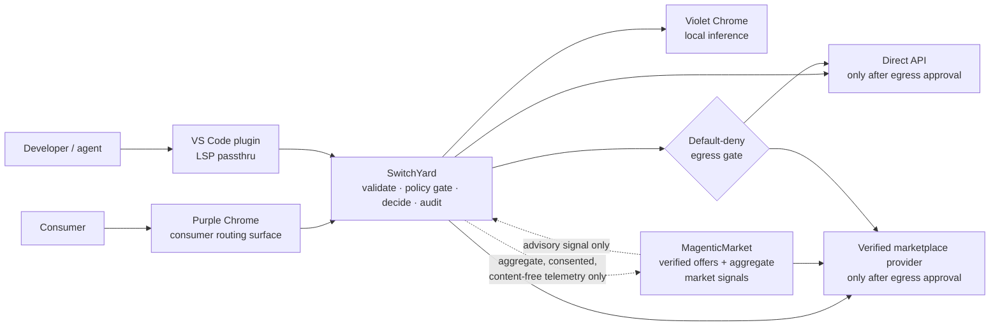

<!--
Drafted by the Manus cloud agent (task FyEBME6qnjyvbtpCjXuMfb), 2026-08-15. Review-ready draft; not independently verified.
-->

# OSI Level 8 — JSON-RPC-LD Profile 3: Market Routing (SwitchYard)

## 1. Abstract and relationship to the base profiles

**Profile 3: Market Routing (SwitchYard)** defines the route-selection and marketplace layer for OSI Level 8 / JSON-RPC-LD. It answers a bounded question: given a requested capability—such as inference, optimization, development, or query execution—**where may this invocation be served under the user’s policy?** Its possible execution classes are **local** execution, including Violet Chrome local inference; a preconfigured **direct API**; and a verified **marketplace** offer published through MagenticMarket (MM).

Profile 3 is not a transport replacement or an exception to the privacy architecture. Before a call crosses an execution boundary, it records a grounded decision. Every request, candidate, decision, offer, and metric has stable JSON-LD `@id` and `@type`; every invocation receives closed-SHACL validation; and every failure uses the base never-raise envelope, `{ "ok": false, "reason": ..., "because": ... }`. JSON-RPC 2.0 provides the request/response frame, and JSON-LD provides portable resource semantics. [1] [2] The Profile uses the normative terms **MUST**, **MUST NOT**, **SHOULD**, and **MAY** as defined by RFC 2119. [5]

> **Design principle.** SwitchYard may recommend a destination; it may never create authority to disclose payload, override an explicit user rule, or turn a market signal into a routing command.

The base OSI Level 8 protocol establishes grounded RPC, operation-level idempotency, portable references, the FRONT-private/BACK-canonical separation, and a **DEFAULT-DENY egress gate**. Profile 3 preserves these invariants. A RouteDecision can select only an eligible destination, and a selected non-local destination remains blocked unless the egress gate emits an affirmative, attributable release authorization. A routing engine therefore does not “send data to a provider”; it proposes a destination and, if appropriate, invokes the base egress process.

Profile 1, the **Cyborg Channel**, supplies the local-first three-ledger discipline. SwitchYard retains route exploration, candidate scoring, local payload references, and granular consent state in `private_local`; it records retryable or pending route actions in `sync_intent`; and it commits only the smallest canonical, shareable decision record to the canonical ledger. Profile 2 supplies capability references, Context reads, and structured Effects. Profile 3 sits above that exchange: a RouteRequest states *which capability* is wanted, a routed call carries Profile 2 Context by reference wherever possible, and the result returns as a structured Effect through the same grounded channel. Thus routing changes neither the meaning of Context nor the protocol envelope. It selects a permissible executor for an otherwise ordinary Profile 1/2 interaction.

| Layer | Primary concern | Profile 3 relationship |
|---|---|---|
| **Base OSI Level 8 / JSON-RPC-LD** | Grounded RPC, validation, idempotency, portable identifiers, never-raise semantics, default-deny egress | Profile 3 inherits these requirements; a route is an egress proposal, never a bypass. |
| **Profile 1: Cyborg Channel** | Canonical, `sync_intent`, and `private_local` ledgers | Profile 3 puts sensitive route inputs and evaluation locally, and commits only minimized decision/audit facts. |
| **Profile 2: Reference-passing for agents** | Context by reference and structured Effects | Profile 3 routes the capability invocation; it does not embed or duplicate Context in a marketplace request. |
| **Profile 3: SwitchYard** | Policy-controlled route selection and grounded market offers | Chooses among local, direct API, and marketplace candidates, subject to the first three layers. |

## 2. Routing and marketplace entities

All Profile 3 entities use a Profile 3 JSON-LD context, have an absolute or otherwise portable `@id`, declare one of the types below, and are validated against closed SHACL shapes. Closed shapes are material: unknown properties are rejected rather than silently preserved. SHACL’s `sh:closed true` mechanism provides the relevant vocabulary-level constraint. [3] A conforming implementation MUST version its context and shape identifiers, so a verifier can establish exactly what it validated.

### 2.1 Entity model

| Entity | Purpose | Required grounded fields | Privacy placement |
|---|---|---|---|
| **RouteRequest** | A capability request plus classification and routing policy. | `@id`, `@type`, `operationId`, `capability`, `privacyClass`, `routePolicy`, `payloadRef` | Payload and detailed policy stay `private_local`; only release-minimized references may leave. |
| **RouteCandidate** | An eligible possible executor. | `@id`, `@type`, `candidateClass`, `capabilityRef`, `destinationRef`, `eligibility` | Candidate evaluation is normally local; marketplace identity may be canonical. |
| **RouteDecision** | A selected candidate, refusal, or no-route result with verifiable rationale. | `@id`, `@type`, `routeRequestRef`, `outcome`, `rationaleCodes`, `audit`, `policyDigest` | Canonical record contains no payload, prompt, embedding, or raw telemetry. |
| **SwitchYard** | The local or user-controlled component that evaluates policy and emits decisions. | `@id`, `@type`, `implementationRef`, `policyEvaluatorRef`, `conformance` | Its working set is `private_local` by default. |
| **UsageMetric** | A consented, aggregate, content-free performance observation. | `@id`, `@type`, `metricWindow`, `routeClass`, `measurement`, `privacyTransform` | Aggregate canonical/market record only after egress approval. |
| **ProviderOffer** | A signed, typed description of a provider service. | `@id`, `@type`, `providerRef`, `capability`, `serviceTerms`, `attestations`, `offerVersion` | Offer is public or market-visible; it conveys no request payload. |
| **MagenticMarket (MM)** | Market-maker: verification, publication, aggregate signals, settlement records, and advisory matching. | `@id`, `@type`, `marketRulesRef`, `signalMethodRef`, `verificationPolicyRef` | Receives only permitted offers, aggregate signals, and settlement minimums. |

The following sketches are intentionally small, but they show the closed-world contract. Implementations MAY add profile-versioned fields only by publishing a successor context and successor closed shape; they MUST NOT accept unrecognized fields under a current shape.

```json
{
  "@context": "https://threedot.dev/contexts/switchyard/v1",
  "@id": "urn:sy:route-request:8b9d",
  "@type": "sy:RouteRequest",
  "operationId": "urn:op:4a7e",
  "capability": {"@id": "urn:capability:text-generation"},
  "privacyClass": "sy:restricted",
  "routePolicy": {"@id": "urn:policy:consumer-default-v3"},
  "payloadRef": {"@id": "urn:private-local:payload:1c2f"}
}
```

```turtle
sy:RouteRequestShape a sh:NodeShape ;
  sh:targetClass sy:RouteRequest ;
  sh:closed true ;
  sh:ignoredProperties ( rdf:type ) ;
  sh:property [ sh:path schema:identifier ; sh:minCount 1 ; sh:maxCount 1 ] ;
  sh:property [ sh:path sy:operationId ; sh:minCount 1 ; sh:maxCount 1 ] ;
  sh:property [ sh:path sy:capability ; sh:minCount 1 ; sh:maxCount 1 ; sh:nodeKind sh:IRI ] ;
  sh:property [ sh:path sy:privacyClass ; sh:minCount 1 ; sh:maxCount 1 ; sh:in ( sy:public sy:internal sy:restricted sy:secret ) ] ;
  sh:property [ sh:path sy:routePolicy ; sh:minCount 1 ; sh:maxCount 1 ; sh:nodeKind sh:IRI ] ;
  sh:property [ sh:path sy:payloadRef ; sh:minCount 1 ; sh:maxCount 1 ; sh:nodeKind sh:IRI ] .

sy:RouteCandidateShape a sh:NodeShape ; sh:targetClass sy:RouteCandidate ; sh:closed true ;
  sh:property [ sh:path sy:candidateClass ; sh:minCount 1 ; sh:in ( sy:local sy:api sy:marketplace ) ] ;
  sh:property [ sh:path sy:destinationRef ; sh:minCount 1 ; sh:nodeKind sh:IRI ] ;
  sh:property [ sh:path sy:eligibility ; sh:minCount 1 ] .

sy:RouteDecisionShape a sh:NodeShape ; sh:targetClass sy:RouteDecision ; sh:closed true ;
  sh:property [ sh:path sy:routeRequestRef ; sh:minCount 1 ; sh:nodeKind sh:IRI ] ;
  sh:property [ sh:path sy:outcome ; sh:minCount 1 ; sh:in ( sy:selected sy:blocked sy:no-route ) ] ;
  sh:property [ sh:path sy:rationaleCodes ; sh:minCount 1 ] ;
  sh:property [ sh:path sy:audit ; sh:minCount 1 ] ;
  sh:property [ sh:path sy:policyDigest ; sh:minCount 1 ; sh:maxCount 1 ] .

sy:UsageMetricShape a sh:NodeShape ; sh:targetClass sy:UsageMetric ; sh:closed true ;
  sh:property [ sh:path sy:metricWindow ; sh:minCount 1 ] ;
  sh:property [ sh:path sy:routeClass ; sh:minCount 1 ; sh:in ( sy:local sy:api sy:marketplace ) ] ;
  sh:property [ sh:path sy:measurement ; sh:minCount 1 ] ;
  sh:property [ sh:path sy:privacyTransform ; sh:minCount 1 ] .

sy:ProviderOfferShape a sh:NodeShape ; sh:targetClass sy:ProviderOffer ; sh:closed true ;
  sh:property [ sh:path sy:providerRef ; sh:minCount 1 ; sh:nodeKind sh:IRI ] ;
  sh:property [ sh:path sy:capability ; sh:minCount 1 ; sh:nodeKind sh:IRI ] ;
  sh:property [ sh:path sy:serviceTerms ; sh:minCount 1 ] ;
  sh:property [ sh:path sy:attestations ; sh:minCount 1 ] ;
  sh:property [ sh:path sy:offerVersion ; sh:minCount 1 ] .
```

A RouteDecision’s audit is not a hidden transcript. It MUST contain a decision timestamp, profile/context/shape versions, the applicable policy digest, considered candidate identifiers or stable classes, egress-gate state, market-signal version, and a finite set of human-readable reason codes, such as `LOCAL_PREFERRED`, `EGRESS_NOT_APPROVED`, `OFFER_CAPABILITY_MATCH`, `COST_CEILING`, or `NO_ELIGIBLE_CANDIDATE`. It MUST NOT contain the payload, prompt text, Context body, raw output, per-user unique telemetry, or a reversible payload fingerprint.

## 3. SwitchYard decision model and routing mechanics

SwitchYard is an independently verifiable policy evaluator rather than an opaque recommender. The deterministic portion of every evaluation MUST be reproducible from the RouteRequest, the resolved policy version, candidate attestations, the market-signal version, and the recorded policy digest. Quality estimation can be probabilistic, but its source, timestamp interval, and confidence class MUST be recorded. Where a current score cannot be reproduced, the decision’s rationale MUST say `NONDETERMINISTIC_SIGNAL` and identify the method version; the implementation MUST NOT claim stronger auditability than it possesses.

The evaluation pipeline is ordered. First, SwitchYard validates and de-duplicates by `operationId`, resolves local inventory, direct APIs, and compatible ProviderOffers, then applies hard gates for capability, policy allow/deny rules, privacy class, jurisdiction/trust, spend ceiling, and consent. This produces the eligible set; an MM ranking alone never creates eligibility.

SwitchYard then evaluates eligible candidates against configured cost, latency, quality, availability, local-preference, trust, and optional carbon/jurisdiction objectives. Violet is a first-class no-egress candidate. Direct APIs are configured destinations; marketplace candidates additionally require compatible typed offers, current verification, and permissible terms.

Finally, SwitchYard emits a RouteDecision. A selected local route may execute through the grounded channel. A selected API or marketplace route is not authorization: it still passes to the base egress gate, which checks recipient, purpose, field set, retention constraints, and consent. Refusal or no-route returns the base never-raise envelope; it never causes a client-side exception as a protocol outcome.



MM participates precisely as an **advisory market-maker**. It verifies offers, publishes applicable offer metadata, aggregates permitted performance and pricing signals, operates matching and settlement records, and returns a signal object that SwitchYard may consider. It MUST NOT receive the payload in order to rank it; it MUST NOT alter the user policy; it MUST NOT invoke a provider on behalf of a user without an emitted RouteDecision and successful egress authorization; and it MUST expose the signal method/version used. The user policy is authoritative. An organization policy may impose stricter prohibitions, but MM has no less restrictive override.

## 4. Usage-metadata privacy discipline

MM may collect only **consented, content-free, aggregate usage metadata** useful for comparing local, direct-API, and marketplace route performance. The intended observations are route class; capability family at a coarse taxonomy level; software/model/offer version; success or bounded error category; latency bucket; cost bucket; quality feedback only when voluntarily supplied and coarse-grained; device capability tier; broad region when needed for latency; and time window. It may also receive the privacy transformation method, aggregation cohort threshold, and differential-privacy release parameters. Differential privacy is relevant because it formalizes a bounded influence of an individual record on released statistics; it is not a substitute for data minimization or consent. [6]

MM MUST NOT collect query text, prompt text, response text, attachments, source code, Context contents, Effects, embeddings, token sequences, raw IP address, persistent browser identifiers, cryptographic payload hashes, per-event timestamps precise enough to recreate a session, or any identifier that permits linkage to a user or individual request. In particular, a hash of a sensitive request is not “content-free” if it can be matched against a candidate corpus; it is prohibited. `private_local` data NEVER leaves merely because a metric is enabled.

The telemetry pipeline starts locally. A client computes an event record within `private_local`; it discards prohibited fields; buckets allowed measures; enforces a minimum cohort and reporting delay; applies the declared privacy transformation; and sends the release only if telemetry consent and the base egress gate both permit it. The canonical UsageMetric records the window, transform, and aggregate values rather than raw observations. An MM signal derived from these metrics MUST identify its cohort, freshness interval, sample-quality class, and any differential-privacy parameters, but MUST not provide a drill-down interface that reconstructs individual traffic.

| Data class | MM may receive it? | Conditions |
|---|---:|---|
| Local/API/marketplace route class, coarse capability family, bounded success and latency/cost buckets | **Yes** | Explicit telemetry consent, minimization, aggregation, egress approval, retention limit. |
| Voluntary coarse quality rating | **Yes** | Separate consent; unlinkable or cohort-level release; no free-text review attached by default. |
| Provider/offer version and verification tier | **Yes** | Needed to produce comparable market signals; retained only under stated market rules. |
| Query, response, Context, Effect, code, attachment, embedding, payload hash | **No** | Prohibited regardless of market value. |
| Raw device identity, raw IP, fine-grained timestamp, user account correlation | **No** | Prohibited from Profile 3 market telemetry. |

## 5. Provider marketplace channel

A provider enters the marketplace by publishing a signed, versioned ProviderOffer. The offer describes a capability vocabulary reference; input and output shape references; service class (inference, optimization, development, or another registered capability); price model and currency; latency/availability targets; geographic and data-handling terms; maximum data class accepted; supported auth and egress contract; expiry; provider identity; verification attestations; and dispute/settlement references. An offer is a declarative promise, not an unrestricted endpoint advertisement. Its input shape is crucial: SwitchYard can verify capability compatibility before any content is released.

MM acts as a market-maker, not as a content intermediary by default. Its role includes provider identity and signing-key verification, offer syntax and shape validation, publication/discovery, conformance status, aggregate price/quality/availability signals, settlement evidence, and dispute handling under published rules. It SHOULD publish provider verification status, the basis and expiry of verification, conflict disclosures, and the source/freshness of market signals. A provider whose attestation is expired, revoked, or incompatible with the RouteRequest MUST be excluded from the eligible candidate set.

Providers do not obtain a right to inspect `private_local`, route deliberations, or unrelated Profile 1/2 records. A provider receives only the payload fields that a successful egress gate explicitly authorizes for the selected service and purpose. If no egress authorization exists, it receives neither the payload nor a request-derived market lookup. If execution is authorized, standard result handling remains a Profile 2 structured Effect with a portable reference; the provider cannot infer permission to republish or retain it outside the released service terms. This makes the distinction precise: **the marketplace can list and rank an offer without observing customer content; an executing provider can receive only the explicitly released contract payload.**

Settlement MUST be separable from payload content. A conforming implementation SHOULD use route/offer identifiers, price band or signed usage receipt, and settlement reference rather than request text, outputs, or content-derived identifiers. A provider may prove billable service under the offer terms, but MM MUST NOT require raw inputs or outputs as a condition of settlement.

## 6. Delivery and UX

Profile 3 has one grounded surface and two deliberately different entry points. The **developer surface** is threedot.dev, where the ellipsis in **“...”** means “fill in your language.” It presents a single capability specification as simple, idiomatic typed Cyborg APIs for Rust, Python, Java, Ruby, Go, and JavaScript. The VS Code plugin is the traditional developer-tool entry point: it is an LSP passthru for each Cyborg Language Server, including the language servers serving HTML and CSS in the editor. It does not reimplement routing per language. Instead, the language-specific API and server emit the same grounded RouteRequest and resolve the same RouteDecision/Effect types.

The VS Code experience SHOULD surface a compact route explanation alongside an invocation: the selected class; the non-sensitive rationale codes; the applicable policy profile; whether an egress approval is pending, granted, or denied; and the offer/provider identity when relevant. It MUST NOT display payload fragments as diagnostic evidence or encourage a developer to bypass a denied route. IDE configuration may select policy references and direct APIs, but it MUST NOT silently grant consumer or organizational egress consent.

The **consumer surface** is the Purple Chrome plugin. Purple is the named routing layer: it accepts a consumer query, classifies it locally, exposes an understandable routing preference, invokes SwitchYard, and presents the decision in consumer language. Violet is distinct: **Violet Chrome is the local inference engine**—the patched local inference environment and model pack—on which Purple can route a compatible task. Purple is not Violet with a new color; it is the policy-aware router that may choose Violet, a direct API, or a marketplace offer.

| Brand/surface | User | Responsibility | Relationship to Profile 3 |
|---|---|---|---|
| **Violet** | Consumer or developer using local compute | Local model discovery and inference execution in the browser. | Provides the `local` candidate and executes when selected. |
| **Purple** | Consumer | Query classification, route explanation, consent, and SwitchYard interaction. | Hosts the consumer routing UX; never treats an external route as implicit. |
| **threedot.dev / “...”** | Developer | Typed Cyborg API documentation, language onboarding, and capability discovery. | Developer front door for a common grounded API surface. |
| **VS Code plugin + Cyborg Language Servers** | Developer and agent | LSP passthru for Rust, Python, Java, Ruby, Go, JavaScript, HTML, and CSS. | Emits/consumes the same RouteRequest, RouteDecision, and Effects as Purple. |

The same semantics therefore serve both audiences. A Python developer calling an idiomatic Cyborg method, an HTML/CSS author triggering an editor capability, a Rust agent using a language server, and a consumer entering a question in Purple all create a validated capability request. The UX differs in vocabulary and controls; the underlying identifiers, shapes, policy evaluation, operation idempotency, decision audit, egress gate, and result channel do not.

## 7. Privacy, trust, and conformance requirements

A Profile 3 implementation is conformant only if it complies with the following requirements in addition to all base protocol and Profile 1/2 requirements.

| Conformance subject | Mandatory requirement |
|---|---|
| **All Profile 3 implementations** | MUST use JSON-RPC-LD grounded entities with declared context/type/id; MUST validate against the applicable closed shapes; MUST preserve operation idempotency; MUST return failures through the never-raise envelope. |
| **SwitchYard router** | MUST apply user/organization policy before ranking; MUST treat MM signals as advisory; MUST produce a minimized RouteDecision audit; MUST reject an unknown or invalid candidate; MUST keep evaluation data in `private_local` unless separately authorized. |
| **Egress path** | MUST default to deny; MUST require a positive release authorization for every non-local payload release; MUST bind authorization to recipient, purpose, fields, and applicable terms; MUST record the gate outcome. |
| **Telemetry reporter and MM** | MUST obtain consent; MUST collect only the approved content-free metric schema; MUST enforce aggregation, privacy transformation, retention, and access controls; MUST never accept request content under the telemetry interface. |
| **Provider and ProviderOffer publisher** | MUST publish typed, signed, versioned offers; MUST maintain verifiable identity/attestations; MUST honor declared data-handling terms; MUST receive no data before egress approval; MUST support revocation/expiry. |
| **Purple and VS Code clients** | MUST make external routing distinguishable from local execution; MUST show meaningful route/consent state; MUST not imply that a favorable MM signal is mandatory or user consent. |

Trust is compositional. Provider verification, signed offers, context/shape validation, policy digests, limited-release egress, and auditable route records each provide a check against a different failure. None is sufficient alone. In particular, a verified provider is not a privacy grant, a signed decision is not valid if policy evaluation was bypassed, and a consent dialog is not meaningful if it fails to identify the external recipient and purpose.

## 8. Minimal proof and principal risks

The smallest end-to-end proof should implement one **restricted** text-capability RouteRequest with two viable candidates: Violet local inference and one verified marketplace ProviderOffer. The user policy should prefer local execution when the local quality floor is met and should require explicit confirmation before any marketplace egress. SwitchYard validates the request, evaluates both candidates from local offer metadata and an MM advisory signal, selects Violet, and writes a grounded RouteDecision with `LOCAL_PREFERRED` and a policy digest. It then records one local performance event, converts it into a cohort-safe, content-free aggregate UsageMetric, and permits its release only when telemetry consent is enabled. The marketplace offer remains discoverable and auditable, but it receives no request content.

Acceptance evidence MUST include: a shape-validation record for the request, offer, decision, and metric; a deterministic decision replay from the retained inputs; a packet and application-level egress trace showing no marketplace/API payload request occurred; inspection proving the raw payload lived only in `private_local`; a metric inspection proving that query/response text, hashes, embeddings, and persistent identifiers are absent; and a retry test showing the same `operationId` does not execute the capability twice. A companion test SHOULD confirm that, when a user explicitly authorizes a compatible marketplace route, only the contractually authorized fields cross the gate.

| Risk | Failure mode | Required mitigation |
|---|---|---|
| **Metadata re-identification** | Small or linkable telemetry releases reveal an individual’s activity. | Coarse buckets, minimum cohorts, delayed aggregation, differential privacy where appropriate, retention bounds, and no persistent identifiers or payload hashes. |
| **Provider trust failure** | A listed provider misstates capability, price, retention, or security posture. | Signed/versioned offers, independent verification, expiry/revocation, transparent attestations, dispute process, and policy-based exclusion. |
| **MM conflict of interest** | Market signals steer users toward preferred or affiliated providers. | Advisory-only signals, disclosed methodology/affiliations, policy-authoritative selection, replayable rationale, and optional signal suppression. |
| **Consumer consent fatigue** | Users approve external egress without understanding it. | Recipient/purpose/field-specific consent, sensible local defaults, durable policy controls, and no preselected marketplace disclosure. |
| **Routing latency** | Discovery and scoring degrade the interaction. | Local capability cache, signed/offline offer catalog, bounded evaluation time, stale-signal labeling, and deterministic local fallback/no-route behavior. |
| **Policy/shape drift** | Different clients interpret an offer or decision differently. | Versioned contexts and shapes, conformance tests, policy/shape identifiers in audit, and rejection of unknown fields. |

## 9. References and source URLs

[1] JSON-RPC Working Group. *JSON-RPC 2.0 Specification*. https://www.jsonrpc.org/specification

[2] W3C. *JSON-LD 1.1*. https://www.w3.org/TR/json-ld11/

[3] W3C. *Shapes Constraint Language (SHACL)*. https://www.w3.org/TR/shacl/

[4] laquereric. *OSI Level 8 repository*. https://github.com/laquereric/osi-level-8

[5] IETF. *RFC 2119: Key words for use in RFCs to Indicate Requirement Levels*. https://www.rfc-editor.org/rfc/rfc2119

[6] NIST. *Differential Privacy Overview*. https://www.nist.gov/itl/applied-cybersecurity/privacy-engineering/collaboration-space/differential-privacy

[7] laquereric. *JSON-RPC-LD repository*. https://github.com/laquereric/json-rpc-ld

[8] laquereric. *Context Record repository*. https://github.com/laquereric/context-record

[9] Microsoft. *Language Server Protocol Specification*. https://microsoft.github.io/language-server-protocol/specifications/lsp/3.17/specification/

[10] W3C. *Verifiable Credentials Data Model v2.0*. https://www.w3.org/TR/vc-data-model-2.0/

---

**End of memo.**

---

> Note: The complete, review-ready memo text is available in the attached Markdown file to ensure fidelity and for archival purposes. See /home/ubuntu/OSI_Level_8_JSON_RPC_LD_Profile_3_SwitchYard_Design_Memo.md for the full specification content, Mermaid diagram, and all references.
