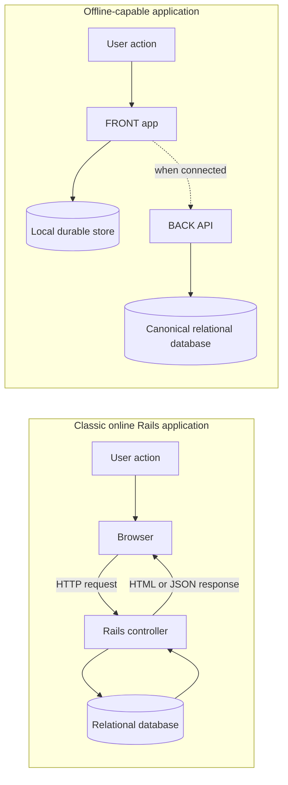
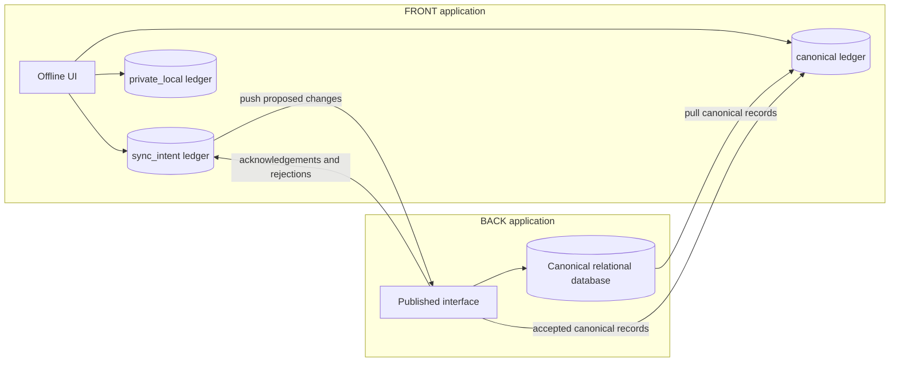
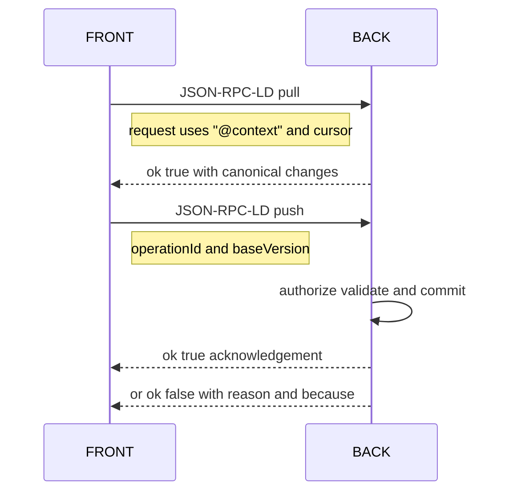

<!--
Drafted by the Manus cloud agent (task kYw9V4VZPcM4SBwiKy3JGK), 2026-08-14. Review-ready draft; not independently verified.
-->

---
title: "OSI Level 8 — Profile 1 for a Rails Developer"
sources:
  - https://github.com/laquereric/osi-level-8/blob/main/docs/osi-level-8-base.md
  - https://github.com/laquereric/osi-level-8/blob/main/docs/osi-level-8-profile-1-vv-graph.md
  - https://github.com/laquereric/json-rpc-ld
  - https://www.jsonrpc.org/specification
  - https://www.w3.org/TR/json-ld11/
  - https://www.w3.org/TR/shacl/
  - https://guides.rubyonrails.org/routing.html
  - https://guides.rubyonrails.org/api_app.html
  - https://developer.mozilla.org/en-US/docs/Web/API/IndexedDB_API
  - https://developer.mozilla.org/en-US/docs/Web/API/Service_Worker_API
---

# OSI Level 8 — Profile 1 for a Rails Developer

The finished, self-contained Markdown document is provided below. It carries a Rails developer from familiar Rails MVC concepts through the OSI Level 8 Profile 1 model, with inline code samples, diagrams, a cheat sheet, and fully cited references.

A Rails application already gives you a powerful mental model for data: a model maps to a table, a row is authoritative when it is committed to the database, controllers admit requests through named routes, and validations constrain writes. **OSI Level 8 Profile 1 does not discard that model.** It adapts it for a world in which a browser application can retain data and work independently for a while, while a server remains the authoritative writer.

This is a guided translation, not a demand that you abandon Rails conventions. The key shift is to recognize that, once the browser has a durable local store, you have two applications with a deliberately designed synchronization contract rather than one request/response application with a passive client.

## 1. ONLINE vs OFFLINE applications

An **online application** requires a server round-trip for every meaningful action. Classic Rails request/response is the familiar example: click “Save”, submit `PATCH /tasks/42`, let the controller call `@task.update(task_params)`, redirect or render JSON, then display the response. The browser may cache assets, but the action itself cannot complete meaningfully without the server and its relational database.

An **offline-capable application** can continue useful work while disconnected. It keeps a local copy of the relevant data, records local changes durably, and reconciles with the server later. Gmail offline mode is a concrete example. A user can read already-synced mail, search that local mail, compose messages, and queue sends while disconnected. When a connection returns, Gmail synchronizes its local state and delivers the queued messages. Google Docs, Notion, and many calendar applications use the same broad pattern: local responsiveness first, reconciliation later.



The tension is straightforward. **Relational truth lives on the server**, where transactions, constraints, auditing, and access control can be enforced centrally. Users, however, expect local speed, resilience to intermittent networks, and the ability to keep working on a train or airplane. Profile 1 supplies a disciplined way to give the FRONT local agency without silently turning it into a competing authority.

## 2. RAILS IN ONE SCREEN: MVC

Rails MVC remains the starting point. A **Model** is typically an ActiveRecord class backed by a relational table. Its rows are the durable source of truth. A **Controller** receives requests, authorizes them, applies strong parameters, invokes model or service-layer behavior, and chooses a response. A **View**, when present, renders HTML; in an API application, JSON usually fills the response role.

| Rails component | Familiar responsibility | What matters for this explainer |
|---|---|---|
| Model / ActiveRecord | Maps Ruby objects to relational rows | The canonical database commits the authoritative state |
| Controller | Applies request policy and coordinates writes | It is a server-side boundary, not a peer-to-peer merge engine |
| View / JSON renderer | Presents a representation | A representation is not automatically the truth |
| Migration and constraints | Define durable structure and invariants | The BACK retains final authority over canonical data |

The important anchor is not MVC itself. It is that **the relational database is the truth**. In a conventional Rails app, that fact is easy to take for granted because the browser has little durable domain state. With offline capability, the browser may carry a mirror of selected rows, but a mirror is still not the canonical table.

## 3. `routes.rb` IS AN INTERFACE SPECIFICATION

It is tempting to call `config/routes.rb` plumbing. For this model, treat it as a **declared interface**: the published, enumerable surface through which clients read from and propose writes to your relational database. Every route is a named doorway with an expected resource, operation, authorization rule, parameter shape, and response shape. Rails routing already treats routes as a request-recognition and URL-generation contract. [7]

```ruby
# config/routes.rb
Rails.application.routes.draw do
  namespace :api, defaults: { format: :json } do
    resources :tasks, only: %i[index show create update destroy]
  end
end
```

Read this as a contract rather than a list of controller conveniences. `GET /api/tasks` publishes the collection query. `GET /api/tasks/:id` publishes a single-record read. `POST /api/tasks`, `PATCH /api/tasks/:id`, and `DELETE /api/tasks/:id` are the paths through which a client can ask the server to change canonical state. The controller may reject those requests, but the permitted shapes are visible and enumerable.

In Profile 1 language, `routes.rb` begins to grow into the **published interface surface**. The exact wire format can change from resource-and-verb REST to named protocol methods, but the design principle survives: the server should make its allowed operations, input records, validation rules, and failure modes explicit. Do not confuse “published” with “unauthenticated.” An interface can be fully specified and tightly authorized at the same time.

## 4. A RAILS API APP IS A STAND-ALONE BACK

`rails new my_app --api` produces a Rails application focused on JSON endpoints rather than server-rendered views. Rails API mode removes browser-oriented middleware and defaults that are unnecessary for API-only applications while retaining the framework’s routing, controllers, ActiveRecord, validations, and rendering capabilities. [8]

In this explainer, call that headless application the **BACK**. It is a complete, stand-alone program. It owns the canonical relational database, enforces authorization and invariants, and is the **sole writer of canonical data**. “Sole writer” does not mean no other process can submit a change. A worker, CLI, integration, or FRONT can all propose writes. It means every canonical mutation is accepted, validated, and committed by the BACK rather than being treated as self-authenticating because it originated elsewhere.

That distinction is helpful for a Rails developer. Your API controller already does not blindly trust JSON from a browser. It permits declared attributes through strong parameters, checks policy, invokes validations, and handles errors. Profile 1 keeps that posture during synchronization. The FRONT can accumulate change intent, but it does not independently pronounce its mirror to be the final truth.

## 5. THE BROWSER SPA IS A STAND-ALONE FRONT

A browser single-page application talking to the Rails API is often described as “the front end.” That is accurate but incomplete once it stores durable data. A SPA with IndexedDB, SQLite compiled for the browser, or another persistent local store has its own application state, its own failure modes, and its own local history. IndexedDB is specifically a browser API for storing significant structured data locally, including offline use. [9]

Call this independent program the **FRONT**. It is not merely a View in the Rails MVC sense. It may render screens, but it also owns local queries, local draft state, a queue of requested mutations, and the machinery that reconnects and synchronizes. A service worker may make assets and selected network behavior resilient, but it does not replace the application’s data model or conflict protocol. [10]

This naming is intentionally architectural. **BACK and FRONT are both real applications.** The BACK is authoritative. The FRONT is durable, responsive, and sometimes isolated. Once you say that clearly, it becomes obvious why “just retry the REST request later” is often not enough: you need a stable, validated protocol for exchanging both records and requested changes.

## 6. WHAT THE FRONT IS ALLOWED TO DO

The FRONT has three explicit capabilities. Defining them prevents an accidental architecture in which some local state becomes quasi-canonical without rules.

### (a) Run in isolation for a time

The FRONT may keep a local mirror of rows it has pulled and continue operating while disconnected. A task list, for example, can be displayed and edited from local storage without an active request. This is the Gmail-offline behavior applied to your domain. The local record is useful and queryable, but it carries a provenance: it is the FRONT’s last known representation of canonical state.

### (b) Store private data not intended for BACK

The FRONT may store private, per-device data that must **never** be sent to the server: an unfinished compose draft, a local note, an expanded-panel preference, a temporary filter, or encrypted device-only material. This is not failed synchronization. It is intentional ownership. Treating private local data as a first-class category prevents the common mistake of calling every browser-store entry a cache that the server is entitled to overwrite or collect.

### (c) Sync both ways

The FRONT pulls canonical rows downward from the BACK to refresh its mirror. It pushes proposed changes upward. The BACK validates each proposal, applies authorized writes, and returns the resulting canonical state or a structured rejection. The direction of data flow is bidirectional; the direction of authority is not.

A useful Rails-shaped implementation has **three ledgers**, analogous to three tables in the FRONT’s local database.

| Local ledger | Analogous database table | Purpose | May it leave the FRONT? |
|---|---|---|---|
| `canonical` | Local mirror of server rows | Last accepted representation of server truth | Yes, as protocol records where required |
| `sync_intent` | Durable outbox | Proposed create, update, or delete operations awaiting acknowledgement | Yes, pushed to BACK |
| `private_local` | Device-only table | Drafts, local UI state, and other private records | No, never |



Two familiar Rails mechanisms make this safe. **Optimistic locking** detects whether the row you based an edit on has changed before the update is accepted. Rails commonly implements that with a `lock_version` column; in this protocol, the same idea is carried as `baseVersion`. A rejected stale update must be reconciled rather than silently overwriting another accepted change.

**Idempotent retries** handle unreliable networks. If a request times out after the BACK commits it, the FRONT cannot know whether the change succeeded. It retries with the same `operationId`. The BACK remembers or otherwise recognizes that operation identifier and returns the original outcome rather than applying the mutation twice. Think of `operationId` as a request-level counterpart to a unique constraint or a durable outbox key.

## 7. JSON-RPC

Rails REST routes organize an API around **resource plus HTTP verb**: `PATCH /tasks/42` means “update this task.” JSON-RPC organizes a protocol around a **named method in a JSON request body**. A request has `jsonrpc`, `method`, `params`, and an `id`; a response contains a `result` or an `error`. [4]

```json
{
  "jsonrpc": "2.0",
  "method": "task.pull",
  "params": { "sinceVersion": 42 },
  "id": 1
}
```

```json
{
  "jsonrpc": "2.0",
  "result": { "changes": [] },
  "id": 1
}
```

For a Rails developer, picture a single `POST /rpc` endpoint that dispatches to a named, carefully specified service method. That is not inherently better than REST. It is often a good fit for a sync channel because the channel tends to need a small vocabulary of operations such as `pull` and `push`, each of which may process a batch, return acknowledgements, and report conflicts. The HTTP route remains part of the published surface; the protocol’s semantic operation is the JSON-RPC method.

## 8. JSON-LD

Ordinary JSON tells you field names but not necessarily their globally agreed meaning. JSON-LD adds a compact linked-data layer. The three keys to learn first are **`@context`**, **`@id`**, and **`@type`**. JSON-LD 1.1 defines these keywords and the context mechanism. [5]

```json
{
  "@context": "https://example.test/contexts/task-v1.jsonld",
  "@id": "https://api.example.test/tasks/01J9X8P4D5K7",
  "@type": "Task",
  "title": "Prepare release notes",
  "completed": false,
  "version": 7
}
```

`@context` is a shared data dictionary. It maps short terms such as `title` and `completed` to globally defined identifiers, much as a schema, namespace, or fully qualified column meaning prevents two integrations from assigning incompatible meanings to the same short word. `@id` is a global primary key expressed as a URL rather than an integer meaningful only inside one database. `@type` identifies the kind of record, roughly analogous to declaring the model or table class.

The Rails translation is simple: give every externally synchronized ActiveRecord row a stable URL identity and publish a vocabulary that explains its fields. Your `Task` table can still have an internal integer or UUID primary key. Profile 1 requires that the protocol record expose an identity that is globally unambiguous and grounded in a shared meaning system.

## 9. JSON-RPC-LD

**JSON-RPC-LD combines JSON-RPC method calls with JSON-LD records in their payloads.** In the Level-8 channel, this becomes the wire protocol between FRONT and BACK: method calls have a known operational meaning, while records are self-describing through their context, identity, and type. The JSON-RPC-LD project specifies this combination and its envelope conventions. [3]

SHACL is the other key piece. In one line: **SHACL publishes validation rules as data**, like ActiveRecord validations plus database constraints made explicit enough that both FRONT and BACK can enforce the same shape before and during exchange. SHACL itself defines a language for validating RDF graphs against shapes. [6]

The response envelope should never force the client to infer success from an exception or an ambiguous HTTP response. Normalize outcomes:

```json
{ "ok": true, "result": { "accepted": ["op-7f4"], "changes": [] } }
```

```json
{
  "ok": false,
  "reason": "conflict",
  "because": "baseVersion 7 does not match canonical version 8"
}
```

A `push` request carries a stable `operationId` for idempotency, `baseVersion` for optimistic concurrency, and JSON-LD records or patches for semantic grounding. A `pull` request asks for canonical changes since a known checkpoint. The BACK validates the request against published shapes, authorizes it, applies it once if appropriate, and returns an explicit result.



In Rails terms, `baseVersion` is your optimistic-locking precondition. `operationId` is the durable idempotency key. SHACL shapes complement, rather than replace, strong parameters, model validations, database constraints, and authorization. The FRONT can fail fast locally; the BACK must still enforce the final decision.

## 10. THIS IS PROFILE 1

OSI Level 8 Profile 1 is the **vv-graph relational/graph model**: every record is a typed row with a URL primary key, represented in a shared vocabulary and exchanged through a validated protocol. [1] [2] That is recognizably the Rails relational model, lifted so its rows are globally identified and semantically grounded.

A Rails developer is therefore already most of the way there. You already believe in authoritative data, declared interfaces, validation at boundaries, relational rows, and optimistic concurrency. Profile 1 adds three large pieces: a **global identifier** rather than a database-local identifier, a **shared vocabulary** rather than undocumented field-name conventions, and a **validated two-way channel** that lets a durable FRONT work in isolation without becoming a second canonical writer.

The mapping is direct. **BACK** is your Rails API and canonical relational database. **FRONT** is your SPA plus its durable local store. `routes.rb` evolves from route plumbing into the published interface surface. JSON-RPC-LD gives that surface a compact synchronization vocabulary. The result is not “Rails, but graph-shaped.” It is Rails’ existing data discipline extended to explicit identities, exchangeable meanings, and safe offline synchronization.

## Rails developer’s cheat sheet

| Rails concept | Level-8/Profile-1 concept | Practical translation |
|---|---|---|
| ActiveRecord row | Typed record with `@id` | Expose a stable URL identity and a declared record type |
| `config/routes.rb` | Published interface surface | Make operations, input records, outcomes, and failures explicit |
| Rails API app | BACK | Keep it as the sole writer of canonical data |
| SPA plus local store | FRONT | Treat it as a durable peer application, not only a renderer |
| ActiveRecord validations and strong parameters | SHACL shape | Publish portable structural rules while keeping BACK enforcement final |
| `lock_version` optimistic locking | `baseVersion` | Reject and reconcile stale proposals rather than clobbering rows |
| Named service call | JSON-RPC method | Use operations such as `pull` and `push` for the sync channel |
| Job outbox or idempotency key | `operationId` | Retry safely after timeouts without duplicating a mutation |
| Browser-only preference or draft | `private_local` ledger | Model it deliberately and never synchronize it |

## References

[1]: https://github.com/laquereric/osi-level-8/blob/main/docs/osi-level-8-base.md "OSI Level 8 Base"
[2]: https://github.com/laquereric/osi-level-8/blob/main/docs/osi-level-8-profile-1-vv-graph.md "OSI Level 8 Profile 1 vv-graph"
[3]: https://github.com/laquereric/json-rpc-ld "JSON-RPC-LD"
[4]: https://www.jsonrpc.org/specification "JSON-RPC 2.0 Specification"
[5]: https://www.w3.org/TR/json-ld11/ "JSON-LD 1.1"
[6]: https://www.w3.org/TR/shacl/ "Shapes Constraint Language SHACL"
[7]: https://guides.rubyonrails.org/routing.html "Rails Routing from the Outside In"
[8]: https://guides.rubyon Rails.org/api_app.html "Using Rails for API-only Applications"
[9]: https://developer.mozilla.org/en-US/docs/Web/API/IndexedDB_API "MDN IndexedDB API"
[10]: https://developer.mozilla.org/en-US/docs/Web/API/Service_Worker_API "MDN Service Worker API"

## Sources

- https://github.com/laquereric/osi-level-8/blob/main/docs/osi-level-8-base.md
- https://github.com/laquereric/osi-level-8/blob/main/docs/osi-level-8-profile-1-vv-graph.md
- https://github.com/laquereric/json-rpc-ld
- https://www.jsonrpc.org/specification
- https://www.w3.org/TR/json-ld11/
- https://www.w3.org/TR/shacl/
- https://guides.rubyonrails.org/routing.html
- https://guides.rubyonrails.org/api_app.html
- https://developer.mozilla.org/en-US/docs/Web/API/IndexedDB_API
- https://developer.mozilla.org/en-US/docs/Web/API/Service_Worker_API
