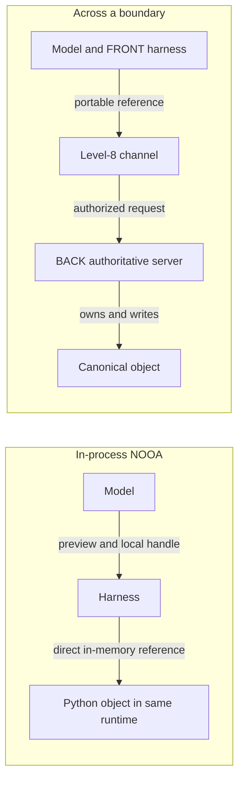
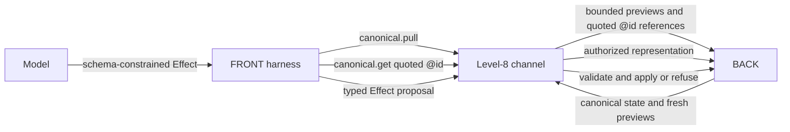
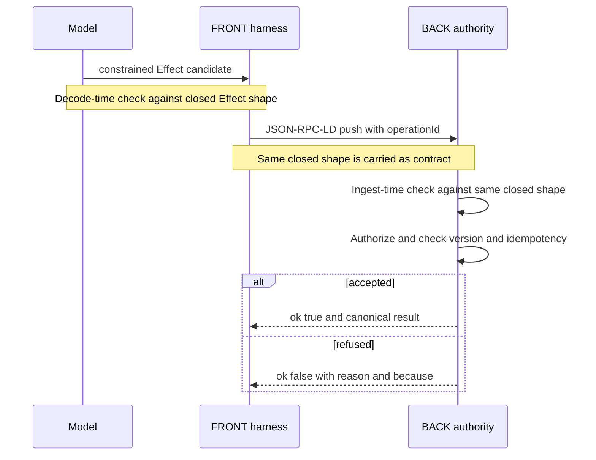

<!--
Drafted by the Manus cloud agent (task 6QkLPi9iKJQUgDrCa2UFSz), 2026-08-14. Review-ready draft; not independently verified.
-->

# OSI Level 8 — Profile 2 for a NOOA Developer

**A guided explainer for developers using NVIDIA Object-Oriented Agents**

You already know the useful NOOA move: keep large, typed values in the runtime, place a bounded preview in the model-visible transcript, and let the model retain a handle rather than a payload. Profile 2 starts there. It asks what happens when the object is no longer owned by the same Python runtime as the harness, but by an authoritative service across both a network and a trust boundary. Its answer is deliberately familiar: preserve pass-by-reference and typed contracts, but make the reference portable, publish the contract, and move authority behind the boundary. [1] [2]

## 1. In-process vs across-a-boundary agents

A **NOOA in-process agent** is one coherent runtime. The model, harness, tool implementations, and live objects all inhabit one Python process. A tool can return a large result, the runtime can retain that object in memory, and the model can receive a typed bounded preview plus a handle. The handle works because the runtime that issued it still owns the referent. It is an efficient local agreement between the transcript and the Python object graph. [5] [6]

An **across-a-boundary agent** has a different topology. The model and its harness live on one side, while canonical data live on a separate server on the other. The hop is not merely a different function call. It crosses a network, a process boundary, a restart boundary, and a trust boundary. The server is authoritative for its data and evaluates each request under its policy.



That makes a normal NOOA handle the central limitation and the central opportunity. A local handle is effectively an in-process pointer. It is valid only while the relevant runtime and object registry exist. It does not survive serialization, a network hop, a restart, or a second process by itself; and a receiver outside the runtime has no reason to accept it as authority. It is neither a portable name nor a credential.

Profile 2 does **not** treat this as a flaw in NOOA. It recognizes that a local pointer is exactly right when the runtime owns the object. It changes the situation only when the authoritative object must be accessed from elsewhere.

## 2. NOOA in one screen: the six capabilities

The familiar NOOA harness supplies typed input and output, pass-by-reference, code-as-action, a programmable loop, explicit object state, and model-callable harness APIs. Those capabilities give the model a controlled working environment rather than an unstructured chat surface. [5] [6]

| NOOA capability | Why it matters for Profile 2 |
|---|---|
| Typed input and output | Becomes the basis for a published, server-enforced method contract. |
| Pass-by-reference | Becomes portable reference passing through an IRI. |
| Code-as-action and programmable loop | Remain harness-side techniques for planning, inspecting previews, and deciding when to request more context. |
| Explicit object state | Splits into local private state and a non-authoritative mirror of server state. |
| Model-callable harness APIs | Become remote, named operations against an authority rather than direct calls into the same runtime. |

The two anchors are **pass-by-reference** and **typed I/O**. Everything else continues to work, but now the reference is not a Python-local implementation detail and the type contract is not merely a harness convention.

## 3. The handle is the pivot

Make one substitution in the NOOA model. Instead of a runtime-local handle such as `Handle[Task]("h_42")`, give the model a global, serializable name such as `https://api.example.test/tasks/42`. In JSON-LD that name is carried as `@id`; formally, it is an IRI. JSON-LD uses `@id`, `@type`, and `@context` to identify nodes, state their class, and interpret terms through a shared vocabulary. [8]

> **The Profile 2 pivot is simple:** an `@id`/IRI is a portable pass-by-reference handle.

It can be serialized into JSON, sent to another process, put into a durable log, and later presented back to the server. That preserves the NOOA benefit: the model names the object without ingesting every byte of it. But portable does not mean unconditional. An IRI is not a bearer credential, is not a promise that the object still exists, and is not a forever-valid snapshot. Every dereference is a fresh request that the BACK can authorize, redact, or refuse. [2] [3]

Here is the change in the model-visible value. The important difference is not the summary field. It is that the reference is globally meaningful and can be sent over the wire.

```json
{
  "@context": "https://api.example.test/context/profile-2",
  "@id": "https://api.example.test/tasks/42",
  "@type": "TaskPreview",
  "summary": "Confirm the supplier's delivery date before Friday.",
  "allowedActions": ["Task.NoteAdded", "Task.Completed"],
  "sensitivity": "internal"
}
```

A NOOA developer should retain the pass-by-reference analogy while respecting its new failure modes: the object may have been redacted or become unauthorized since the preview was issued. Policy-aware dereference makes those conditions explicit instead of silently pretending a pointer is eternal.

## 4. BACK is the authority behind the references

In NOOA, the runtime owns the live objects. In Profile 2, **BACK** is the authoritative server, perhaps a Rails API, and it owns the canonical objects. It is the **sole writer** to the canonical store. The FRONT cannot mutate canonical state by holding a reference, and the model cannot mutate it by emitting plausible JSON.

BACK publishes an **API surface**: a menu of named methods and the shapes that their inputs and outputs must satisfy. Think of it as your typed tool contract, but now the contract is published by the server and enforced where authority resides. If a method, field, type, or action is not admitted by that surface, it is default-deny. The profile represents these contracts as closed SHACL shapes. SHACL is the W3C language for expressing constraints over RDF graphs, while the profile uses it as a concrete, machine-checkable contract language. [1] [9]

The distinction matters operationally. A local Python annotation can improve a harness implementation. A BACK-published shape defines what the remote authority will accept, regardless of the client’s implementation, prompt, or model output.

## 5. The harness is a client: the FRONT

The NOOA harness becomes the **FRONT**. It still provides an agent runtime: it calls models, manages a programmable loop, exposes narrow client capabilities, and retains explicit state. Yet it is no longer the authority over the canonical objects. Its job is to hold references, consume previews, determine what extra context may be needed, and **propose** effects through the published surface.

A practical FRONT keeps a local mirror or cache of admissible canonical context. It may accelerate rendering and planning, but it is never an authority and must reconcile with BACK.

This refines familiar NOOA explicit object state. Ask of each object: “Is this canonical server-governed state, a cache of canonical state, or an intended effect awaiting submission?” Each has a possible protocol role, and the cache is never authoritative.

## 6. What the harness does across the boundary

Profile 2 gives the FRONT two central capabilities.

### 6.1 Read context by reference

`canonical.pull` obtains bounded previews and their IRIs. It is the networked analogue of receiving NOOA’s typed bounded preview rather than a huge tool payload. The model sees enough salient information to choose a next action without flooding the context window. When more detail is necessary, `canonical.get(@id)` dereferences one selected object, subject to authorization, an optional version condition, and a representation budget. [2] [3]

The prompt-engineering benefit survives the network hop. Large canonical records remain BACK-side. The model receives stable, compact structure, and prompt prefixes can remain largely invariant as values change. The extra cost is purposeful: dereference is now an explicit, observable, policy-controlled tool call.

### 6.2 Return structured output as a typed effect

The model’s schema-constrained decoding output is a JSON-LD **Effect** record. An Effect says, in typed and grounded form, what change is being proposed, for which target, using which parameters, under which asserted authorization basis. It is not the same thing as the committed world change. BACK remains responsible for validating and applying or refusing it. [1] [2]



## 7. JSON-RPC: a remote typed tool call

For a NOOA developer, JSON-RPC is the basic mechanics of changing an in-process tool invocation into a remote named method call. A request identifies the protocol version, a `method`, optional structured `params`, and a client-chosen `id`; a response carries a result or an error corresponding to that request. [7]

```json
{
  "jsonrpc": "2.0",
  "method": "canonical.get",
  "params": {
    "id": "https://api.example.test/tasks/42",
    "ifVersion": 7,
    "maxRepresentationBytes": 4096
  },
  "id": "read-42"
}
```

This resembles `harness.call_tool("canonical.get", ...)`, but the server resolves the method name, checks the caller and parameters, and owns the result. Remote naming is therefore not a convenience wrapper around direct object access. It is the point at which BACK can apply authority and governance.

## 8. JSON-LD: grounding the references and records

Plain JSON names keys but does not, by itself, guarantee that two systems mean the same thing by `status`, `Task`, or `owner`. JSON-LD supplies a shared vocabulary through `@context`, a global identifier through `@id`, and a class assertion through `@type`. It is the grounding layer that makes the record more than a locally agreed JSON dictionary. [8]

In NOOA terms, `@id` is your portable handle; `@type` is the object class in the remote contract; and `@context` is the shared namespace that prevents the FRONT and BACK from silently assigning different meanings to the same field. The result is a reference-bearing, typed record that can be logged, retried, and interpreted outside the original process.

## 9. JSON-RPC-LD: the Level-8 channel

**JSON-RPC-LD** combines named JSON-RPC operations with JSON-LD-grounded resources. It is the Level-8 channel between FRONT and BACK: typed calls about typed, globally identified context and effects. Profile 2 couples that channel to closed SHACL shapes and a never-raise response envelope. Every response becomes either a successful outcome such as `{ "ok": true, ... }` or a structured refusal such as `{ "ok": false, "reason": "shape_violation", "because": ... }`, rather than an uncaught cross-boundary exception. [1] [2] [4]

The key NOOA-specific guarantee is **one contract, enforced twice**. The same closed shape drives the grammar or structured-output constraint during model decoding and validates the received Effect at BACK ingest. Thus the model cannot emit values outside the contract if decoding succeeds, and the authority refuses malformed or nonconforming data even if a client is compromised or bypasses the normal decoder. This is not “trust the model’s JSON.” It is two independent checks derived from one declared contract.

`operationId` provides idempotency: a retry of the same intended operation is applied at most once. It turns an ordinary distributed-systems fact—retries—into explicit protocol data. [1] [2]



The two checks have different roles. Decode-time enforcement prevents the model from producing a syntactically or structurally invalid candidate. Ingest-time enforcement protects the canonical authority from every client path, including a buggy harness, replay, direct caller, or hostile process. Neither removes the need for authorization and domain validation, which BACK performs separately.

## 10. The isolation boundary: NOOA’s caveat, elevated

NOOA correctly treats AST validation and deny-lists as **defense in depth**, not as a containment boundary. That warning becomes more important when an agent interacts with authoritative data and effects. AST checks can reduce risky code paths inside a harness, but they do not create a trustworthy external authority or confine a compromised runtime by themselves.

Profile 2 makes the boundary concrete. BACK is the **reference monitor** and sole canonical writer. It re-authorizes every dereference and every submitted Effect. The harness itself belongs inside an isolation layer, such as a container or microVM with restricted filesystem access, restricted network egress, and narrowly scoped credentials. A prompt-injected model may ask for an operation, but it cannot make BACK accept an operation outside the published method surface and closed shapes. [2] [3]

Default-deny matters just as much. If a method is absent, the model has no legitimate protocol operation to invoke. And because the model holds references rather than live server objects, it can only request: **BACK decides**.

This should not be oversold as universal security. The quality of authorization, isolation configuration, credential design, transport security, and server implementation still determines the system’s real security posture. Profile 2’s contribution is architectural: it supplies a place where those controls can be centralized and enforced on every access.

## 11. This is Profile 2

Profile 2 is NOOA’s pass-by-reference, typed I/O, and model-callable API mindset carried across a network and a trust boundary. It puts an authoritative server behind the references. A NOOA developer does not need to abandon the familiar model. The stable translation is:

> **Make the handle portable. Publish the contract. Make the boundary real.**

The local handle becomes an `@id`/IRI. The typed tool contract becomes a server-published closed SHACL method shape. The harness keeps doing intelligent loop work with previews and explicit state, while BACK decides what may be read, what may be changed, and whether each proposed Effect is accepted. That is the Profile 2 move. [1] [2]

## NOOA developer’s cheat sheet

| NOOA concept | Profile 2 concept | Practical reading |
|---|---|---|
| In-process object handle | `@id`/IRI portable reference | A serializable name that can cross processes, but every dereference is authorized and version-aware. |
| Typed tool contract | Published closed SHACL method shape | The server publishes and enforces the admissible method surface. |
| Bounded preview | `canonical.pull` preview plus dereference | Show concise context first, then request a bounded representation with `canonical.get(@id)`. |
| Explicit object state | Canonical mirror (a cache) | Treat mirrored canonical data as non-authoritative; reconcile with BACK. |
| AST and deny-list checks | **Not the boundary** | Use them as defense in depth; isolation plus BACK authority are the actual boundary controls. |
| Runtime as owner | BACK as authority and sole writer | FRONT proposes; BACK owns, authorizes, validates, applies, and refuses. |
| Structured output | Typed Effect enforced twice | Constrain decoding from the same shape used for BACK ingest validation. |

## References

[1]: https://github.com/laquereric/osi-level-8/blob/main/docs/osi-level-8-base.md "OSI Level 8 Base — A Cybernetic Interface: The JSON-RPC-LD Protocol and its SHACL-Shaped Contracts"

[2]: https://github.com/laquereric/osi-level-8/blob/main/docs/osi-level-8-profile-2-nooa.md "OSI Level 8 — Profile 2: Reference-Passing for Agents (NOOA)"

[3]: https://github.com/laquereric/vv-nooa/blob/main/docs/research/nooa-level-8-design-memo.md "NOOA x Level-8 Design Memo: Portable References and Typed Effects"

[4]: https://www.jsonrpc.org/specification "JSON-RPC 2.0 Specification"

[5]: https://github.com/NVIDIA-NeMo/labs-OO-Agents "NVIDIA NeMo labs-OO-Agents"

[6]: https://developer.nvidia.com/blog/six-agent-harness-capabilities-for-higher-model-performance/ "NVIDIA: Six Agent Harness Capabilities for Higher Model Performance"

[7]: https://arxiv.org/html/2607.20709v1 "NOOA paper"

[8]: https://www.jsonrpc.org/specification "JSON-RPC 2.0 Specification"

[9]: https://www.w3.org/TR/json-ld11/ "JSON-LD 1.1"

[10]: https://www.w3.org/TR/shacl/ "Shapes Constraint Language (SHACL)"

[11]: https://github.com/laquereric/todo-app-python "todo-app-python"

## Sources

- https://github.com/laquereric/osi-level-8/blob/main/docs/osi-level-8-base.md
- https://github.com/laquereric/osi-level-8/blob/main/docs/osi-level-8-profile-2-nooa.md
- https://github.com/laquereric/vv-nooa/blob/main/docs/research/nooa-level-8-design-memo.md
- https://github.com/laquereric/json-rpc-ld
- https://github.com/NVIDIA-NeMo/labs-OO-Agents
- https://developer.nvidia.com/blog/six-agent-harness-capabilities-for-higher-model-performance/
- https://arxiv.org/html/2607.20709v1
- https://www.jsonrpc.org/specification
- https://www.w3.org/TR/json-ld11/
- https://www.w3.org/TR/shacl/
- https://github.com/laquereric/todo-app-python
