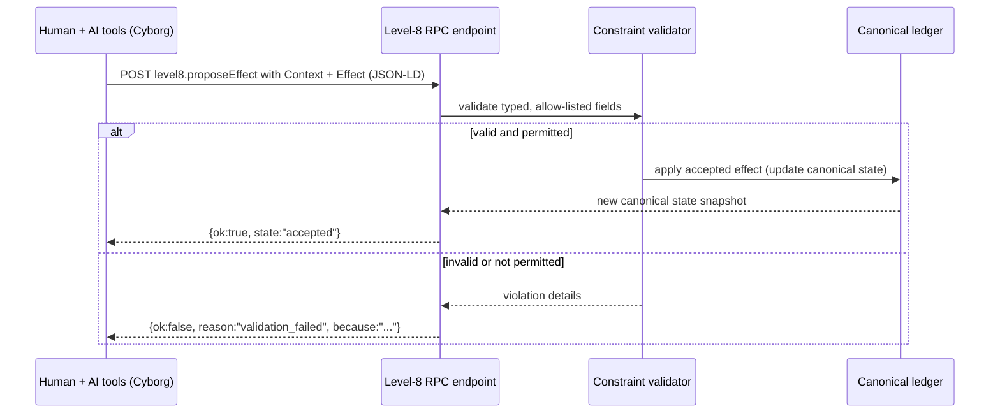
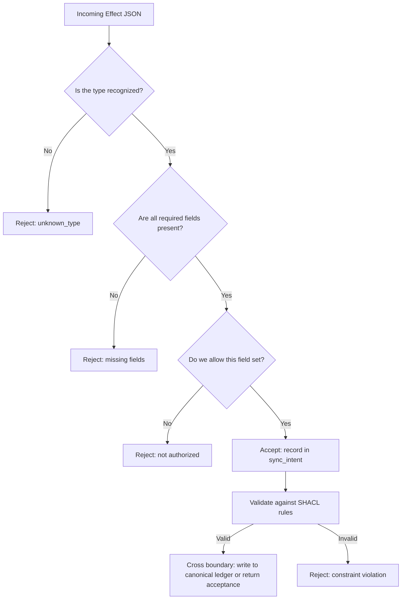
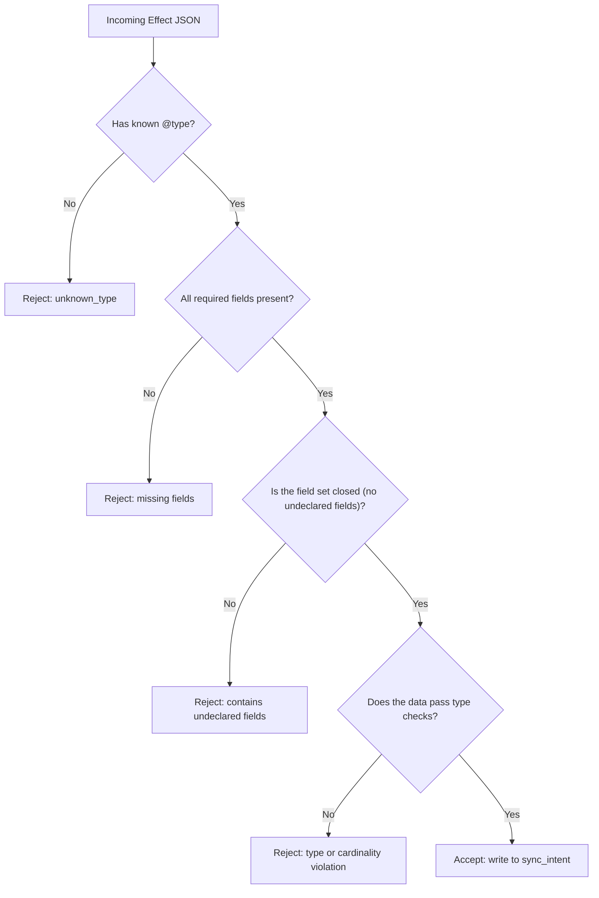

<!--
Tutorial drafted by the Manus cloud agent (task n6VSat5fjRRN9vt48UhjCQ), 2026-08-14.
Review-ready draft; not independently verified.
-->

# OSI Level 8 for JSON & SQL developers: a safe interface between an AI-assisted operator and a database

This tutorial is written for a working developer who already knows JSON and SQL inside out, but who has never touched RPC, RDF, SHACL, Turtle/.ttl, JSON-LD, or SPARQL. The goal is to teach these concepts purely by translating them into JSON/SQL terms you already understand. Each new term is introduced with an analogy to familiar SQL/JSON ideas, followed by the formal concept name and how it maps to your existing mental model. The tutorial contains three Mermaid diagrams, a practical cheat sheet, and concrete examples you can try in your own project.

> Note: This tutorial uses a simple, concrete model called Profile 1, where every record is a typed row with a globally unique primary key URL, and all fields have explicit types. You do not need to learn RDF/SPARQL to work with this model; the same ideas translate directly to ordinary SQL tables and JSON objects.

1. Start with the familiar model

Think of the classic OSI model as a stack of seven layers, from the physical wires to the application. The key idea for Level 8 is to add a new, distinct layer on top of that stack: a safe interface between a human operator and the application. In practical terms, Level 8 is an architectural boundary that governs how a human (or a human plus AI assistant) interacts with the application’s data through the server.

- The Cyborg is a single accountable operator composed of a responsible human and their compute tools (relational databases and AI assistants). This is not one system pretending to be another; it is a unified operator coordinating reads and writes through a disciplined boundary.
- The boundary exposes two kinds of artifacts: Context and Effect. Context corresponds to what the operator is allowed to observe (reads), while Effect corresponds to what the operator is allowed to propose (writes). Context is read-only from the boundary; Effect is a proposed change that must pass validation before it can cross the boundary.

Translate the key terms into JSON/SQL terms:

- Context = a read projection from the canonical data, serialized as JSON. It’s like performing a SELECT and returning only the allowed fields.
- Effect = a proposed write (INSERT/UPDATE/DELETE) that is stored as an outbox item to be validated before it becomes a real change. Think of it as a constrained, validated change request.

Two practical downsides to remember: first, Level 8 does not magically make AI trustworthy; second, it requires a strict boundary so private data cannot leak through the boundary.

> Core rule: default-deny. Nothing crosses the Level-8 interface unless a rule explicitly permits that particular field and operation.

2. The feedback loop: read Context, propose Effect

The core behavior is a loop: read, reason, propose, validate, then apply. You can visualize it as a feedback loop where the Cyborg observes the current state (Context), reasons about a change, and proposes a change (Effect). Only after validation is a proposed change accepted and reflected in the canonical data.

Diagram 1: Sequence diagram of a request/response between Cyborg, the Level-8 RPC endpoint, the validator, and the canonical ledger



3. The wire call: a named server function with JSON-LD bookkeeping

Think of a wire call as a named server function invoked by POSTing a small JSON document and receiving a small JSON response. This mirrors a familiar pattern you already know as JSON-RPC, but with added bookkeeping fields that help different systems stay aligned.

- JSON-RPC is simply calling a named server function by POSTing a small JSON request and getting a JSON response. The function name lives inside the request body, which makes the interface explicit and easy to version.
- JSON-LD takes JSON and adds a small data dictionary called @context to map short field names to globally unique identifiers. It also adds a globally unique @id for the resource and a @type to indicate the table/entity the record belongs to. In practice, you can read these as: your data has a stable identity, a shared vocabulary, and a clear owner.

Putting these together, a Level-8 wire call uses JSON-RPC with JSON-LD bookkeeping. Here is a concrete example:

```http
POST /rpc
Content-Type: application/json
```

```json
{
  "jsonrpc": "2.0",
  "id": "request-829",
  "method": "level8.proposeEffect",
  "params": {
    "@context": {
      "ex": "https://acme.example/vocab/",
      "TicketEffect": "https://acme.example/vocab/TicketEffect",
      "target": "https://acme.example/vocab/target",
      "newStatus": "https://acme.example/vocab/newStatus"
    },
    "@id": "https://acme.example/effects/829",
    "@type": "TicketEffect",
    "target": "https://acme.example/tickets/482",
    "newStatus": "resolved"
  }
}
```

Interpretation for the reader:
- @context acts as a data dictionary that maps short field names to globally unique identifiers (URLs). This ensures that two systems never collide on what a field means.
- @id is the globally unique primary key for the record. In SQL, a primary key would be a numeric ID; here, we use a URL to guarantee global uniqueness across systems.
- @type indicates which table or entity the record belongs to, helping the server route the payload to the right schema.

A successful response uses a consistent, never-raise envelope:

```json
{
  "jsonrpc": "2.0",
  "id": "request-829",
  "result": {
    "ok": true,
    "effectId": "https://acme.example/effects/829",
    "state": "accepted"
  }
}
```

This pattern is the heart of Level 8: a status-bearing response that communicates success or failure without throwing exceptions across the boundary. This is what we call the never-raise envelope.

Diagram 2: Flowchart of validation decisions across the Level-8 boundary



4. Three ledgers: authoritative data, proposed changes, and private work

Level 8 enforces a clear separation among three ledgers, each with its own purpose and boundary crossing rules: canonical, sync_intent, and private_local.

- Canonical: This is the server’s authoritative set of records. It powers Context (for reads) and is the real source of truth that changes must reflect after validation.
- Sync_intent: This is an outbox of eligible write proposals. It carries the Effect that the system has approved in principle but not yet applied to canonical data. It ensures the boundary remains under control: only validated intentions cross into canonical changes.
- Private_local: A private workspace on the operator’s side. It may store drafts, prompts, model configurations, and other private data that must never cross the interface. It is never transmitted across the Level-8 boundary.

A minimal SQL sketch to illustrate the mapping looks like this:

```sql
CREATE TABLE canonical_ticket (
  global_id     text PRIMARY KEY,  -- URL primary key
  title         text NOT NULL,
  status        text NOT NULL,
  assignee_id   text,
  created_at    timestamptz NOT NULL
);

CREATE TABLE sync_intent (
  effect_id     text PRIMARY KEY,  -- URL primary key
  target_id     text NOT NULL,
  new_status    text NOT NULL,
  proposed_by   text NOT NULL,
  proposed_at   timestamptz NOT NULL
);

CREATE TABLE private_local (
  local_key              text PRIMARY KEY,
  operator_notes         text,
  prompt_material        text,
  model_confidence       numeric,
  unsent_draft           jsonb
);
```

How does the data move across the boundary?
- Context is produced by reading from the canonical ledger and serializing a safe projection into JSON. It is the Cyborg’s window into the authoritative state.
- Effect is produced by the operator as a proposal, stored in sync_intent after validation. It is the outbound payload that the boundary can carry, as defined by the shapes.
- Private_local remains on the operator’s side and does not traverse the boundary.

5. Constraints shipped as data: SHACL and Turtle

The Level-8 boundary uses constraints stored as data to validate every crossing. In the SQL/JSON world, these constraints are the equivalent of CHECK constraints, NOT NULL, and data-type checks, but they are serialized and enforced by the server as data. The formal name for this approach is SHACL, the Shapes Constraint Language. The server reads the SHACL shapes and enforces them on every crossing from sync_intent to canonical.

- SHACL is a portable way to describe constraints in a machine-readable format. The shapes describe which fields are allowed, what types they must have, and how many of them are required.
- Turtle (.ttl) is simply a text syntax for expressing such constraints. You can treat it as a human-readable schema file; the server enforces the constraints regardless of the textual syntax.

A concrete example shows how a shape might constrain a TicketEffect object to only allow specific fields with specific data types. The conceptual shape below demonstrates the intent, not a line-for-line RDF schema:

```turtle
@prefix sh:  <http://www.w3.org/ns/shacl#> .
@prefix ex:  <https://acme.example/vocab/> .
@prefix xsd: <http://www.w3.org/2001/XMLSchema#> .
@prefix rdf: <http://www.w3.org/1999/02/22-rdf-syntax-ns#> .

ex:TicketEffectShape
  a sh:NodeShape ;
  sh:targetClass ex:TicketEffect ;
  sh:closed true ;
  sh:ignoredProperties ( rdf:type ) ;
  sh:property [
    sh:path ex:target ;
    sh:datatype xsd:string ;
    sh:minCount 1 ;
    sh:maxCount 1
  ] ;
  sh:property [
    sh:path ex:newStatus ;
    sh:datatype xsd:string ;
    sh:minCount 1 ;
    sh:maxCount 1
  ] .
```

What does this mean in practice? The key idea is that the client-provided Effect payload must conform exactly to the declared fields and types. Any attempt to include private fields (like operatorNotes) or server-owned fields (like createdAt) would violate the shape and be rejected by the validator before the change ever crosses into canonical.

A simple flow diagram helps: incoming JSON hits the shape checker, and only if it passes are the changes written into the official ledger. If it fails, the system returns a structured rejection that explains why.



6. Profile 1: no RDF or SPARQL prerequisite

In this tutorial, RDF and SPARQL are deliberately avoided. The aim is to present a familiar mental model: records with globally unique IDs (URLs) and typed fields, which you already understand in SQL terms. Think of RDF as nothing more than a general way to describe rows where the primary key is a URL and each column has an explicit type. You do not need to learn SPARQL to build, validate, or operate this interface: use ordinary SQL and JSON to operate against the canonical data, while the boundary enforces shape and permission rules.

Profile 1 keeps the model lean: you don’t introduce extra layers of complexity for the sake of theory. The data-plane is SQL tables; the boundary uses a simple JSON-LD envelope to convey context and effects; and SHACL shapes enforce the policy with data rather than code.

7. HTTP or NATS: change the road, not the contract

The transport mechanism should not affect the Level-8 contract. You can run the same JSON-RPC-LD payloads either over HTTP or over a message bus such as NATS. HTTP gives you request/response semantics, while NATS provides a publish/subscribe model and asynchronous request/reply patterns. The key point is that the payload format and the boundary rules stay the same across transports.

- HTTP: A traditional request/response path; the boundary validates and returns a structured envelope.
- NATS: A streaming or messaging path; the same JSON-RPC-LD payloads are sent via subjects, with replies carried back as messages.

8. Cheat sheet: if you know SQL/JSON, then...

| Level-8 concept | If you know SQL/JSON, think of it as | Practical consequence |
|---|---|---|
| Cyborg | One accountable operator composed of a human plus tools | AI can assist, but the human owns the decision. |
| Context | An allow-listed SELECT result in JSON | Read only what the interface permits. |
| Effect | A proposed, permissioned INSERT/UPDATE/DELETE | A proposal is not a committed change. |
| JSON-RPC | A named server function called with a JSON request body | method identifies the operation. |
| @context | A globally qualified data dictionary | Short field names cannot silently collide. |
| @id | A URL-valued global primary key | A record stays identifiable across systems. |
| @type | The table/entity discriminator | The server knows which schema applies. |
| JSON-LD | Normal JSON plus identity and vocabulary bookkeeping | Interoperable JSON, not a new database. |
| SHACL | Portable CHECK/NOT NULL/type/cardinality rules | Constraints are data that every crossing enforces. |
| Turtle (.ttl) | A schema text file, like .sql DDL | It is a format for expressing the rules. |
| Closed shape | A strict schema with no undeclared columns | Private and server-owned fields are rejected. |
| Canonical ledger | Authoritative production tables | Source of truth for Context. |
| sync_intent | A validated outbox of allowed write proposals | Carrier for Effect. |
| private_local | A local-only table | It never crosses the interface. |
| Never-raise envelope | A stored procedure that always returns a status row | Consumers handle success and rejection uniformly. |

9. Mental model: a safe database boundary for a cybernetic operator

The model can be summarized without new jargon: a human and their tools observe an explicit subset of authoritative rows (Context), formulate a proposal for change that is limited to explicitly permitted fields (Effect), and send that proposal through a constraint-driven gate that enforces field names, cardinalities, and types (SHACL/Turtle). The server validates the proposal against the policy, and either accepts it into the canonical ledger or returns a structured rejection. Private local material never leaves the operator’s environment.

Table: mapping of Level-8 concepts to SQL/JSON equivalents

| Level-8 concept | SQL/JSON translation |
|---|---|
| Cyborg | A responsible developer/operator plus their database client and AI helper |
| Context | A permissioned projection of canonical SELECT results in JSON |
| Effect | A permissioned, schema-validated write proposal (not the write itself) |
| Profile 1 | Typed rows with URL primary keys |
| Safety boundary | Default-deny contract with a strict outbound column allow-list |
| Accountability | The human remains responsible; automation has bounded authority |

If you retain one sentence, retain this one: Level 8 treats an AI-assisted operator as a controlled SQL/JSON client whose perception is constrained to Context, whose proposed writes are constrained to Effect, and whose private local data has no route out. This is a practical architecture for making useful automation accountable rather than unrestricted.

### References

[1] https://www.jsonrpc.org/specification "JSON-RPC 2.0 Specification"  
[2] https://www.w3.org/TR/json-ld11/ "JSON-LD 1.1"  
[3] https://www.w3.org/TR/shacl/ "Shapes Constraint Language (SHACL)"  
[4] https://docs.nats.io/nats-concepts/what-is-nats "NATS Documentation: What is NATS?"  
[5] https://www.iso.org/standard/14256.html "ISO/IEC 7498-1: Open Systems Interconnection basic reference model"

---

*Tutorial scope: this document uses “OSI Level 8” as the named architectural interface described here; it is not claiming that the historical seven-layer OSI reference model was formally amended with an eighth networking layer.*

Mermaid diagrams embedded above illustrate the flow, validation, and data movement across the Level-8 boundary. These diagrams provide a visual reference to the textual explanations and help you reason about how Context and Effect travel through canonical, sync_intent, and private_local.

If you’d like to turn this into a quick starter project, you can implement a minimal prototype with:
- a small SQL schema for canonical_ticket, sync_intent, and private_local as shown;
- a simple HTTP JSON-RPC server that accepts level8.proposeEffect requests with an example @context and @type and validates against a SHACL-like schema encoded as JSON;
- a mock validator that enforces a closed shape by rejecting any extra fields in the Effect payload;
- a client that composes Context by querying canonical_ticket, and composes Effect by sending a proposal to sync_intent, then commits to canonical_ticket after validation.

This approach gives you an actionable, explainable, and auditable boundary that aligns with JSON/SQL expertise while making room for AI-assisted automation under explicit governance.

References and further reading
- JSON-RPC 2.0 Specification [1]
- JSON-LD 1.1 [2]
- SHACL Shapes Constraint Language [3]
- NATS Documentation: What is NATS? [4]
- ISO/IEC 7498-1: Open Systems Interconnection basic reference model [5] 
