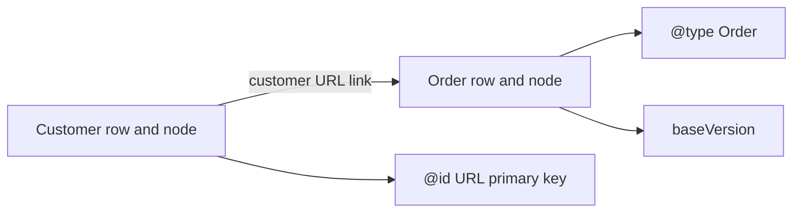
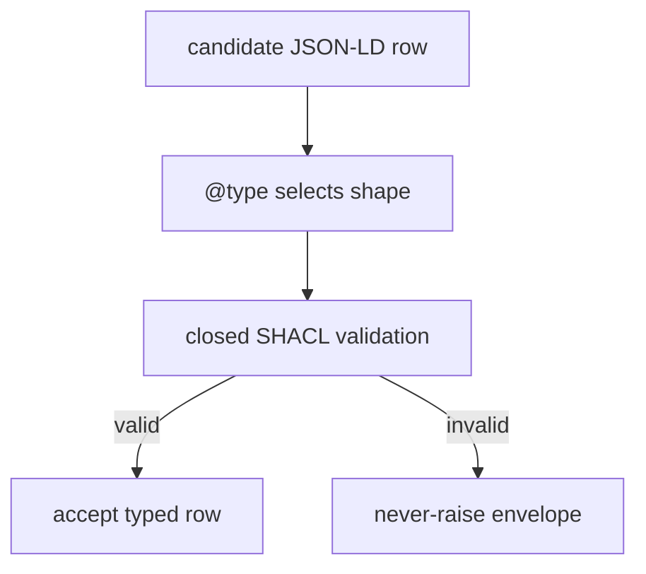
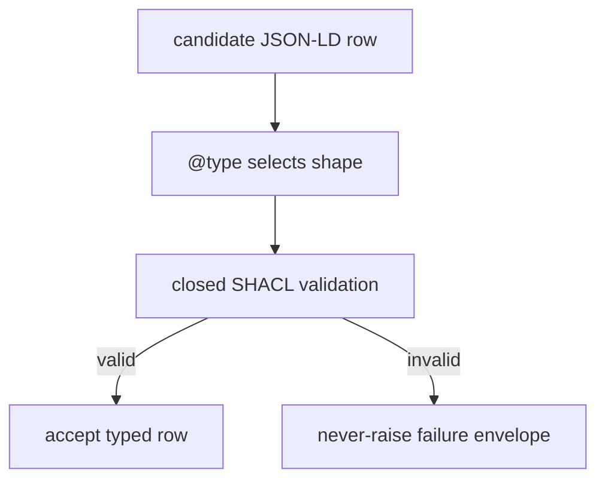

<!--
Drafted by the Manus cloud agent (task jP6ynfuoBYUMmoKewX57MX), 2026-08-14. Review-ready draft; not independently verified.
-->

# OSI Level 8 Profile 1 for JSON & SQL developers: typed rows with URL primary keys

## 1. The three-sentence recap: Level 8 in a safe act channel

OSI Level 8 creates a safe boundary between an operator or AI client and a database-backed service. It standardizes how requests are made, how data is returned, and how failures are expressed so you never get thrown into opaque exceptions. Profile 1 fixes the data model by making every record a typed, URL-keyed row that can be viewed both relationally and as a graph, without needing SPARQL or RDF tooling to get value from it.

```
flowchart LR
  O["Operator or AI client"] --> R["JSON request"]
  R --> S["Level 8 service"]
  S --> D["typed rows with URL keys"]
  D --> S
  S --> E["never-raise envelope"]
  E --> O
```

## 2. Profile 1 in one sentence

Start with the SQL analogy: imagine every row has a globally unique VARCHAR primary key, every row also carries a table name, and foreign-key values are those same global keys. Profile 1, also described as the vv-graph relational/graph model, standardizes that idea using JSON-LD field names:

```json
{
  "@context": "https://example.com/vocab/",
  "@id": "https://acme.example/customers/42",
  "@type": "Customer",
  "name": "Asha Patel",
  "email": "asha@example.com",
  "baseVersion": 7
}
```

Read the object as a familiar row:

```sql
CREATE TABLE customer (
  id           VARCHAR PRIMARY KEY,
  name         TEXT NOT NULL,
  email        TEXT NOT NULL,
  base_version BIGINT NOT NULL
);

INSERT INTO customer (id, name, email, base_version)
VALUES (
  'https://acme.example/customers/42',
  'Asha Patel',
  'asha@example.com',
  7
);
```

The JSON object is ordinary JSON plus three reserved fields. Its row identity is `@id`, and its declared kind is `@type`. The data can therefore be viewed relationally, as `customer` rows, or graph-wise, as URL-identified nodes connected by URL-valued properties. These are two views of the same rows, not two databases to synchronize.



## 3. Translate the unfamiliar vocabulary before naming it

The following table is the core mental model. First read the JSON/SQL column; then attach the formal name.

- If you know SQL/JSON: a field-name dictionary, similar to qualifying short names with `schema.table.column`
  - Then: **`@context`** — A data dictionary mapping short field names to global URLs, like fully-qualified `schema.table.column` names
- Globally unique primary-key string: **`@id`** — A global primary key that is a URL
- The table or entity discriminator for a row: **`@type`** — Which table/entity the object represents
- Normal JSON with metadata fields: **JSON-LD** — Ordinary JSON plus `@context`, `@id`, and `@type`
- A table schema expressed as reusable validation data: **SHACL** — Validation rules stored as data, like `CREATE TABLE` constraints for `CHECK`, `NOT NULL`, types, and required
- A strict table rejecting undeclared columns: **closed SHACL shape** — A strict schema that allows only declared columns
- A schema-definition file in a compact text syntax: **Turtle / TTL** — The text format those rules are commonly written in
- Rows keyed by URLs, including references to other URL-keyed rows: **RDF / graph** — Rows whose primary key is a URL, without needing SPARQL
- An optimistic-lock version column: **`baseVersion`** — The row version on which an update was based
- A result union rather than an exception: **never-raise envelope** — Every response is `{ok:true,...}` or `{ok:false,reason,because}`

A vocabulary is a shared dictionary that makes short names unambiguous. Example vocabulary:

```json
{
  "@context": {
    "Customer": "https://acme.example/vocab/Customer",
    "name": "https://acme.example/vocab/name",
    "email": "https://acme.example/vocab/email",
    "baseVersion": "https://acme.example/vocab/baseVersion"
  },
  "@id": "https://acme.example/customers/42",
  "@type": "Customer",
  "name": "Asha Patel",
  "email": "asha@example.com",
  "baseVersion": 7
}
```

You do not have to expand those short names manually in application code to benefit. The point is that the data has an unambiguous shared dictionary, much as qualified SQL identifiers prevent two schemas from accidentally treating `status` as the same column.

## 4. The grounding rule: every node has a type

In SQL, a row exists in a table. A row in `orders` is not merely a bag of columns that happens to contain `total`; its table tells you which columns, constraints, and business meaning apply. Profile 1 makes the equivalent rule explicit: every node has a type.

This is the grounding rule. The graph representation must not contain anonymous, unclassified blobs that the service cannot validate or interpret. A node states `@type`, just as a relational row belongs to `Customer`, `Order`, or `Product`.

```json
{
  "@context": "https://acme.example/vocab/",
  "@id": "https://acme.example/orders/9001",
  "@type": "Order",
  "customer": "https://acme.example/customers/42",
  "totalCents": 4999,
  "currency": "USD",
  "baseVersion": 3
}
```

Here `customer` is a URL-valued link to another node. In SQL terms, that is a foreign key:

```sql
CREATE TABLE orders (
  id              VARCHAR PRIMARY KEY,
  customer_id     VARCHAR NOT NULL REFERENCES customer(id),
  total_cents     INTEGER NOT NULL CHECK (total_cents >= 0),
  currency        CHAR(3) NOT NULL,
  base_version    BIGINT NOT NULL
);
```

In Profile 1 language, a link is a URL-valued property pointing to another URL-keyed node. The relational view calls it a foreign key. The graph view calls it an edge. There is no conflict: the value is the URL string stored, and it can be interpreted in either mode.


## 5. Relational and graph are two query lenses, not competing architectures

In SQL, you join: `SELECT... FROM customer JOIN orders ON orders.customer_id = customer.id`. In Profile 1, you retrieve the typed records and follow the URL in a link to the related node via `@id` matching. The graph lens simply makes relationships explicit and portable in JSON.

Core correspondences:
- Relational question: which table does this row belong to? Answer: read `@type`.
- What is the row’s primary key? Answer: read `@id`.
- Which customer owns this order? Answer: follow the URL in `customer` to the node with that `@id`.
- How do I validate the permitted columns? Answer: apply the shape for the row’s type.
- Has another writer changed this row? Answer: compare `baseVersion`.

Example combining nodes in one response (two reads, no graph DB required):

```json
{
  "ok": true,
  "data": [
    {
      "@context": "https://acme.example/vocab/",
      "@id": "https://acme.example/customers/42",
      "@type": "Customer",
      "name": "Asha Patel",
      "email": "asha@example.com",
      "baseVersion": 7
    },
    {
      "@context": "https://acme.example/vocab/",
      "@id": "https://acme.example/orders/9001",
      "@type": "Order",
      "customer": "https://acme.example/customers/42",
      "totalCents": 4999,
      "currency": "USD",
      "baseVersion": 3
    }
  ]
}
```

A beginner sometimes hears “RDF graph” and assumes a new query language. For Profile 1, keep the definition simple: RDF/graph means rows whose primary key is a URL, with URL-valued links between rows. You can implement reads and writes using your existing SQL and JSON plumbing; the graph interpretation is just a lens, not a brand-new database.



## 6. Validation: strict tables written as data

In SQL, you declare column names, types, NOT NULL, and CHECK constraints inline in `CREATE TABLE`. Profile 1 moves validation into machine-readable schema data. This approach is SHACL: validation rules stored as data that describe what a valid row must contain.

A shape (the schema) for a `Customer` might express: the shape applies to the `Customer` class, the table is closed to undeclared properties, and certain properties are required with specific datatypes.

```ttl
@prefix sh: <http://www.w3.org/ns/shacl#> .
@prefix ex: <https://acme.example/vocab/> .

ex:CustomerShape
  a sh:NodeShape ;
  sh:targetClass ex:Customer ;
  sh:closed true ;
  sh:property [
    sh:path ex:name ;
    sh:minCount 1 ;
    sh:datatype <http://www.w3.org/2001/XMLSchema#string>
  ] ;
  sh:property [
    sh:path ex:email ;
    sh:minCount 1 ;
    sh:datatype <http://www.w3.org/2001/XMLSchema#string>
  ] .
```

A closed shape means undeclared columns are rejected. The above TTL-like snippet demonstrates the intent—binding validation to the vocabulary and type rules. A production shape must explicitly cover metadata like `@id`, `@type`, and `baseVersion` according to the vocabulary and profile rules.



## 7. Calling the service: named functions over JSON

Think of a stored-procedure API: you POST a JSON object, name a server function, pass parameters, and receive JSON. That is JSON-RPC. It is not a graph query language; it is simply calling a named server function by POSTing JSON and getting JSON back.

A read call might look like this:

```json
{
  "jsonrpc": "2.0",
  "id": "req-104",
  "method": "record.get",
  "params": {
    "id": "https://acme.example/customers/42"
  }
}
```

Profile 1 uses a never-raise envelope for all responses. Instead of throwing exceptions on validation failures, conflicts, or missing records, the server always returns a top-level `ok` boolean with either `data` or `reason` and `because`.

```json
{
  "ok": true,
  "data": {
    "@context": "https://acme.example/vocab/",
    "@id": "https://acme.example/customers/42",
    "@type": "Customer",
    "name": "Asha Patel",
    "email": "asha@example.com",
    "baseVersion": 7
  }
}
```

```json
{
  "ok": false,
  "reason": "validation_failed",
  "because": "Customer allows name, email, and declared metadata only. Property emali is not permitted by the closed shape."
}
```

A read, or a write, returns a predictable envelope you can test against. The naming of the function is stable, and the contract is explicit: either `ok: true` with `data`, or `ok: false` with a reason and cause.

## 8. Safe updates with `baseVersion`

A version column in SQL implements optimistic concurrency: update only if the value you originally read still matches. In Profile 1, that field is `baseVersion`, the row version on which an update is based.

Suppose you read Customer 42 at version 7, then propose a new email:

```json
{
  "jsonrpc": "2.0",
  "id": "req-105",
  "method": "record.update",
  "params": {
    "record": {
      "@context": "https://acme.example/vocab/",
      "@id": "https://acme.example/customers/42",
      "@type": "Customer",
      "name": "Asha Patel",
      "email": "asha.patel@example.com",
      "baseVersion": 7
    }
  }
}
```

The SQL intuition is:

```sql
UPDATE customer
SET email = 'asha.patel@example.com', base_version = base_version + 1
WHERE id = 'https://acme.example/customers/42'
  AND base_version = 7;
```

If another writer already produced version 8, return a normal envelope instead of raising:

```json
{
  "ok": false,
  "reason": "version_conflict",
  "because": "The record changed after baseVersion 7 was read. Fetch the current row and retry with an intentional merge."
}
```

This approach ensures safe updates without surprising exceptions, aligning with the never-raise envelope.

## 9. When Profile 1 fits

Use Profile 1 for ordinary data-centric applications: customer and order systems, case-management workflows, inventories, approvals, content records, operational registries, and AI-assisted tools that must manipulate well-governed business data. It is especially useful when records need durable identity across services, explicit types, strict validation, links among entities, and clear machine-readable success or failure results.

Do not adopt it because “graph” sounds exotic. Adopt it when you want SQL-like rigor plus portable JSON records with URL primary keys. Begin with a small vocabulary, define one closed shape per entity type, require `@id`, `@type`, and `baseVersion`, represent entity relationships as URL links, and keep the server methods narrowly named and predictable.

Repo and docs reference:
- OSI Level 8 Profile 1: vv-graph relational/graph model
- OSI Level 8 repository (docs and profile notes)

Source for the profile: https://github.com/laquereric/osi-level-8

## 10. Cheat sheet: if you know SQL/JSON, then...

- If you know SQL/JSON, then think this | In Profile 1, use this
- PRIMARY KEY that survives system boundaries | `@id`, a global primary key URL
- Table name or entity discriminator | `@type`
- Fully qualified `schema.table.column` dictionary | `@context`, mapping short names to global URLs
- JSON object with identity and schema metadata | JSON-LD, ordinary JSON plus `@context`, `@id`, and `@type`
- FOREIGN KEY ... REFERENCES ... | A URL-valued `customer` link to another node’s `@id`
- Tables plus joins | The relational view of the same URL-keyed rows
- Rows plus navigable links | The graph/RDF view of the same rows
- `CREATE TABLE`, `NOT NULL`, types, and `CHECK` | SHACL validation rules stored as data
- Strict table rejecting unknown columns | A closed SHACL shape
- A compact schema-definition source file | Turtle / TTL file
- `WHERE base_version = ?` | `baseVersion` (optimistic locking)
- `POST /procedure` with a JSON request and JSON response | JSON-RPC, call a named server function by POSTing JSON, get JSON back
- Result union instead of exceptions | Never-raise envelope: `{ok:true,...}` or `{ok:false,reason,because}`
- A need to query graph data with a specialized language | Not required here: use your normal service operations and SQL implementation as appropriate

The durable summary is: Profile 1 is typed, validated, versioned rows whose primary keys are URLs. Treat them as relational records when thinking about schemas and constraints; treat them as graph nodes when thinking about navigable links. The data remains the same; the orientation you apply depends on your task.

## Sources

- https://github.com/laquereric/osi-level-8/blob/main/docs/osi-level-8-profile-1-vv-graph.md
- https://github.com/laquereric/osi-level-8

End of tutorial.
