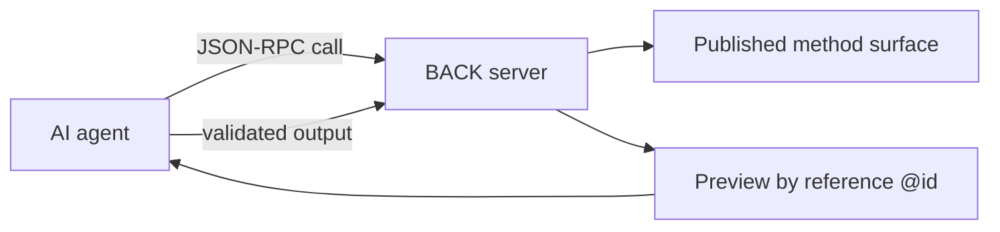
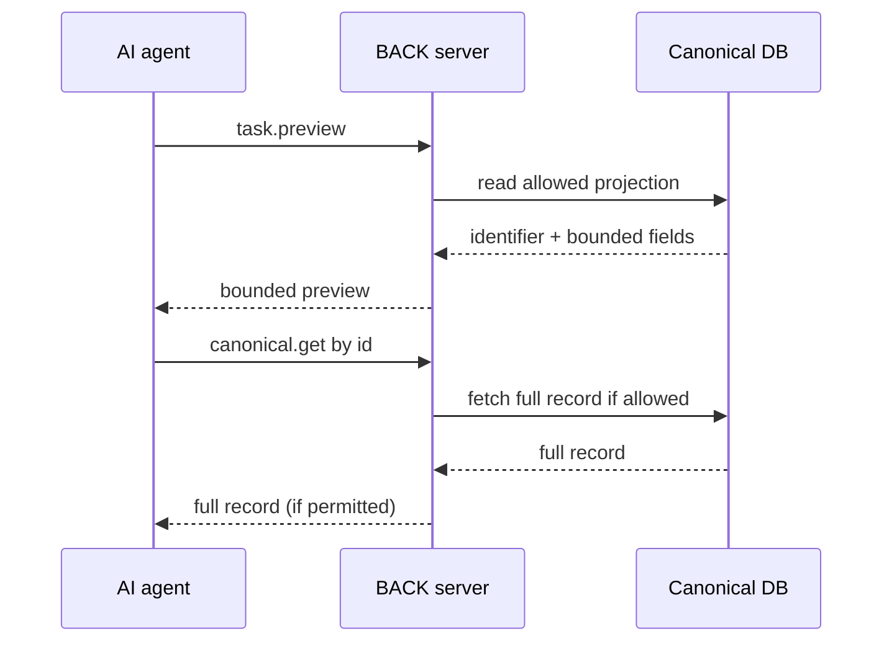
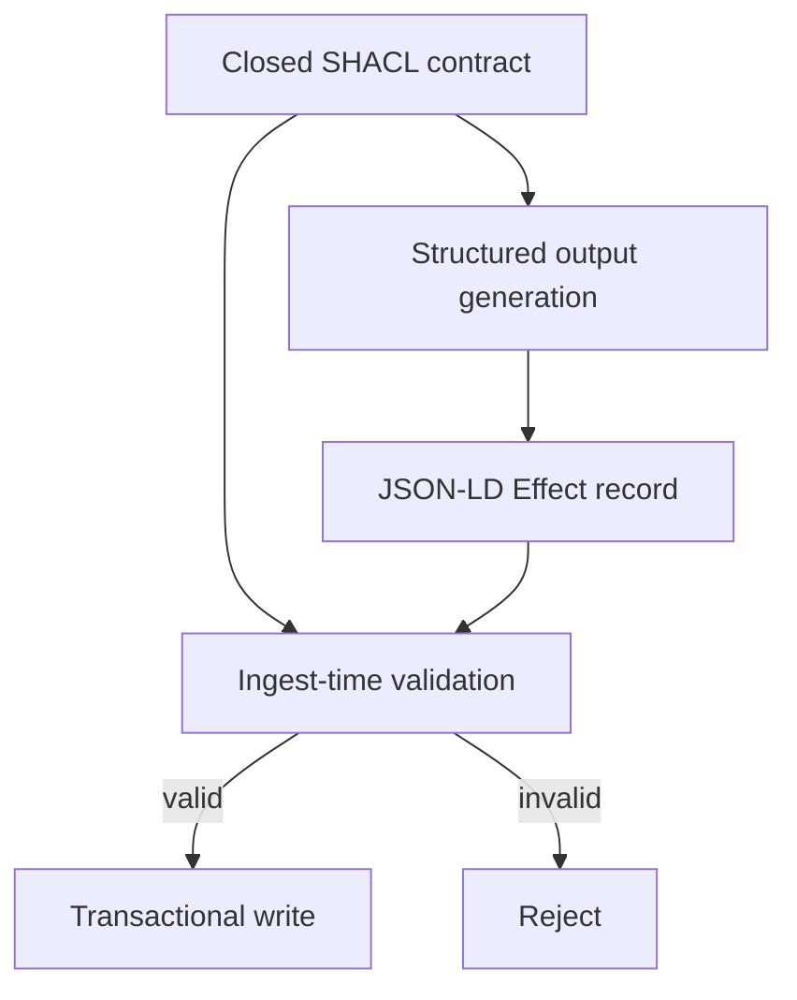

<!--
Drafted by the Manus cloud agent (task KMHKtTKjK6ufXdoBZynfG6), 2026-08-14. Review-ready draft; not independently verified.
-->

# OSI Level 8 Profile 2 for JSON & SQL developers: let an AI assistant use your database safely

> Audience: a working developer comfortable with JSON and SQL, starting from zero with RPC, RDF, SHACL, Turtle/.ttl, JSON-LD, or SPARQL. This tutorial translates those concepts into JSON/SQL equivalents and provides a complete, self-contained guide you can follow without assuming prior exposure to the RDF/SHACL stack.

## 1. The idea in three sentences

In the Level 8 framing, an AI model should not be treated as a general-purpose database user with broad access. It sits behind a deliberately small, typed interface and can only invoke a fixed, published surface of server-side capabilities. The server remains authoritative and enforces all constraints. Profile 2 is the agent-oriented version of that idea: the model receives compact references and previews, uses pass-by-reference to identify rows, and returns strictly validated outputs that are checked both at decode time and at ingest time.

Concretely for a JSON/SQL developer: the server publishes a dictionary of callable methods (a stored-procedure-like surface). The AI reads data by reference (it learns from a small preview plus a global URL @id, then fetches the full record only if needed). The AI then returns a structured, validated output that must pass the same contract on the way into the system as it did on the way out of the model. This keeps the prompt lightweight and the server secure.



## 2. Start from the familiar model: stored procedures over HTTP

Before naming terms, translate the idea: you call a named server function by posting JSON and you get JSON back. This is the JSON-RPC concept, translated into a familiar SQL-style pattern: a fixed set of server-side routines, each with a well-defined input/output contract, represented as data rather than code.

Example SQL-like prototype:

CREATE TABLE task (
  id UUID PRIMARY KEY,
  title TEXT NOT NULL,
  status TEXT NOT NULL CHECK (status IN ('open','done')),
  private_notes TEXT NOT NULL,
  version INTEGER NOT NULL
);

In the JSON-RPC world, the server publishes a menu of allowed methods (the API surface). Each method has a shape for input (params) and output (result) expressed as a closed contract. Anything not on the surface is refused by default. This is the essence of a closed surface: a strict, mission-critical boundary around what the AI can call.

A typical JSON-RPC request looks like:

```json
{
  "jsonrpc": "2.0",
  "id": "call-104",
  "method": "task.preview",
  "params": {
    "assignee": "https://api.example.test/users/ana",
    "limit": 3
  }
}
```

This is analogous to calling a stored procedure, except the call traverses HTTP and uses a JSON payload.

A successful response would look like:

```json
{
  "ok": true,
  "result": {
    "items": [
      {
        "title": "Close onboarding checklist",
        "status": "open",
        "@id": "https://api.example.test/tasks/42"
      }
    ]
  }
}
```

A failed response preserves the envelope and explains the reason, e.g.:

```json
{
  "ok": false,
  "reason": "not_published",
  "because": "Method payroll.export is not on this agent's API surface"
}
```

Note how the responses are explicit JSON objects with a top-level ok flag, rather than unstructured errors or stack traces. This uniformity helps the AI control flow reliably.

## 3. References, not rows: the key cost and safety move

In SQL terms, you typically fetch a preview of a row with a few columns. In Profile 2 you fetch a small preview and a global identifier, then dereference only if needed. The global identifier is an IRI (a URL) that serves as the primary key. This is the pass-by-reference idea: large payloads stay off the AI prompt; the AI can request the full row later via a dereference operation if allowed.

Example preview payload:

```json
{
  "title": "Close onboarding checklist",
  "status": "open",
  "@id": "https://api.example.test/tasks/42"
}
```

A dereference call to fetch the full row might look like:

```json
{
  "jsonrpc": "2.0",
  "id": "call-105",
  "method": "canonical.get",
  "params": {
    "id": "https://api.example.test/tasks/42"
  }
}
```

The server validates and authorizes the dereference, returning an approved representation. The key idea is that payloads do not fill the prompt; the reference does the work of pointing to the exact resource.

Mermaid diagram of the pass-by-reference workflow:



You can see how this keeps the AI context small. The NOOA-related implementation in the vv-nooa project demonstrates similar pass-by-reference ideas within a learning harness, providing a concrete example of these concepts in practice. [1][2]

## 4. JSON-LD and RDF without the mystique

Pretend JSON is JSON. The only twist is adding a small dictionary of semantic context: a @context that maps short field names to fully qualified URLs, plus @id as the global primary key, and @type as the record type. This is not a mystique; it is simply a portable dictionary that helps systems speak the same language across boundaries.

Example of a JSON-LD-like payload:

```json
{
  "@context": {
    "TaskUpdate": "https://schema.example.test/TaskUpdate",
    "task": "https://schema.example.test/task",
    "status": "https://schema.example.test/status"
  },
  "@id": "https://api.example.test/updates/123",
  "@type": "TaskUpdate",
  "task": "https://api.example.test/tasks/42",
  "status": "done"
}
```

RDF graph concepts can be understood as facts about resources expressed via URIs. A row in a traditional SQL table might be bolstered by RDF-style triples like:

- https://api.example.test/tasks/42  ex:title  "Close onboarding checklist"
- https://api.example.test/tasks/42  ex:status  "open"

You do not need SPARQL to use this profile. Instead, the API surface and the contract are expressed in JSON and SHACL shapes, described below.

## 5. Contracts as data: SHACL and Turtle

SHACL is a way to declare validation rules for graph-shaped data. The idea is to store validation rules as data, which can be loaded and evaluated by a validation engine. A closed SHACL shape is a strict set of properties that a valid record must contain; it is analogous to a strict SQL table with a fixed column set. The text format commonly used for graph validation rules is Turtle (.ttl), a readable semantic notation for RDF graphs.

Example SHACL-constrained shape for a TaskUpdate-like record:

```turtle
@prefix sh: <http://www.w3.org/ns/shacl#> .
@prefix ex: <https://schema.example.test/> .

ex:TaskUpdateShape a sh:NodeShape ;
  sh:targetClass ex:TaskUpdate ;
  sh:closed true ;
  sh:property [
    sh:path ex:task ;
    sh:datatype xsd:string ;
    sh:minCount 1 ;
    sh:maxCount 1
  ] ;
  sh:property [
    sh:path ex:status ;
    sh:datatype xsd:string ;
    sh:minCount 1
  ] ;
  sh:property [
    sh:path ex:operationId ;
    sh:datatype xsd:string ;
    sh:minCount 1
  ] ;
  sh:property [
    sh:path ex:baseVersion ;
    sh:datatype xsd:integer ;
    sh:minCount 1
  ] .
```

The SQL analogue would be a table definition with NOT NULL constraints, type constraints, and a CHECK for enumerations. SHACL provides the capability to validate the shape of data across systems in a data-driven, exchangeable way. The same shape should be used both for the model’s emitted structured output and for the server’s ingest validation to ensure the “decode-time” and “ingest-time” checks stay in lockstep. [1]

Mermaid flow showing dual validation of a TaskUpdate via a closed SHACL shape:



Turtle/.ttl is the common textual representation of those SHACL shapes; think of it as a human-friendly YAML-like format for graph constraints. The core point is that validation rules are data, not executable code, and they can be versioned and shared across systems as part of contracts.

## 6. The write path: intent, idempotency, and optimistic locking

The effect returned by the model is a validated record that must pass the same SHACL shape on ingest. The server enforces the contract and then writes to the canonical store. This separation ensures the model cannot sterilize or override the authoritative data.

Two key fields enable safe concurrency and retries:

- operationId: an idempotency key. If the same operation is retried, the server applies it at most once. This prevents duplicate updates due to transient failures in the model or the network.
- baseVersion: an optimistic lock value. If the row has moved since the model created its intent, the update is rejected to prevent lost updates. This is akin to SQL: UPDATE ... WHERE id = ? AND version = ?; if no row is updated, you know someone else modified the data.

A successful server response might be:

```json
{
  "ok": true,
  "receipt": {
    "operationId": "7e2c88ab-319f-4c2d-9cb5-c763a5ca7d66",
    "task": "https://api.example.test/tasks/42",
    "newVersion": 8
  }
}
```

If the version has advanced, the server responds with a version conflict:

```json
{
  "ok": false,
  "reason": "version_conflict",
  "because": "Task 42 is at version 8, but this intent was authored against version 7"
}
```

The model can re-issue an updated intent using the new identifier/version and retry. The important principle is that writes are controlled, deterministic, and auditable.

## 7. Security boundary: what the model cannot reach

A core safety feature is that private data must not appear on the agent-facing surface. If a field is flagged private, it should not be accessible through the API surface or SHACL shapes. The server should refuse any attempt to incorporate private_local data into the published contract or into the model’s outputs.

Default-deny semantics ensure the AI cannot perform actions outside the published surface. The server re-authorizes dereferences and enforces the same SHACL shape at both decode time and ingest time, so there is no drift between what the AI believes it can do and what the server actually enforces. The NOOA family of concepts provides concrete references for this architecture. [1][2]

## 8. Cheat sheet: if you know SQL/JSON, then...

- API surface: a fixed set of stored procedures the AI is allowed to call; default-deny excludes anything not on the surface.
- JSON-RPC: POST a JSON payload to invoke a named server function and receive JSON back.
- Preview: return a small projection with an @id for dereferencing when needed.
- @context: a data dictionary that maps short field names to global URLs.
- @id: a global primary key URL that enables pass-by-reference dereferencing.
- @type: the entity type represented by the payload.
- JSON-LD: ordinary JSON augmented with @context/@id/@type for interoperable semantics.
- RDF graph: a conceptual view of data as named graphs with URL-based identifiers.
- Turtle/.ttl: a human-readable textual format for SHACL-like graph constraints.
- SHACL: a data-driven validation system that expresses constraints (like NOT NULL, type, and enumerations).
- Closed SHACL shape: a strict contract that allows only the fields declared; forbids private fields.
- Structured output: a validated effect that the server can apply as an atomic transaction.
- operationId: an idempotency key; retries apply at most once.
- baseVersion: an optimistic lock; updates fail if the base version changed.
- Never-raise envelope: responses are consistently { ok: true, ... } or { ok: false, reason, because }.

The full pattern is deliberately conservative: present a small, current projection, give the AI a stable global handle for follow-up reads, require a typed, closed-schema intent, and have the server independently validate and apply that intent exactly once. This is how an AI can contribute to data tasks without becoming a privileged database user.

## 9. References

[1] OSI Level 8 — Profile 2: Reference-Passing for Agents (NOOA) – https://github.com/laquereric/osi-level-8/blob/main/docs/osi-level-8-profile-2-nooa.md

[2] vv-nooa: NOOA harness concepts, pass-by-reference, and isolation doctrine – https://github.com/laquereric/vv-nooa

---

References are inline and linked for traceability. The tutorial above maps the OSI Level 8 Profile 2 concepts into JSON/SQL equivalents and provides concrete examples, diagrams, and safety guidance to help a JSON/SQL developer implement and reason about a safe AI-assisted data workflow.
