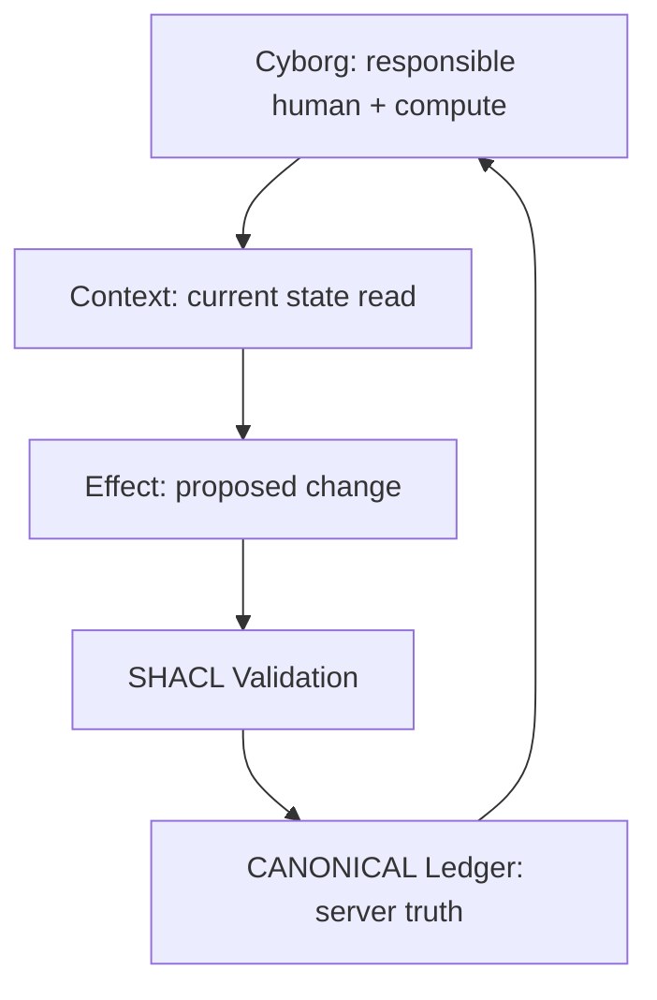
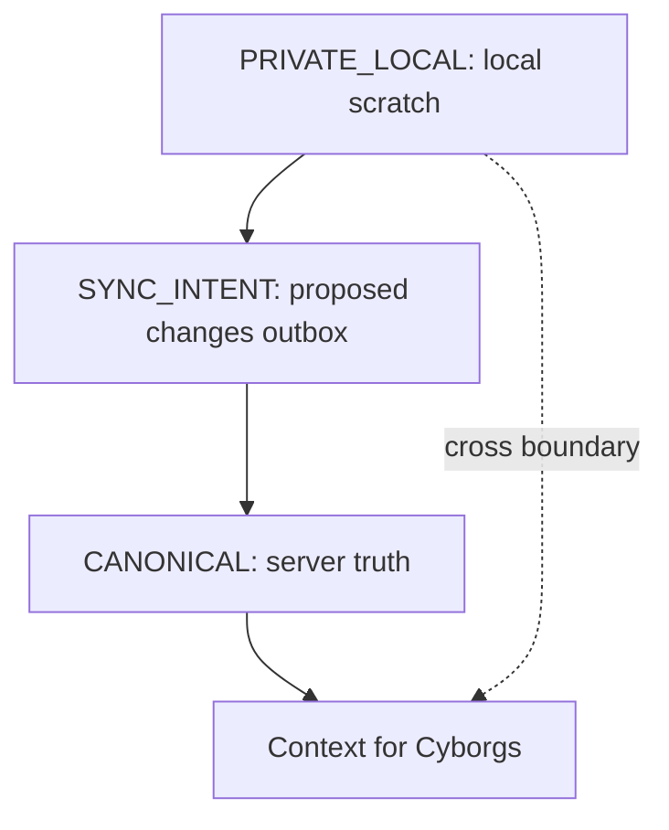
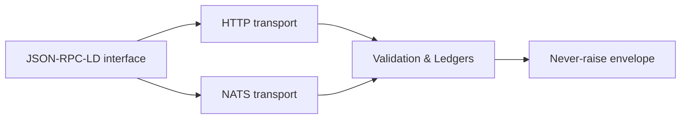

<!--
STATUS: frozen / superseded in place
effective: 2026-08-29
superseded-by: docs/adr/0041-two-shape-gems-role-not-namespace.md
governing-decision: ADR 0041 (two shape gems, role not namespace)
also: ADR 0042 (close the Ruby to the TTL; not this freeze), ADR 0043 (retain unreachable shapes)
This document is retained as historical and normative prose.
New protocol requirements are not added here.
New shape development: gems/osi-level-8-profiles (current SHACL package) and
gems/shapes-level-8, gems/shapes-application (packaging homes).
Do not delete. Do not move into a gem.
-->
<!--
Drafted by the Manus cloud agent (task WtbuVkjwurKRs8UB2GQsnN), 2026-08-14. Review-ready draft; not independently verified.
-->

# OSI Level 8 BASE: A JSON and SQL beginner tutorial for a safe cybernetic interface

Title: OSI Level 8 BASE — A Cybernetic Interface between a Responsible Human Operator and a Database


## 1. Quick orientation: OSI seven layers, then add a new layer on top

Two sentences to anchor the big idea: The classic seven OSI layers separate concerns from physical transmission to application protocols. OSI Level 8 BASE adds a deliberate, human-centric loop on top of that stack so a Cyborg (a responsible human plus compute machinery) can perceive a shared state (Context) and propose changes (Effect) in a controlled, verifiable way. The wire between the Cyborg and the system remains JSON-RPC-like, but those exchanges carry Linked Data semantics via JSON-LD and are constrained by SHACL rules that enforce what may cross the boundary.

In practice, think of Level 8 as a disciplined boundary: the Cyborg reads Context by running read-like operations (SELECTs), then suggests changes (INSERT/UPDATE/DELETE) that must pass formal validation before becoming part of the canonical server truth. The base idea is to keep responsibility and governance explicit, and to keep communication boringly predictable for software clients. This structure is specifically designed to work with JSON and SQL concepts you already know, but translated into a boundary-crossing protocol. See the references for the formal sources of JSON-RPC, JSON-LD, RDF concepts, and SHACL rules. [1] [2] [3] [4] [5] [6]

> Core idea: BASE gives an AI-assisted operator tools while retaining accountable, governed database changes.


## 2. Translate the core terms into JSON/SQL terms you know

- Context: the current state you read from the system. Analogous to a set of SQL SELECT results that you use to decide what to change, i.e., the data you perceive before acting.
- Effect: the proposed change you want to apply. Analogous to an INSERT/UPDATE/DELETE statement that you would submit, but here it travels separately as a proposal until it is validated.
- @context: a data dictionary mapping short field names to globally unique URLs (for example, a compact name like status maps to a full URL representing that concept).
- @id: a global primary key written as a URL that uniquely identifies a row/entity.
- @type: which table or entity this record belongs to (the SQL table or the RDF class).
- JSON-LD: ordinary JSON augmented with @context, @id, and @type to give identity, vocabulary, and global naming. This is the bridge from plain JSON to a linked-data style payload.

Before the formal terms, here is the direct mapping you’ll use in practice:

| SQL/JSON concept you know | BASE mapping (analogy) | What it becomes in JSON-LD-style payloads |
|---|---|---|
| A row in a table | An entity identified by a URL in a data graph | A JSON object with @id (URL), @type (table/entity), and normal fields
| A foreign key to another row | A field containing a URL reference to another @id | URL-valued fields that link records cross-dataset
| A constraint like NOT NULL | A required field in the SHACL shape | SHACL shapes enforce required properties and types
| A SELECT producing Context | Read-only Context reflects current state | Context is produced by canonical ledger reads
| An INSERT/UPDATE/DELETE proposal | An Effect proposal carried separately | Effect appears in sync_intent ledger for validation

These mappings show how JSON and SQL concepts map into the BASE boundary design, while preserving familiar semantics. Now we’ll walk through the actual wire format.


## 3. The wire call: JSON-RPC-LD, with a familiar POST envelope

- Analogy first: You are used to POSTing JSON to call a server function by name and receive JSON back. This is JSON-RPC: a standard for calling a named server function with a JSON envelope and getting a JSON result back.
- BASE adds JSON-LD inside the call. The outer envelope is the function call; the inner payload uses the Linked Data vocabulary (context, id, type) to express Context or Effect in a portable, globally identifiable form.

Here is a concrete example: a Cyborg proposes changing a work order’s status. The payload is a JSON-RPC-LD request.

```json
{
  "jsonrpc": "2.0",
  "id": "req-1042",
  "method": "base.proposeEffect",
  "params": {
    "effect": {
      "@context": {
        "WorkOrder": "https://example.org/schema/WorkOrder",
        "status": "https://example.org/schema/work-order/status",
        "priority": "https://example.org/schema/work-order/priority"
      },
      "@id": "https://ops.example.org/work-orders/WO-1042",
      "@type": "WorkOrder",
      "status": "scheduled",
      "priority": 2
    }
  }
}
```

- Outer envelope: this calls the server function named base.proposeEffect and passes the parameters. The nested effect is ordinary JSON, but it is enriched with @context, @id, and @type to make the data portable and globally identifiable. This is the JSON-RPC-LD pattern.
- Validation and results: the server returns a never-raise envelope, either {"ok": true, ...} or {"ok": false, "reason": ..., "because": ...}, and the client updates Context only when the effect has been validated and accepted by the canonical ledger.

A quick mapping table to relate the two worlds:

| JSON/SQL concept | BASE mapping | Translation note |
|---|---|---|
| POST body = action | JSON-RPC call | You call a server function by POSTing JSON and receive a JSON response.
| @context | Global vocabulary mapping | Short names map to fully-qualified URIs so everyone shares a common vocabulary.
| @id | Global primary key | A URL uniquely identifies a row/entity.
| @type | Entity classifier | Indicates the table/collection this record belongs to.
| JSON-LD payload | Context + Effect | Ordinary JSON with the JSON-LD metadata at the surface.

Diagram: Context-to-Effect cycle (Cyborg, BASE server, Validator, Canonical ledger)




## 4. RDF, Turtle, and the graph intuition without needing SPARQL

- Analogy first: SQL uses rows and foreign keys; RDF often represents data as a graph where nodes are identified by URLs. In BASE, you can think of a “graph” as a collection of URL-keyed rows with relationships expressed as URL-valued fields. The canonical relations are encoded as JSON-LD with @id and @type, and when you expand to RDF, you’ll similarly get triples anchored by those IRIs. You do not need SPARQL to begin; you can reason graphically by thinking of URL-keyed rows and references between them.
- SHACL and Turtle: SHACL provides a validation shape language that is commonly serialized in Turtle (.ttl). The shapes express constraints like required properties, type expectations, and field whitelists. In BASE, these shapes are first-class data that can be versioned, shared, and re-used across deployments. The strict (closed) shape means only the declared fields are allowed, blocking undeclared properties from crossing the boundary.

Concrete example: a Turtle shape that asserts a WorkOrder must have a status and a priority, and forbids extra fields beyond the declared ones. You won’t need to memorize Turtle syntax to start, but it demonstrates how data rules can be stored as data and exchanged alongside the payload.

```turtle
@prefix sh: <http://www.w3.org/ns/shacl#> .
@prefix ex: <https://example.org/schema/> .

ex:WorkOrderShape a sh:NodeShape ;
  sh:targetClass ex:WorkOrder ;
  sh:closed true ;
  sh:property [
    sh:path ex:work-order/status ;
    sh:minCount 1 ;
    sh:datatype <http://www.w3.org/2001/XMLSchema#string>
  ] ;
  sh:property [
    sh:path ex:work-order/priority ;
    sh:minCount 1 ;
    sh:datatype <http://www.w3.org/2001/XMLSchema#integer>
  ] .
```

- A SQL-like interpretation would say: create a table WorkOrderEffect with columns for id (URL primary key), status (text), priority (integer) and apply a rule that only the declared columns may appear. The Turtle example is simply a portable way to encode the same constraints as data rather than as application code.


## 5. The three ledgers: canonical, sync_intent, private_local

- Context again in SQL terms: the canonical ledger is the server’s source-of-truth. When a change is accepted, it becomes part of Context that other Cyborgs may read.
- Sync_intent: this is the outbox for proposed changes. It preserves what the Cyborg intends to do, without making the change official yet. It’s the “proposal” stage, not the final truth.
- Private_local: local scratch data—prompts, temporary state, or model hints—that must never cross the boundary. It stays on the client side and is never exported through the Level 8 interface.

Diagram: three ledgers and data flow



- Practical takeaway: an AI-assisted workflow benefits from keeping deliberations separate from committed facts. The Cyborg can bring in private notes to draft an effect, but only after validation does the canonical store reflect the change and propagate as Context to others. This separation helps avoid unintended mutations and keeps auditability clear.


## 6. Validation and the never-raise envelope

- Validation: Before an Effect can cross into the canonical ledger, it must be validated against an associated SHACL shape. Validation checks standard properties: presence (NOT NULL-ish), type conformity, allowed values, and the absence of undeclared fields when using a closed shape.
- Never-raise envelope: the protocol’s responses are always deterministic JSON, never exceptions. A successful operation returns {"ok": true, ...} and a failed one returns {"ok": false, "reason": ..., "because": ...}. This makes client software straightforward: check ok; if false, present the reason, then refresh Context. No unstructured error traces, no surprises in the response.

Example of a successful response:

```json
{
  "ok": true,
  "requestId": "req-1042",
  "effectId": "https://ops.example.org/effects/ef-9001",
  "canonical": {
    "@id": "https://ops.example.org/work-orders/WO-1042",
    "@type": "WorkOrder",
    "status": "scheduled",
    "priority": 2
  }
}
```

Example of a rejected proposal:

```json
{
  "ok": false,
  "reason": "validation_failed",
  "because": "The closed WorkOrder shape does not allow property 'prority'."
}
```

The beauty of this approach is predictable client behavior: you always know when a change is tentatively proposed and when it has actually become part of Context. The separate ledgers and the strict shapes provide a disciplined, auditable boundary.


## 7. Interfaces and transports: HTTP or NATS

- Transport neutrality: The same JSON-RPC-LD payload can travel over HTTP or a message bus such as NATS. The semantics do not change; only the delivery mechanism changes.
- HTTP is synchronous and straightforward: a Cyborg posts the JSON-RPC-LD request and awaits the JSON envelope.
- NATS is asynchronous: the same request is published to a subject, and the response is observed through a reply channel or correlated with a request identifier. The identity, validation, and ledger-boundaries remain the same regardless of transport.

Diagram: HTTP vs NATS as two roads to the same boundary



- Practical guidance: choose the transport by architectural needs (latency, throughput, or asynchronous processing) but keep the interface contract stable and the same across transports.


## 8. Profiles: fixing a concrete model for a safe boundary

- BASE defines a base protocol, but a profile fixes the concrete data model, shapes, and method surfaces used in a deployment. Without a profile, a payload may be valid JSON-LD but ambiguous for a given service.
- Profile 1 (the Cyborg Channel relational/graph model) provides a general grounding where every record is a typed, globally identified row, with relational and graph views as two perspectives on the same grounded model.
- Profile 2 (reference-passing for agents) adapts the interface for agents (LLMs and other AI) by exposing a typed method surface and dereferencing references on demand. Both profiles are defined in companion documents.

Why this matters: with profiles, you lock the interpretation of Context and Effect to a defined schema, so governance and validation rules apply consistently across deployments. The base protocol remains stable; profiles tailor it to specific use cases.


## 9. Worked scenario: a step-by-step walk-through

- Step 1: The Cyborg reads Context by issuing a read operation (SELECT-like) to the canonical ledger. The server returns a structured JSON object containing the current WorkOrder with its status and priority, all identified by @id and typed by @type.
- Step 2: The Cyborg drafts an Effect to change the status from scheduled to in-progress, keeping only allowed fields. This draft is stored in Sync_Intent, not in Canonical yet.
- Step 3: The server validates the Edit against the SHACL shape for WorkOrder; if ok, it is accepted into the canonical ledger and becomes part of the new Context.
- Step 4: The Cyborg receives a response in the never-raise envelope and updates its perception of Context accordingly. If not ok, the response explains the reason and the Cyborg revises the proposal before resubmitting.

This sequence ensures accountability and reproducibility: Context is what others can read, while Effect is what a Cyborg proposes, and only after validation does an Effect cross the boundary into Context.


## 10. Cheat sheet: if you know SQL/JSON, then...

| Situation | BASE term | Practical implication |
|---|---|---|
| You want to read the current truth | Context | Use a read operation to gather the current state from CANONICAL. |
| You want to propose a change | Effect in SYNC_INTENT | The proposal lives in the outbox until validated. |
| You want to cache local reasoning | PRIVATE_LOCAL | Local scratch data that must not cross the boundary. |
| You want a portable schema | SHACL shapes | Validation rules stored as data; shapes describe the boundary. |
| You want a URL-keyed row | @id and @type | Global identity for a row; a specific class identifies its type. |
| You want to reference a related record | URL-valued fields | Relationships are expressed as globally identifiable URIs. |
| You want a strict boundary | Closed SHACL shape | Only declared fields cross; no surprises. |
| You want a consistent contract | JSON-RPC-LD | All messages follow the same envelope and data model across transports. |
| You want predictable outcomes | Never-raise envelope | Always {ok:true} or {ok:false, reason, because}. |


## 11. Mental-model recap table

| Question | Answer |
|---|---|
| What is Level 8 BASE? | The safe, explicit operating layer above the classic stack that governs a Cyborg’s boundary with the system. |
| What does the Cyborg perceive? | Context: current, authoritative facts from the canonical ledger. |
| What does the Cyborg propose? | An effect that is stored in the sync_intent ledger until validated. |
| How is it delivered? | Through JSON-RPC-LD, over HTTP or NATS as the transport. |
| How is it validated? | SHACL shapes enforce required fields, types, and allowed properties; closed shapes block undeclared fields. |
| Where does accepted truth live? | The CANONICAL ledger on the server. |
| What stays private? | The PRIVATE_LOCAL ledger, which never crosses the boundary. |
| How are results reported? | Always a deterministic JSON envelope: {ok:true,...} or {ok:false, reason,because}. |
| Do HTTP and NATS change the contract? | No; they are alternative transports for the same contract. |
| Where do concrete entities and permissions come from? | A PROFILE fixes the concrete model for a deployment. |


## 12. Final recap and mental model summary

- The OSI seven layers keep networking responsibilities clean. BASE keeps the boundary between a Cyborg and the system explicit, turning a human-in-the-loop into a governed and auditable process.
- Context and Effect separate perception from action, ensuring governance before canonical changes.
- JSON-LD gives portable identity and vocabulary; SHACL shapes give portable data validation rules; Turtle is a canonical text format for SHACL rules.
- Three ledgers separate truth, intent, and private reasoning; never crossing boundaries keeps the system safe and auditable.
- The base protocol remains stable across transports; profiles lock concrete models for real deployments.

If you are comfortable with SQL and JSON, you are already halfway to mastering BASE. The rest is just adopting the three-ledger hygiene (canonical, sync_intent, private_local), the SHACL-driven validation, and the JSON-RPC-LD envelope as your standard reckoning instrument.


## 13. References

- [1] https://github.com/laquereric/osi-level-8/blob/main/docs/osi-level-8-base.md — OSI Level 8 BASE repository documentation
- [2] https://www.jsonrpc.org/specification — JSON-RPC 2.0 Specification
- [3] https://www.w3.org/TR/json-ld11/ — JSON-LD 1.1
- [4] https://www.w3.org/TR/rdf11-concepts/ — RDF 1.1 Concepts and Abstract Syntax
- [5] https://www.w3.org/TR/shacl/ — Shapes Constraint Language (SHACL)
- [6] https://www.w3.org/TR/turtle/ — RDF 1.1 Turtle


> Sources (URLs)
> - https://github.com/laquereric/osi-level-8/blob/main/docs/osi-level-8-base.md
> - https://www.jsonrpc.org/specification
> - https://www.w3.org/TR/json-ld11/
> - https://www.w3.org/TR/rdf11-concepts/
> - https://www.w3.org/TR/shacl/
> - https://www.w3.org/TR/turtle/
